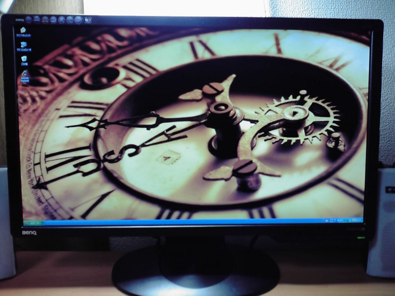

今使っている<a class="keyword" href="http://d.hatena.ne.jp/keyword/%B1%D5%BE%BD%A5%E2%A5%CB%A5%BF%A1%BC">液晶モニター</a>がどうも心許なくなってきたので買い換えを一大決心。

最近は比較的モニターが安くなってきているみたい。円高の影響だろうか。

 

 

***

今回購入したのは<a class="keyword" href="http://d.hatena.ne.jp/keyword/BenQ">BenQ</a>のG2411HDという24インチのモニター。これまで15インチだったからでかいのなんの。

しかも今回購入したモニターは<a class="keyword" href="http://d.hatena.ne.jp/keyword/%A5%A2%A5%B9%A5%DA%A5%AF%A5%C8%C8%E6">アスペクト比</a>が16:9のワイド画面だから違和感がものすごい。これまで4:3になれていたからなれるまで時間がかかりそうだ。

でも広くなったおかげで、パソコンで行う作業ははかどりそう。

