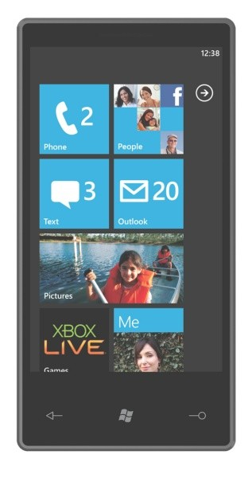

正直、いいのか悪いのか何ともいえません。。

 

 

 

 

***

 

Gizmodo Japanの記事によると

 

<blockquote>

<a class="keyword" href="http://d.hatena.ne.jp/keyword/%A5%DE%A5%A4%A5%AF%A5%ED%A5%BD%A5%D5%A5%C8">マイクロソフト</a>が新モバイルプラットフォーム <a class="keyword" href="http://d.hatena.ne.jp/keyword/Windows%20Phone%207">Windows Phone 7</a> Seriesを発表しました。最大の特徴は、ルック＆フィールから中身のコードまで、これまでの<a class="keyword" href="http://d.hatena.ne.jp/keyword/Windows%20Mobile">Windows Mobile</a> とはまったく違う新しい<a class="keyword" href="http://d.hatena.ne.jp/keyword/%A5%B9%A5%DE%A1%BC%A5%C8%A5%D5%A5%A9%A5%F3">スマートフォン</a>OSへと変化したこと。従来のスタート画面はタイルベースのアプリアイコンやコンタクトショートカット、<a class="keyword" href="http://d.hatena.ne.jp/keyword/%A5%A6%A5%A3%A5%B8%A5%A7%A5%C3%A5%C8">ウィジェット</a>が縦に並ぶホームスクリーンになり、画面遷移やシンプルなメニューなどは <a class="keyword" href="http://d.hatena.ne.jp/keyword/Zune%20HD">Zune HD</a>と非常に良く似たデザインが採用されています。<a class="keyword" href="http://d.hatena.ne.jp/keyword/%A5%BD%A1%BC%A5%B7%A5%E3%A5%EB%A5%CD%A5%C3%A5%C8%A5%EF%A1%BC%A5%AF">ソーシャルネットワーク</a>関連の強化や <a class="keyword" href="http://d.hatena.ne.jp/keyword/Xbox%20LIVE">Xbox LIVE</a>の統合もうわさされていたとおり。コンタクトを開けば、<a class="keyword" href="http://d.hatena.ne.jp/keyword/Facebook">Facebook</a> や <a class="keyword" href="http://d.hatena.ne.jp/keyword/Twitter">Twitter</a>など複数のサービスから最新のアップデートを統合して表示します。<a class="keyword" href="http://d.hatena.ne.jp/keyword/Xbox%20LIVE">Xbox LIVE</a>は<a class="keyword" href="http://d.hatena.ne.jp/keyword/Xbox%20360">Xbox 360</a> や <a class="keyword" href="http://d.hatena.ne.jp/keyword/Games%20for%20Windows">Games for Windows</a> LIVE と同様に<a class="keyword" href="http://d.hatena.ne.jp/keyword/%A5%A2%A5%D0%A5%BF%A1%BC">アバター</a>や ゲーマータグをそのまま統合。メディア再生部分は<a class="keyword" href="http://d.hatena.ne.jp/keyword/Zune%20HD">Zune HD</a>プレーヤをサブセットとしてそのまま含むような感覚です。

 

また従来の<a class="keyword" href="http://d.hatena.ne.jp/keyword/Windows%20Mobile">Windows Mobile</a> と異なり、ハードウェアとソフトウェアがより強く結びついた垂直モデルを採用しているのも特徴です。<a class="keyword" href="http://d.hatena.ne.jp/keyword/%A5%DE%A5%A4%A5%AF%A5%ED%A5%BD%A5%D5%A5%C8">マイクロソフト</a>は具体的な採用CPU や速度・メモリー容量などを含む要求仕様を設定しており、またソフトウェアでも キャリア・メーカー独自のUI (たとえば Sense UI や TouchWizなど) は採用できないことになっています。タッチスクリーン以外に必須のボタンは戻る・スタート (<a class="keyword" href="http://d.hatena.ne.jp/keyword/Windows">Windows</a>)・検索 (Bing)の3つ。

 

<a class="keyword" href="http://d.hatena.ne.jp/keyword/Windows%20Phone%207">Windows Phone 7</a> Seriesの端末を提供するキャリアパートナーとしては、<a class="keyword" href="http://d.hatena.ne.jp/keyword/AT%26amp%3BT">AT&amp;T</a>, Deutsche Telekom AG, Orange, SFR, Sprint, Telecom Italia, Telefónica, Telstra, <a class="keyword" href="http://d.hatena.ne.jp/keyword/T-Mobile">T-Mobile</a> USA, Verizon Wireless, <a class="keyword" href="http://d.hatena.ne.jp/keyword/Vodafone">Vodafone</a>が挙げられています。ハードウェアパートナーは<a class="keyword" href="http://d.hatena.ne.jp/keyword/Dell">Dell</a>, <a class="keyword" href="http://d.hatena.ne.jp/keyword/Garmin">Garmin</a>-<a class="keyword" href="http://d.hatena.ne.jp/keyword/Asus">Asus</a>, HTC, HP, LG, <a class="keyword" href="http://d.hatena.ne.jp/keyword/Samsung">Samsung</a>, <a class="keyword" href="http://d.hatena.ne.jp/keyword/Sony%20Ericsson">Sony Ericsson</a>, <a class="keyword" href="http://d.hatena.ne.jp/keyword/%C5%EC%BC%C7">東芝</a>, <a class="keyword" href="http://d.hatena.ne.jp/keyword/Qualcomm">Qualcomm</a> など。ただしMWCの時点では、<a class="keyword" href="http://d.hatena.ne.jp/keyword/%A5%B5%A1%BC%A5%C9%A5%D1%A1%BC%A5%C6%A5%A3">サードパーティ</a>ー製の<a class="keyword" href="http://d.hatena.ne.jp/keyword/Windows%20Phone%207">Windows Phone 7</a>端末は公開されず、<a class="keyword" href="http://d.hatena.ne.jp/keyword/%A5%DE%A5%A4%A5%AF%A5%ED%A5%BD%A5%D5%A5%C8">マイクロソフト</a>の評価デバイスのみが展示されます。

 

</blockquote>

 

だとかどうとか。

 

現時点で評価できるのはデザイン。

これまでの<a class="keyword" href="http://d.hatena.ne.jp/keyword/Windows%20Mobile">Windows Mobile</a>は垢抜けないというか地味な印象というか、一般大衆向けのデザインではなかったと思うのです。

それに対し今回は<a class="keyword" href="http://d.hatena.ne.jp/keyword/Zune">Zune</a>開発陣ががんばったのかなかなか良い感じじゃないかと。

また、<a class="keyword" href="http://d.hatena.ne.jp/keyword/Microsoft">Microsoft</a>が端末の要求仕様をきちんとまとめていること。話によるとドライバもMSが提供するのだとか。

<a class="keyword" href="http://d.hatena.ne.jp/keyword/iPhone">iPhone</a>と違ってMSがOSを作り各社が端末をつくることになっているので内蔵している<a class="keyword" href="http://d.hatena.ne.jp/keyword/GPS">GPS</a>などが独自のものだったりすると動かないソフトウェアがでたりしていたことを考えると比較的妥当な判断ではないかと。

ただそれ故に<a class="keyword" href="http://d.hatena.ne.jp/keyword/%C6%C8%BC%AB%C0%AD">独自性</a>がだせなくなり各社から出てくる端末が似たり寄ったりというのも困りものですけどね。

また今回<a class="keyword" href="http://d.hatena.ne.jp/keyword/XboxLive">XboxLive</a>統合や<a class="keyword" href="http://d.hatena.ne.jp/keyword/%A5%BD%A1%BC%A5%B7%A5%E3%A5%EB%A5%CD%A5%C3%A5%C8%A5%EF%A1%BC%A5%AF">ソーシャルネットワーク</a>関連を強化したのも販売戦略としてはおもしろいと思います。

会場で「すべての7 Series 携帯は同時に<a class="keyword" href="http://d.hatena.ne.jp/keyword/Zune">Zune</a>でもあります」、なんて行っていたとのことですが、だとするならば<a class="keyword" href="http://d.hatena.ne.jp/keyword/Zune">Zune</a>が<a class="keyword" href="http://d.hatena.ne.jp/keyword/Xbox">Xbox</a>の<a href="http://japanese.engadget.com/2009/09/17/zune-hd-xna-game-studio/" target="_blank">開発環境でゲームを作ることができていた</a>ことを考えるとこれでも使える可能性はあると思います。

てかこの<a href="http://blogs.shintak.info/archive/2010/02/08/51775.aspx" target="_blank">サイト</a>によると<a class="keyword" href="http://d.hatena.ne.jp/keyword/XNA">XNA</a>ゲームスタジオ3.1で作ったアプリケーションが動くとありますし（噂ですが）。

開発の裾野が広がるのは良いことなので。

 

ただ予想していたとはいえ、コードを一新したと言うことなのでどうやら既存のアプリは動かないんじゃないかと。

CF環境で書かれたものは手直しすれば使えると言うことですが、すでに開発が終了したアプリは切り捨てざるを得ないみたいです。

WMの利点はこれまでに作られた比較的豊富なアプリの存在ですので、ここで切り捨てると言うことは一つの賭なのでしょうかね。

WMの<a class="keyword" href="http://d.hatena.ne.jp/keyword/%A5%AB%A1%BC%A5%CD%A5%EB">カーネル</a>であるCE5.0という結構レガシーなもので、アプリ一つに付き32MBまでしかメモリを利用できないという欠点がありましたし、今後というか現時点で足を引っ張っている部分をきってしまうのは必然だったと言えば必然だったので。

また、他所での情報によると勝手アプリを入れることができないなんて話も。WMは<a class="keyword" href="http://d.hatena.ne.jp/keyword/iPhone">iPhone</a>とは違いMarketSpaceに流れていない、各サイトなどで配布されているアプリケーションをインストールできるという利点があったわけです。

これがもしだめになったら消費者の立場としては非常に購入意欲を損ないそうです。メーカーからすればきちんと検証もされていない勝手アプリを入れて動作が不安定になったなどの<a class="keyword" href="http://d.hatena.ne.jp/keyword/%C9%F7%C9%BE%C8%EF%B3%B2">風評被害</a>を避ける等といったメリットがあるわけですが。

さらにブラウザが<a class="keyword" href="http://d.hatena.ne.jp/keyword/Flash">Flash</a>に対応しないなんて言う話がありました。とはいえ<a class="keyword" href="http://d.hatena.ne.jp/keyword/Adobe">Adobe</a>の<a href="http://forums.adobe.com/thread/550281" target="_blank">フォーラム</a>にて、

 

<blockquote>

As for WinMo, we have made the tough decision to defer support for that platform until WinMo7.

This is due to the fact that WinMo6.5 does not support some of the critical APIs that we need.

</blockquote>

 

意訳（間違えているかも）

<a class="keyword" href="http://d.hatena.ne.jp/keyword/Windows%20Mobile">Windows Mobile</a>に関しては、我々は<a class="keyword" href="http://d.hatena.ne.jp/keyword/Windows%20Mobile">Windows Mobile</a> 7まで対応を延期するという厳しい判断を下しました。 これは、<a class="keyword" href="http://d.hatena.ne.jp/keyword/Windows%20Mobile">Windows Mobile</a> 6.5が我々が必要とする

重要な<a class="keyword" href="http://d.hatena.ne.jp/keyword/API">API</a>のいくつかがサポートされていないためです。

 

ということが書かれていたので<a class="keyword" href="http://d.hatena.ne.jp/keyword/Flash">Flash</a>自体はWM7で動きそうです。<a class="keyword" href="http://d.hatena.ne.jp/keyword/IE">IE</a>で動かなくたってブラウザは多分<a class="keyword" href="http://d.hatena.ne.jp/keyword/Opera">Opera</a>や<a class="keyword" href="http://d.hatena.ne.jp/keyword/NetFront">NetFront</a>などが発表するでしょうし、多分<a class="keyword" href="http://d.hatena.ne.jp/keyword/Flash">Flash</a>も動くんじゃないかと楽観視しています。

 

まぁ、こんなところでしょうかね。おおざっぱに言えば。

既存アプリが動かないというのは昔から言われていた予想の範囲でしたし、ここで上手く切り捨ててしまえばよい軌道に乗れるかもしれませんから。

 

ただし、一つだけ大事なことが。

何はともあれWMアプリケーションの開発環境が有料だというのだけは何とかしてください・・・。

私は学校が<a class="keyword" href="http://d.hatena.ne.jp/keyword/MSDN">MSDN</a> AAに加入していたおかげで開発環境を無償で手に入れられましたけど、一般の開発者の方々に<a class="keyword" href="http://d.hatena.ne.jp/keyword/Visual%20Studio">Visual Studio</a>のProfessionalを買わせるのは酷です。あれ、アカデミックならともかく普通に買ったら10万近くするんだから・・・。

無償でつかえたeVC++もWM7はコードを一新しているので使えない可能性がありますし。

 

というわけで<a class="keyword" href="http://d.hatena.ne.jp/keyword/Microsoft">Microsoft</a>には早急に無償で使えて使いやすい<a class="keyword" href="http://d.hatena.ne.jp/keyword/%C5%FD%B9%E7%B3%AB%C8%AF%B4%C4%B6%AD">統合開発環境</a>やそのほかの開発ソフトでも使える<a class="keyword" href="http://d.hatena.ne.jp/keyword/SDK">SDK</a>の準備、豊富な<a class="keyword" href="http://d.hatena.ne.jp/keyword/%A5%C1%A5%E5%A1%BC%A5%C8%A5%EA%A5%A2%A5%EB">チュートリアル</a>、サンプルコードなどなどを用意してほしいですね。

てかなかったらユーザーは離れるような気がするんですけど。いろいろな場所を見る限り今回の発表結構がっかりしている人多いので・・・。
