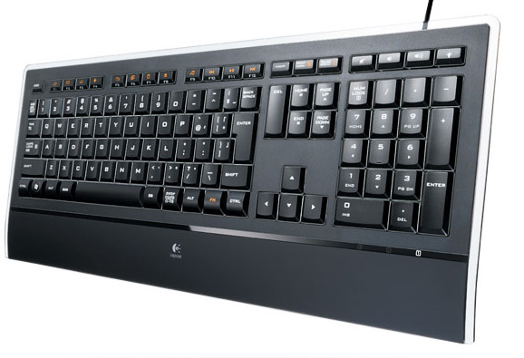

 

 

 

これまで使っていたキーボードが以前使っていたマウスコンピュータ製デスクトップパソコンについてきたもので、だんだん掠れや引っかかりを感じるようになったので初めてキーボードを購入してみました。

オークションだけど。

 

 

 

***

 

購入したのは<a class="keyword" href="http://d.hatena.ne.jp/keyword/%A5%ED%A5%B8%A5%AF%A1%BC%A5%EB">ロジクール</a>製Illuminated Keyboard、CZ-900という代物。

購入の決め手は<a class="keyword" href="http://d.hatena.ne.jp/keyword/%B2%C1%B3%CA.com">価格.com</a>で比較的高評価であったことと、有線でスリムなところ。

マウスはともかくキーボードは無線だと電池がもったいないので有線と言うことで。充電もあるけど、結局コードにつなぐのであったら有線で良いじゃないかと。

唯一の問題は値段だったのだけど、オークションで安く購入できたのでクリア－。

 

中古と言うことで箱は傷んでましたけど、中身は一つをのぞいて（ゴム足が一つない）綺麗で良い感じ。ゴム足がないこともわかっていて買ったので問題なし。

 

使ってみた感想は、薄い！静か！綺麗！

 

このキーボードの特筆すべきなのはその薄さ。仕様表によると456x9.3x190 mm。

なんと厚さ9.3mmしかないということに驚き。一般的なキーボードのサイズが3cm4cmあることを考えると非常に薄い！

 

そしてこのキーボードはノートパソコンと同じ<a class="keyword" href="http://d.hatena.ne.jp/keyword/%A5%D1%A5%F3%A5%BF%A5%B0%A5%E9%A5%D5">パンタグラフ</a>型なのでキーが薄くて静かなのがまた良い感じ。

これまでのキーボードは<a class="keyword" href="http://d.hatena.ne.jp/keyword/%A5%E1%A5%F3%A5%D6%A5%EC%A5%F3">メンブレン</a>型という一般的なキーボードのキースイッチを採用しているけども、静かなときに打ち込むとカタカタ若干うるさかったので静かなのは好印象。

ただこれまでのキーボードは4~5年使っていたのでそのキーピッチになれてしまって打ちにくい打ちにくい・・・。

特にファンクションキーは薄くなったがために見ないで場所を<a class="keyword" href="http://d.hatena.ne.jp/keyword/%C6%C3%C4%EA">特定</a>するのが若干難しい。DEL、BackSpaceの位置も違うほか、PAGEUPなどのボタンがこれまでテンキーについていたのに対し独立した関係で打ち間違えることが多いのなんの・・・。

これまでエンターキーがあったあたりがDELキーなものだから確定できずに「あれ？」って思うことも何度か。

まぁこればかりは慣れの問題なので使っていればなんとかなるかな。

 

あと、見た目もさることながらキーボード裏にライトがついていて暗いところでもキーが確認でき、それがなかなか格好良い！

また仮名文字が書かれていないキーなのですっきりとした感じです。私はローマ字打ちなので仮名文字入力しませんから全然問題なし。

 

あとキー<a class="keyword" href="http://d.hatena.ne.jp/keyword/%A5%B9%A5%C8%A5%ED%A1%BC%A5%AF">ストローク</a>が普通の<a class="keyword" href="http://d.hatena.ne.jp/keyword/%A5%D1%A5%F3%A5%BF%A5%B0%A5%E9%A5%D5">パンタグラフ</a>形式だと2.2mm程度なのにこれは<a class="keyword" href="http://d.hatena.ne.jp/keyword/%A5%E1%A5%F3%A5%D6%A5%EC%A5%F3">メンブレン</a>型と同じくらいの3.2mmなのでなかなか打ちやすい。

 

今のところ購入してよかったという印象を持てるキーボードでした。

予算が許せばマウスも換えたいかな。ちょっと古くてドライバーが64bitOSに対応せず、独自機能が使えなくなっているので・・・。
