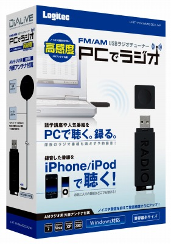

 

<a class="keyword" href="http://d.hatena.ne.jp/keyword/%CE%D3%B8%B6%A4%E1%A4%B0%A4%DF">林原めぐみ</a>のラジオ番組を聴きたかったので買ってみた。

 

 

***

中学校の頃技術の授業でつくったラジオがあったけどチューナーの反応が悪かったのでこの際買ってしまえとパソコンで録画できる<a class="keyword" href="http://d.hatena.ne.jp/keyword/LRT">LRT</a>-FMAM200UWを買ってみました。

最近聞くようになった<a class="keyword" href="http://d.hatena.ne.jp/keyword/%CE%D3%B8%B6%A4%E1%A4%B0%A4%DF">林原めぐみ</a>のラジオ番組を聴きたかったので。。

最初は<a class="keyword" href="http://d.hatena.ne.jp/keyword/%A5%B5%A5%F3%C5%C5%BB%D2">サン電子</a>のラジオチューナーを考えていたものの<a class="keyword" href="http://d.hatena.ne.jp/keyword/LRT">LRT</a>-FMAM200UWのほうが安かったし<a href="http://av.watch.impress.co.jp/docs/news/20100205_347272.html" target="_blank">こんな記事も</a>あったので変更。

入金後初めてこのチューナーの製品情報を確認したところ（バカ）、32bit版のみ対応という文字が・・・。

今使っているOSは<a class="keyword" href="http://d.hatena.ne.jp/keyword/Windows%207">Windows 7</a> Professional 64bitなので使えないかも・・・、とか思いながら到着を待つ。

箱を開けて思ったのが馬鹿にでかい<a class="keyword" href="http://d.hatena.ne.jp/keyword/USB%A5%E1%A5%E2%A5%EA">USBメモリ</a>ーという印象。購入する時点で思っていたけども、実物を見て再認識。

横幅はそこそこあるものの、ほかのUSB製品がさせなくなるほどではなさそう。

必要なソフトをインストールしていざ差し込んでみたところ<a class="keyword" href="http://d.hatena.ne.jp/keyword/%A5%C7%A5%D0%A5%A4%A5%B9%A5%C9%A5%E9%A5%A4%A5%D0">デバイスドライバ</a>ーを確認中とのバルーンが。おぉっ！とか思いながらしばらくおいてドライバのインストールが終了したというバルーンが。

64bitOSはドライバーに<a class="keyword" href="http://d.hatena.ne.jp/keyword/%C5%C5%BB%D2%BD%F0%CC%BE">電子署名</a>がないと機能しないわけですが、<a class="keyword" href="http://d.hatena.ne.jp/keyword/%A5%ED%A5%B8%A5%C6%A5%C3%A5%AF">ロジテック</a>の署名がついているのできちんとインストールできたみたい。

アプリを立ち上げたところプリセットの登録画面が表示されまして、<a href="http://www.shin-yas.com/shin.amfm.html" target="_blank">ここ</a>を参考に周波数を登録してみたところ見事スピーカーから音楽が。

32bit対応としか書いてなかったので64bitはだめかと思っていたけれども杞憂だったようです。

てか今<a class="keyword" href="http://d.hatena.ne.jp/keyword/2ch">2ch</a>の<a href="http://pc11.2ch.net/test/read.cgi/hard/1263644248/" target="_blank">スレッド</a>をみてみたら64bitで使っている人が普通にいた。見ておけばよかったかな。

肝心の音質は・・・、どうなんだろう（え

AMだと<a class="keyword" href="http://d.hatena.ne.jp/keyword/NHK">NHK</a>は非常にクリアに聞こえるのに地方局だと非常にノイズが走る・・・。まぁ家の近くに高速が走っていたり、電波の入りにくい部屋ってこともあるのだろうけど。

欠点はMP3で保存できないことかな。なぜかMonkey Audioは対応しているみたい。

とはいえMP3変換はすぐできるので別にどうってことはないですが。

 

 

追記　<a class="keyword" href="http://d.hatena.ne.jp/keyword/Windows%207">Windows 7</a>ではコントロールパネルのハードウェアとサウンドの中にあるサウンドの録音タブよりチューナーを有効化しておかないと動かないので注意。
