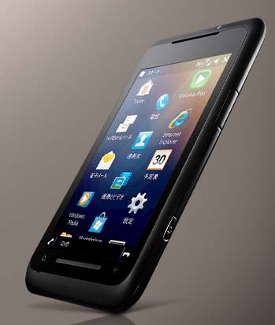

 

 

 

とうとう<a class="keyword" href="http://d.hatena.ne.jp/keyword/%A5%B9%A5%DE%A1%BC%A5%C8%A5%D5%A5%A9%A5%F3">スマートフォン</a>を買いました。

購入したのは<a class="keyword" href="http://d.hatena.ne.jp/keyword/Softbank">Softbank</a>のX02T。

 

 

 

***

 

何年も前から<a class="keyword" href="http://d.hatena.ne.jp/keyword/Windows%20Mobile">Windows Mobile</a>の<a class="keyword" href="http://d.hatena.ne.jp/keyword/%A5%B9%A5%DE%A1%BC%A5%C8%A5%D5%A5%A9%A5%F3">スマートフォン</a>をほしいと思っていた私。

それがために情報を集めるために<a class="keyword" href="http://d.hatena.ne.jp/keyword/Windows%20Mobile">Windows Mobile</a>のサイトを立ち上げたりしてましたけど、今ようやく手に入れました。

 

今回は白ROMを<a class="keyword" href="http://d.hatena.ne.jp/keyword/Yahoo%21%A5%AA%A1%BC%A5%AF%A5%B7%A5%E7%A5%F3">Yahoo!オークション</a>で競り落として購入。普通に白ROMで買うと中古のくせに4万ほどするけど、今回は新品保証付きで2万5千。まぁこんなものかと。

もう少し安く落とせたかもしれないけれど、まぁ勉強代ということで。

 

実物は何度も見ているとはいえ届いてみて再度実感したことは、非常に大きいということ。横幅は<a class="keyword" href="http://d.hatena.ne.jp/keyword/iPod%20Touch">iPod Touch</a>とほとんど同じだけども、縦幅は液晶の大きさ分やはり大きい。

4.1インチ800×480ドット<a class="keyword" href="http://d.hatena.ne.jp/keyword/WVGA">WVGA</a>ということで<a class="keyword" href="http://d.hatena.ne.jp/keyword/PSP">PSP</a>より小さいものの十分な大きさ。

 

とりあえず簡単にタッチパネルの設定、サウンド、<a class="keyword" href="http://d.hatena.ne.jp/keyword/Wi-Fi">Wi-Fi</a>の設定を終わらせておいた。

さぁ、いじるぞ！
