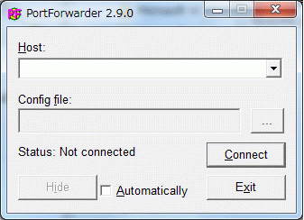
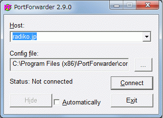
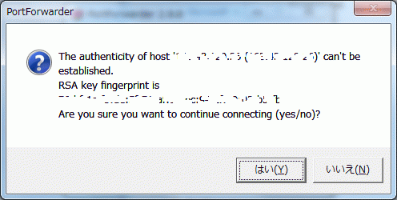
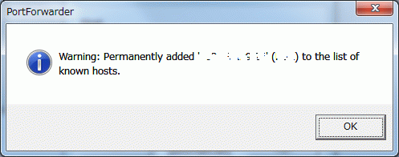
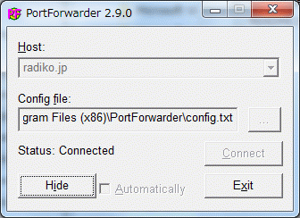

<strong>注意</strong>

追記をご覧あれ。

今年に入って始まったIP<a class="keyword" href="http://d.hatena.ne.jp/keyword/%A5%B5%A5%A4%A5%DE%A5%EB%CA%FC%C1%F7">サイマル放送</a>の<a class="keyword" href="http://d.hatena.ne.jp/keyword/radiko">radiko</a>。ノイズが入らず高音質にラジオを聴けるとあって人気も高い。

ただ、これは東京と大阪のみ聴くことができるという視聴者からしてみたら訳のわからない制限がある。（法律や広告の兼ね合いによるものだけど）

<a class="keyword" href="http://d.hatena.ne.jp/keyword/2ch">2ch</a>では一部の人が<a class="keyword" href="http://d.hatena.ne.jp/keyword/%A5%D7%A5%ED%A5%AF%A5%B7">プロクシ</a>を作ったりしてエリア外から聴けるようにしていたけど、<a class="keyword" href="http://d.hatena.ne.jp/keyword/DDoS%B9%B6%B7%E2">DDoS攻撃</a>にあったり<a class="keyword" href="http://d.hatena.ne.jp/keyword/radiko">radiko</a>側で<a class="keyword" href="http://d.hatena.ne.jp/keyword/IP%A5%A2%A5%C9%A5%EC%A5%B9">IPアドレス</a>制限をしたりしてサービス終了してしまうなどなかなか安定して使えない。

ならば自分で設置してみようじゃないかといろいろやってみた。

 

 

***

まず最初に始めたのはStoneを利用したポートフォワーディング。

<a href="http://padoo-padoo.blogspot.com/2010/03/radiko.html" target="_blank">このサイト</a>を参考にStoneを設置して動かしてみるもあえなく撃沈。うまく動かなかった。

次にxinetdを利用してみた。

いろいろいじって聴けるようになったと思ったものの、ほかの<a class="keyword" href="http://d.hatena.ne.jp/keyword/%A5%D7%A5%ED%A5%AF%A5%B7">プロクシ</a>が入っていたから聴けていただけで、実際のところは機能していなかったことが発覚。無念。

次に<a class="keyword" href="http://d.hatena.ne.jp/keyword/OpenVPN">OpenVPN</a>を入れてやってみようとしたものの、証明書など入れ方がいまいちわからず撃沈。

あきらめていたものの、たまたま今日ほかのようで検索していたら<a href="http://tomocha.net/diary/?201005a#201005043" target="_blank">このサイト</a>を発見。

<a class="keyword" href="http://d.hatena.ne.jp/keyword/SSH">SSH</a> PortForwarderというソフトを利用して<a class="keyword" href="http://d.hatena.ne.jp/keyword/radiko">radiko</a>が聴けるらしい。

まずは<a class="keyword" href="http://d.hatena.ne.jp/keyword/SSH">SSH</a> PortForwarderをダウンロードして適当な場所に展開。今回はProgram Filesに展開した。

これが起動したときの画面。

ここでConfig fileの･･･ボタンをクリックしダイアログを開いて、設定ファイルを読み込む。

設定ファイルはサイトに書かれているものをコピペして(追記 最新版はこの記事の下)、HostNameとUserを変えるだけ。

読み込んだらHostの▽をクリックして<a class="keyword" href="http://d.hatena.ne.jp/keyword/radiko.jp">radiko.jp</a>を選択（デフォルトの場合）

選択したらConnectをクリック。

<a class="keyword" href="http://d.hatena.ne.jp/keyword/SSH">SSH</a>のUnknwon Hostがどうのとでるのではいをクリック。

OKをクリック。

指定したユーザのパスワードを入力してOKをクリック

あとはHostファイルに

 

 

<a class="keyword" href="http://d.hatena.ne.jp/keyword/127.0.0.1">127.0.0.1</a>  <a class="keyword" href="http://d.hatena.ne.jp/keyword/radiko">radiko</a>.smartstream.ne.jp

<a class="keyword" href="http://d.hatena.ne.jp/keyword/127.0.0.1">127.0.0.1</a>  www.<a class="keyword" href="http://d.hatena.ne.jp/keyword/radiko.jp">radiko.jp</a> <a class="keyword" href="http://d.hatena.ne.jp/keyword/radiko.jp">radiko.jp</a>

 

と書いておけば何も間違えていなければポートフォワーディングされて無事にエリア外でも<a class="keyword" href="http://d.hatena.ne.jp/keyword/radiko">radiko</a>を聴くことができるはず。

無論サーバが東京もしくは大阪に無ければ聴けないけどね。

<a class="keyword" href="http://d.hatena.ne.jp/keyword/XREA">XREA</a>サーバなら大阪の放送が聴けるのかな。でも共用サーバーだと他の人に迷惑がかかる可能性もあるからおすすめはしないかな。

これならサーバの設定をいじることなく（<a class="keyword" href="http://d.hatena.ne.jp/keyword/SSH">SSH</a>サーバが動いていなかったり、適切なユーザがない場合は除く）<a class="keyword" href="http://d.hatena.ne.jp/keyword/radiko">radiko</a>に接続ができて便利。

後は対策されないことを祈る。

追記＠19:45

このままだと<a class="keyword" href="http://d.hatena.ne.jp/keyword/radiko">radiko</a>に接続しないまま一定時間がたつと<a class="keyword" href="http://d.hatena.ne.jp/keyword/SSH">SSH</a>が切断されてしまうことに気づいた。

これを迂回するには設定ファイルに

 

<blockquote style="text-align: left;">TcpKeepAlive yes</blockquote>

ServerAliveCountMax 5

ServerAliveInterval 60

なんて呪文を書いておくと切断されない予感。

さらに追記＠07/11

ＸＲＥＡで試してみたらやはり大阪の放送が聴けた。

共用サーバではほかのユーザーに迷惑がかかりかねないのでやるならば大阪にサーバを置いているＶＰＳや専用サーバを利用するしかないかな。

追記×3

ともちゃ日記さんところの設定だと繋がらなくなってしまった。

<a href="http://toki.2ch.net/test/read.cgi/am/1291251411/87" target="_blank">２ちゃんねるのレス</a>で有効な<a class="keyword" href="http://d.hatena.ne.jp/keyword/IP%A5%A2%A5%C9%A5%EC%A5%B9">IPアドレス</a>を知ることができたので、私の今の設定と一緒に貼り付け。

 

 

 Host <a class="keyword" href="http://d.hatena.ne.jp/keyword/radiko.jp">radiko.jp</a>（PortForwarderに表示されるタイトル）

HostName サーバーの<a class="keyword" href="http://d.hatena.ne.jp/keyword/IP%A5%A2%A5%C9%A5%EC%A5%B9">IPアドレス</a>

Port <a class="keyword" href="http://d.hatena.ne.jp/keyword/SSH">SSH</a>のポート番号

User ユーザー名

TcpKeepAlive yes

ServerAliveCountMax 15

ServerAliveInterval 80

# <a class="keyword" href="http://d.hatena.ne.jp/keyword/radiko">radiko</a>.smartstream.ne.jp

LocalForward 1935 219.103.34.224:1935

LocalForward 80 219.103.34.224:80

# <a href="http://www.radiko.jp">www.radiko.jp</a>

LocalForward 80 219.103.34.226:80

LocalForward 443 219.103.34.226:443

LocalForward 8935 219.103.34.226:8935

LocalForward 8936 219.103.34.226:8936

LocalForward 8937 219.103.34.226:8937

 
