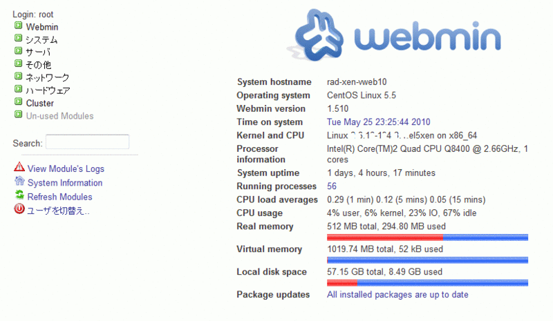
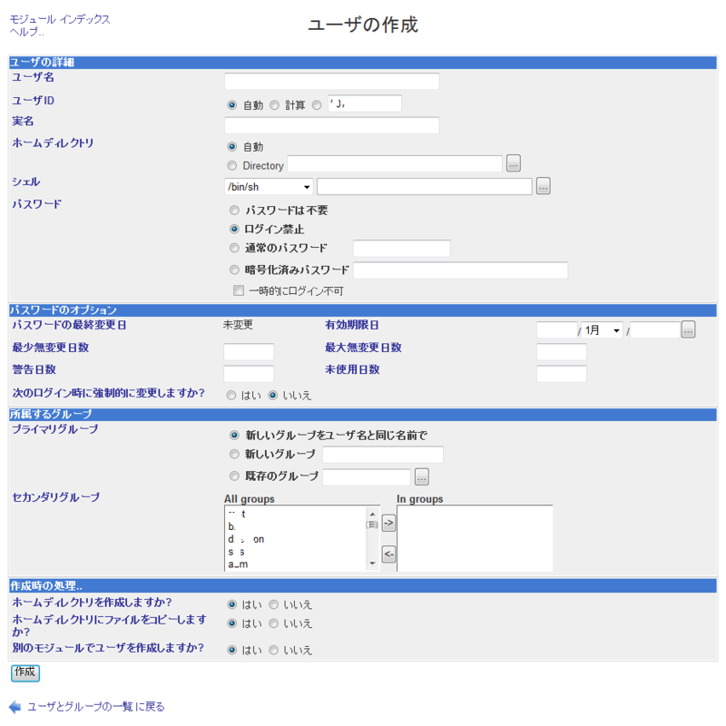

前回の通り、VPSを借りた。

借りたのは[SaaSes](http://www.saases.jp/)。

新サービス登場直後ということもありある程度は時間がかかるかと思っていたけどそれほどかからずに開設が完了したというメールが届いた。

パスワードなどは添付されていたPDFファイルに書かれている。


SaaSesはサーバのコントロールパネルとしてWebminを採用している。

 

これは本来はコンソール上から設定しなければならないApacheなどの設定の大半をGUI上で編集することができるサービス。

勉強の意味では、あまり使わない方が良いのだけど、非常に楽なので今後設定はこれであらかた行う。

PDFに載っていたIDとパスワードでWebminにグイン。

まずはこのWebminのパスワードを変更する。初期設定だと覚えていられないので。

左のメニューからWebmin→Webmin ユーザを開きWebminユーザのテーブル内にあるrootをクリック。

パスワードのコンボボックスから変更:を選択した後新しいパスワードを入力し保存をクリック。これで新しいパスワードが設定される。

次はSSHの設定。

これをしておかないとセキュリティ上の問題があるのですぐに設定を変更する。

まずはユーザを作成する。

今後[SSH](http://d.hatena.ne.jp/keyword/SSH)でログインする際はここで作るユーザを利用する。rootでいきなり入れるようにすると万が一攻撃などで破られたとき悲惨。

左メニュー システム→ユーザーおよびグループを開き、新しいユーザーを作成をクリック。

 

ユーザ名に作りたいユーザの名前を（今回はhogehoge）、パスワードは通常のパスワードにチェックを入れて入力。

通常のパスワードとはいえ、保存する際暗号化されるので安全、なはず。

このときwheelグループに登録しておく。ここにいれておくとsuコマンドで簡単にrootに昇格できる。

次にSSHのログインに関する設定を。

左メニュー→SSHサーバの認証をクリック。

空のパスワードでのログインを制限するをはいにチェック。ルートでのログインを許可するのダイアログボックスをいいえにする。

終わったら保存をクリックして、SSHサーバを再起動する。

次にhost.allowの設定を変更。

左メニュー ネットワーク→TCP Wrappersを開き、Add a new rule.をクリック。

ServiceはALLにチェック。RemoteHostの空欄のチェックを入れて、空欄に自身のIPアドレスを入力。

これで後述するdenyhostsにひっかからなくなるはず。次はrootになれるユーザーの指定。

wheelグループに属しているユーザーのみrootに昇格できるようにする。

ターミナル（WindowsならTeraTermやPuttyなどのソフトを利用）を開き、SSHでログイン。

suコマンドでrootに昇格してから

`vi /etc/login.defs`

SU_WHEEL_ONLY yes を最終行に追加。

`vi /etc/pam.d/su`

`#auth required pam_wheel.so use_uid` の#を外す。

これでwheelグループに属していないユーザーはsuコマンドを利用しても昇格できない。（要再起動）

次に`denyhosts`をインストールする。これはSSHブルートフォースのように短時間にSSHにログインを仕掛けてくるものを片っ端からhost.denyに登録するソフト。

これはパッケージに入っていないので自分でインストールする必要がある。

ただ、通常のレポジトリには登録されていないので自分でコンパイルするか、野良レポジトリを利用する必要がある。  
今回はRPMforgeレポジトリを登録し、yumでインストールする。

まずはyum-prioritiesを導入する。これを入れることでリポジトリの優先度を指定でき、標準リポジトリのパッケージがRPMforgeのパッケージで上書きされてしまわないようになる。

```
yum -y install yum-priorities

vi /etc/yum.repos.d/CentOS-Base.repo
```

各レポジトリにpriority=1を追加。

これでOK。

RPMforgeは
```
rpm --import http://dag.wieers.com/rpm/packages/RPM-GPG-KEY.dag.txt

rpm -ivh http://apt.sw.be/redhat/el5/en/i386/RPMS.dag/rpmforge-release-0.3.6-1.el5.rf.i386.rpm
```

これでいいはず。

後はお好みで

```
yum -y install yum-fastestmirror
```

を入れておくのも良い。

denyhostsはpythonを利用したものなので

```
yum list installed | grep python
```

で必要なソフト（python、python-devel）が入っているか確認する。

入っていたなら

```
yum -y --enablerepo=rpmforge install denyhosts
```

でdenyhostsをインストール。

denyhostsの設定を行う。

```
vi /etc/denyhosts/denyhosts.cfg
```

PURGE_DENYを1hくらいにしておくと良いかと。（1hは1時間）

ついでにいらないものの削除。

SaaSesはプリインストールでECCubeなどが入っている。[これはちょっと邪魔なので削除する](http://www.saases.jp/suport/suport005.html#q05_11)。 

削除するものは/optに入っているもの。ここにはECCubeやphpMyAdminなどのプリインストールされているものが入っている。 

このうち必要なもの以外を削除する。 

これを削除した後、`/etc/httpd/conf.d/` にある該当するconfファイルを削除。私の場合はeccube.confとfdoc.confを削除した。 

また、ECCubeはMySQLを利用しているのでWebminでいらないデータベースを削除。

これで削除は完了、なはず。

最後に時間あわせを。

VPSはホストと時間合わせをしているので基本的に時間あわせは必要ない。はずだけど、ホストが狂うことだって考えられるので一応こちらで時間あわせするようにする。

Webminの左メニュー→システム→予定済みCron作業→新しいスケジュールのCronジョブを作成

cron ジョブを実行するユーザをrootにして、コマンドに

```
/usr/sbin/ntpdate [NTPサーバーのIPアドレス]
```

を入力。実行する時間は適当に。

### 参考にしたサイト

- [CentOS5初期設定 - CentOSで自宅サーバー構築](http://centossrv.com/centos5-init.shtml)
- [RPMForgeの設定 - radio-keiosの日記](http://d.hatena.ne.jp/radio-keios/20080521/1211389508)
- [RPMforgeリポジトリ導入(RPMforge) - CentOSで自宅サーバー構築](http://centossrv.com/rpmforge.shtml)
- [denyhostsを設定してみよう](http://domomo.dip.jp/makeserver/denyhosts.html)
- [セキュアなサーバを作るために最低限やっておくこと: エスキュービズム ラボ Blog](http://labs.s-cubism.com/blog/2009/06/19/120/)