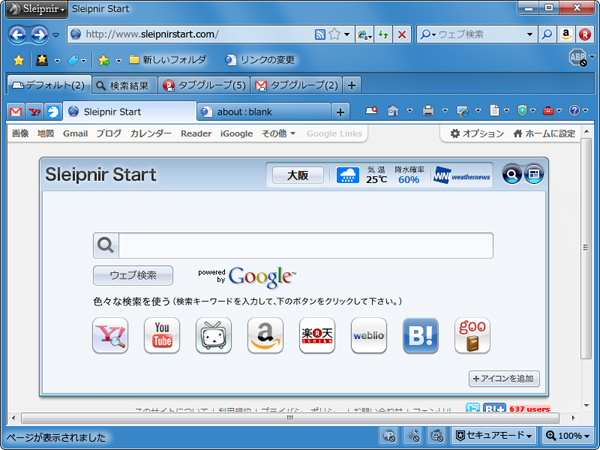

 

私がメインで使っているブラウザは<a class="keyword" href="http://d.hatena.ne.jp/keyword/Firefox">Firefox</a>でも<a class="keyword" href="http://d.hatena.ne.jp/keyword/Google%20Chrome">Google Chrome</a>でも<a class="keyword" href="http://d.hatena.ne.jp/keyword/Safari">Safari</a>でもなく<a class="keyword" href="http://d.hatena.ne.jp/keyword/Sleipnir">Sleipnir</a>。

初めて使った<a class="keyword" href="http://d.hatena.ne.jp/keyword/%A5%BF%A5%D6%A5%D6%A5%E9%A5%A6%A5%B6">タブブラウザ</a>と言うこともあってVer.1.5の頃から、<a class="keyword" href="http://d.hatena.ne.jp/keyword/%A5%BD%A1%BC%A5%B9%A5%B3%A1%BC%A5%C9">ソースコード</a>盗難事件を経て現在まで利用しているのだけど、最近更新が恐ろしく鈍くなってきていた。

少々挙動が怪しく固まってしまうこともあって（test版を利用するなとも言われそうだけど）、フラストレーションがたまることしきりだったのだけど、ほかのブラウザに買えるという選択肢はなかった。

というのも<a class="keyword" href="http://d.hatena.ne.jp/keyword/Sleipnir">Sleipnir</a>の<a class="keyword" href="http://d.hatena.ne.jp/keyword/%A5%D7%A5%E9%A5%B0%A5%A4%A5%F3">プラグイン</a>、HeadlineReaderがとても便利だったので。

 

そんなわけで日々時たま固まる<a class="keyword" href="http://d.hatena.ne.jp/keyword/Sleipnir">Sleipnir</a>に悪戦苦闘しながら次の更新を待ち続けていたのだけど、ようやくメジャーアップデートがあるとかどうとか。

 

 

 

***

 

<a href="http://www.forest.impress.co.jp/docs/news/20101018_400833.html" target="_blank">窓の杜</a>などで取り上げられているけれど、現在<a class="keyword" href="http://d.hatena.ne.jp/keyword/Sleipnir">Sleipnir</a> 3を開発中らしい。

現時点での情報をまとめると、

 

<blockquote>

・<a class="keyword" href="http://d.hatena.ne.jp/keyword/FenrirFS">FenrirFS</a>と連携してお気に入りをラベルで管理できるようになる

・タブ機能が強化され、複数のタブをグループ管理できるようになる

・<a class="keyword" href="http://d.hatena.ne.jp/keyword/Gecko">Gecko</a><a class="keyword" href="http://d.hatena.ne.jp/keyword/%A5%D6%A5%E9%A5%A6%A5%B8%A5%F3%A5%B0">ブラウジング</a>が強化され、<a class="keyword" href="http://d.hatena.ne.jp/keyword/Firefox">Firefox</a>のアドインも利用できるようになる

・デザインが一新され、よりシンプルに

</blockquote>

 

とのこと。まだほかにも新機能を搭載するらしい。

 

情報がまだ少ないのでどれくらい変わるのかはわからないけれど、ほかのブラウザがぐんぐん成長するのに対して<a class="keyword" href="http://d.hatena.ne.jp/keyword/Sleipnir">Sleipnir</a>はどんどん隅に追いやられている印象だったのでなんとしてもここで盛り返してほしいところ。

 

そんなわけで新しい<a class="keyword" href="http://d.hatena.ne.jp/keyword/Sleipnir">Sleipnir</a>とFenrir社に望むことをあげてみた。

 

・デザインはシンプルを求めすぎないで

最近は<a class="keyword" href="http://d.hatena.ne.jp/keyword/IE">IE</a>、<a class="keyword" href="http://d.hatena.ne.jp/keyword/Chrome">Chrome</a>なども<a class="keyword" href="http://d.hatena.ne.jp/keyword/%A5%C4%A1%BC%A5%EB%A5%D0%A1%BC">ツールバー</a>やメニューバーがシンプルになってきているけれど、過度にシンプルさを追い求めるとかえって使いにくい。

最近の流れと逆行した意見だとは認識してるけど、個人的には今の<a class="keyword" href="http://d.hatena.ne.jp/keyword/Sleipnir">Sleipnir</a>程度がちょうどいいので、選択肢として残しておいてほしい。

 

・設定ファイル、フォルダが多すぎるので何とかしてほしい

現在の<a class="keyword" href="http://d.hatena.ne.jp/keyword/Sleipnir">Sleipnir</a>は設定ファイルが多すぎる。Overrideまで含めるともはや何が何だかわからなくなる。<a class="keyword" href="http://d.hatena.ne.jp/keyword/SQLite">SQLite</a>に設定ファイルを全部ぶちこんで、設定エディタなどを使って編集できるようにならないものか。

<a class="keyword" href="http://d.hatena.ne.jp/keyword/Firefox">Firefox</a>みたいな物が理想。一般的な設定はオプションから、詳細な設定は設定エディタを利用って感じで。

 

・<a class="keyword" href="http://d.hatena.ne.jp/keyword/SDK">SDK</a>の公開

確か以前出すと言っていたはずなのにうやむやになっていた<a class="keyword" href="http://d.hatena.ne.jp/keyword/SDK">SDK</a>。開発者を呼び戻すためにも<a class="keyword" href="http://d.hatena.ne.jp/keyword/SDK">SDK</a>を公開してほしい。

 

・<a class="keyword" href="http://d.hatena.ne.jp/keyword/%A5%D7%A5%E9%A5%B0%A5%A4%A5%F3">プラグイン</a>、<a class="keyword" href="http://d.hatena.ne.jp/keyword/%A5%B9%A5%AF%A5%EA%A5%D7%A5%C8">スクリプト</a>公開の場を設ける

今は有志によってSAHKという<a class="keyword" href="http://d.hatena.ne.jp/keyword/%A5%D7%A5%E9%A5%B0%A5%A4%A5%F3">プラグイン</a>公開の場があるけれど、やはり公式が運営する公開の場があった方がありがたい。

 

・<a class="keyword" href="http://d.hatena.ne.jp/keyword/Webkit">Webkit</a>エンジンの採用、トリプルエンジン

これはまぁそこまでほしいというわけではないのだけど、<a class="keyword" href="http://d.hatena.ne.jp/keyword/Lunascape">Lunascape</a>みたいに<a class="keyword" href="http://d.hatena.ne.jp/keyword/Webkit">Webkit</a>も利用できるようになると作成中のサイトの動作確認の時に楽。

 

・<a class="keyword" href="http://d.hatena.ne.jp/keyword/Firefox">Firefox</a>のアドインをTridentでも

これも無理っぽいけどダメ元で。<a class="keyword" href="http://d.hatena.ne.jp/keyword/Sleipnir">Sleipnir</a>をずっと利用してきているけれど、やはりFxのアドインは魅力。特に<a class="keyword" href="http://d.hatena.ne.jp/keyword/Adblock">Adblock</a>とか<a class="keyword" href="http://d.hatena.ne.jp/keyword/Firebug">Firebug</a>は喉から手が出るほどほしい。

 

・徹底的なバグ取り

現状の<a class="keyword" href="http://d.hatena.ne.jp/keyword/Sleipnir">Sleipnir</a>は少々バグが多い気がする。何かちょっと重い動作をしているなと思うと固まってしまうこともしばしば。フィードバックウィンドウが出ることなく終了してしまうこともしばしば。

安定したものがほしい。

 

・マルチスレッド、マルチプロセス

一つのタブが重いとすべての動作が重くなり、固まってしまうのは残念すぎる。

 

・とことん軽く

どんなに性能が良くても動作動作が重いと使う気になれない。Sleipnir1.66の頃のような軽さをもう一度よみがえらせてほしい。

 

・サポートの拡充

現状のフォーラムや<a class="keyword" href="http://d.hatena.ne.jp/keyword/wiki">wiki</a>は正直いって余り機能していない感じ。これじゃユーザーが逃げます。なんとかしてほしいところ。

というか正直「上級者向け」というキャッチフレーズはあまり意味を成していないような。

 

・開発進捗度を公開してほしい

今Fenrir社は何をしているのか、少しでもいいから公開してほしい。以前は<a class="keyword" href="http://d.hatena.ne.jp/keyword/%A3%B2%A4%C1%A4%E3%A4%F3%A4%CD%A4%EB">２ちゃんねる</a>にも泰幸社長がｸﾏｰとかいいながら書き込んでいたのに最近は出てこないし。

たばさんもtest版公開の時くらいしかこないし。

 

あと<a class="keyword" href="http://d.hatena.ne.jp/keyword/%A5%DE%A5%EB%A5%C1%A5%D7%A5%E9%A5%C3%A5%C8%A5%D5%A5%A9%A1%BC%A5%E0">マルチプラットフォーム</a>とか<a class="keyword" href="http://d.hatena.ne.jp/keyword/iPhone">iPhone</a>、WM、<a class="keyword" href="http://d.hatena.ne.jp/keyword/Android">Android</a>などにも進出してほしいところだけど、そこまでいくとリソースが奪われて中途半端になりそうなのでとりあえず今は<a class="keyword" href="http://d.hatena.ne.jp/keyword/Sleipnir">Sleipnir</a> 3に注力してほしいところ。

 

 

 

なんか色々書いたけど、とりあえず<a class="keyword" href="http://d.hatena.ne.jp/keyword/Sleipnir">Sleipnir</a>の開発がちゃんと進んでいることを確認できたのが一番うれしい。

最近は<a class="keyword" href="http://d.hatena.ne.jp/keyword/Grani">Grani</a>のタイアップくらいしかネタがなかったのでどうなってるのかと思った。<a class="keyword" href="http://d.hatena.ne.jp/keyword/%C1%EB%A4%CE%C5%CE">窓の杜</a>を装った<a class="keyword" href="http://d.hatena.ne.jp/keyword/Sleipnir">Sleipnir</a> 3のがせネタに踊らされるくらい情報がなかったし。

今後も使い続けたいと思うので期待しています。

 

 

 

ところでTridentと決別したとかブログや<a class="keyword" href="http://d.hatena.ne.jp/keyword/Twitter">Twitter</a>に書いている人がいたけど、Tridentも使うんだよね・・・？
