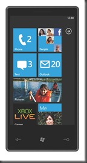

<a class="keyword" href="http://d.hatena.ne.jp/keyword/Windows%20Phone%207">Windows Phone 7</a>を買いました。まぁ買ったのは2ヶ月も前の話なんですが（おい

 

***

 

もちろん日本ではまだ未発売の端末なので通常ルートでは購入できるはずもなく。  <a class="keyword" href="http://d.hatena.ne.jp/keyword/Twitter">Twitter</a>のフォロアーの方々は海外から直輸入している方々ばかりなのですが、少々面倒だったのでたまたま<a class="keyword" href="http://d.hatena.ne.jp/keyword/%A5%E4%A5%D5%A5%AA%A5%AF">ヤフオク</a>に出ていたHTC HD7を購入しました。

ただそのHD7がなかなかくせ者。というのも元の持ち主の方曰く香港で買ってきたものとのことで、中国語表記だったのです。設定で変えられるかと思いきや設定における表示言語はEnglish固定。  どうやら言語リソースをいじって独自に中国語表記にしたものだったようで・・・。まいったまいった・・・。

まぁそれ以外には特に問題は無い感じだったので音楽入れてみたりとかしていたのですがNoDoアップデートというOSアップデートで問題発生。  ほかの方々がどんどん<a class="keyword" href="http://d.hatena.ne.jp/keyword/Twitter">Twitter</a>で更新報告をされている中、私は告知そのものは下手したら日本で一番早く来たんじゃないかと思うほど早く来たのになぜかエラーで更新できず・・・。

いろいろ調べたところ中国語フォーラムでも同じような報告があったのでこれは前述の独自チューニングによるものだろうと推測。このまま更新できないのかと思っていたところ<a href="http://nanapho.jp/" target="_blank">ななふぉ</a>さんのサイトでChevronWP7.Updaterという非公式アップデートツールを知り早速試してみたところ無事NoDoアップデート完了！

喜んでいたのもつかの間おなじく<a href="http://nanapho.jp/archives/2011/04/chevronwp7-updater-pulled-breaks-future-updates/" target="_blank">ななふぉさん</a>にこんな記事が。非公式アップデートツールを利用すると将来的なアップデートが受けられなくなるなんて話がｏｒｚ  ただ私の場合一度NoDoにアップデートした後なぜか<a class="keyword" href="http://d.hatena.ne.jp/keyword/Zune">Zune</a>でアップデート告知が表示され、そちらのアップデートも行ってみたところ普通に動いたのでたぶん大丈夫なはず・・・。

NoDoでMMSが使えるようになったという話も聞いたのでちょっといろいろ試してみる夢を見ました。

まず私が契約している<a class="keyword" href="http://d.hatena.ne.jp/keyword/SoftBank">SoftBank</a>の銀色SIMが利用できるかどうか。<a class="keyword" href="http://d.hatena.ne.jp/keyword/iPhone">iPhone</a>用の黒SIMを使ってみた夢を見た人は何人かいるものの銀SIMを使った夢を見た人は今のところ知らない。  裏蓋を外して<a class="keyword" href="http://d.hatena.ne.jp/keyword/SIM%A5%AB%A1%BC%A5%C9">SIMカード</a>を差し込み電源を入れたところちゃんと認識され、HTC製アプリのConnection Setupが<a class="keyword" href="http://d.hatena.ne.jp/keyword/%BC%AB%C6%B0%C5%AA">自動的</a>に起動してSoftBankSIMと判定、勝手に設定してくれました。  たぶんほかのメーカーの場合類似アプリがないと思うので自分でAPNなどの設定を行う必要があるかと。  銀SIMなら

<blockquote>

APN open.<a class="keyword" href="http://d.hatena.ne.jp/keyword/softbank">softbank</a>.ne.jp  ユーザ名 opensoftbank  パスワード 「open.<a class="keyword" href="http://d.hatena.ne.jp/keyword/softbank">softbank</a>.ne.jp pass」みたいな感じで<a class="keyword" href="http://d.hatena.ne.jp/keyword/%A5%B0%A5%B0%A4%EB">ググる</a>

</blockquote>

を設定すれば動くかな？  一応確認したところ私の環境では<a class="keyword" href="http://d.hatena.ne.jp/keyword/%A5%D1%A5%B1%BB%E0">パケ死</a>にすることはないみたい。

というわけで一番試してみたかったMMSを試すことに。メールを送ってみたところ受信通知が！  ハブを開いたところ確かに自分が送ったメールが表示されている！

しかしいざ開こうとすると開こうとする動作はあるものの元の画面に戻ってしまうorz  何度かやってみてもだめだった。MMSの設定ができていなかったのか、WP7の問題なのかは不明だけれど、現状では使うことはできないみたい。残念。

という夢を見てました。もちろん技適マークを取得していない端末でこんなことしたら電波法違反なので（ry
