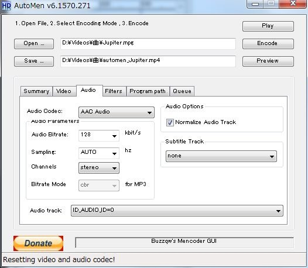

地デジチューナーのPT2を購入以来音楽番組などの好きな部分だけ切り取って保存していたのだけれど地デジファイルそのままだと4分で500MBとかはざらにある。さすがにちょっとハードディスク容量を圧迫してきたので<a class="keyword" href="http://d.hatena.ne.jp/keyword/%A5%A8%A5%F3%A5%B3%A1%BC%A5%C9">エンコード</a>しようと思っていたところいいソフト発見。

 

***

 

見つけたのはAutoMenというソフト。詳しくは<a title="MencoderをGUIで簡単に使えるフリーソフト、AutoMen ぼくんちのTV 別館" href="http://freesoft.tvbok.com/freesoft/encode/mencoderguiautomen.html" target="_blank">このサイト</a>を読んだ方がわかりやすいかも。（丸投げ  このサイトによれば<a class="keyword" href="http://d.hatena.ne.jp/keyword/Windows%207">Windows 7</a>では不具合が多発しているとのことだったけど私の環境方は特に問題は起きなかった。

とりあえず<a href="http://forum.doom9.org/showthread.php?p=1018336" target="_blank">ここ</a>から必要なファイルをダウンロード。Full packageっていうのをDL,展開してからUpdateでDLした実行形式ファイルを上書きすればいいみたい。

以下は私の場合の設定。

動画を読み込むとPossible Telecine pattern found.というウィンドウが出るけどたぶんこれは「はい」でいいかな。フレームレートが減るみたいだけど。

この画面で画質などの設定を行うみたい。  Source FormatのWidth/Heightは縦横のサイズを指定するみたいだけど、<a class="keyword" href="http://d.hatena.ne.jp/keyword/%B4%F0%CB%DC%C5%AA">基本的</a>に動画ファイル読み込み時に入れてくれる。  Target FormatのEncode withで<a class="keyword" href="http://d.hatena.ne.jp/keyword/%A5%A8%A5%F3%A5%B3%A1%BC%A5%C9">エンコード</a>形式の設定。私はx264のMP4にした。  Pass to doは何回<a class="keyword" href="http://d.hatena.ne.jp/keyword/%A5%A8%A5%F3%A5%B3%A1%BC%A5%C9">エンコード</a>処理するかみたい。2passの方が時間はかかるけどたぶん高画質になる。  Presetは左に行くほど処理が早く画質が悪い。右はその逆。まぁ中間あたりで十分な気がする。  Video Optionsはファイルサイズ指定。Video Bitrateに入れてもなぜかうまく動かない。下ののKeep inにファイルサイズを指定する方式みたい。  アニメの場合<a class="keyword" href="http://d.hatena.ne.jp/keyword/%A5%D3%A5%C3%A5%C8%A5%EC%A1%BC%A5%C8">ビットレート</a>は低くてもいい気がする。2～4Mbps位かな。実写はそれぞれ違うかも。

Videoタブで動画のリサイズを行うらしい。私は<a class="keyword" href="http://d.hatena.ne.jp/keyword/%B4%F0%CB%DC%C5%AA">基本的</a>に<a class="keyword" href="http://d.hatena.ne.jp/keyword/%A5%D5%A5%EBHD">フルHD</a>のまま<a class="keyword" href="http://d.hatena.ne.jp/keyword/%A5%A8%A5%F3%A5%B3%A1%BC%A5%C9">エンコード</a>するのでAllow Resizeのチェックを外す。

<a href="http://pandora.thty.net/wp-content/uploads/2011/04/AutoMen_3.jpg"> </a>

Audioタブは音声の変換設定。Audio CodecでMP3や<a class="keyword" href="http://d.hatena.ne.jp/keyword/AAC">AAC</a>などに変えられるけど私の場合は<a class="keyword" href="http://d.hatena.ne.jp/keyword/AAC">AAC</a>にした。  Bitrateはお好みで。<a href="http://pandora.thty.net/wp-content/uploads/2011/04/AutoMen_4.jpg"> </a>

Filtersタブは名前そのままフィルターの設定を行うみたい。  Denoise Levelでフィルターの度合いを指定できるみたいだけど、私はNoneにしておいた。  Select Encoderなのだけど、<a class="keyword" href="http://d.hatena.ne.jp/keyword/Mencoder">Mencoder</a>はx264noMP4形式に対応していないみたい。

後は上のEncodeをクリックすれば<a class="keyword" href="http://d.hatena.ne.jp/keyword/%A5%A8%A5%F3%A5%B3%A1%BC%A5%C9">エンコード</a>してくれる。  ちなみにQueueタブで複数動画を一括<a class="keyword" href="http://d.hatena.ne.jp/keyword/%A5%A8%A5%F3%A5%B3%A1%BC%A5%C9">エンコード</a>してくれるみたい。やったことないけれど。

参考にしたサイト  ・<a class="keyword" href="http://d.hatena.ne.jp/keyword/Mencoder">Mencoder</a>を<a class="keyword" href="http://d.hatena.ne.jp/keyword/GUI">GUI</a>で簡単に使える<a class="keyword" href="http://d.hatena.ne.jp/keyword/%A5%D5%A5%EA%A1%BC%A5%BD%A5%D5%A5%C8">フリーソフト</a>、AutoMen  <a href="http://freesoft.tvbok.com/freesoft/encode/mencoderguiautomen.html">http://freesoft.tvbok.com/freesoft/encode/mencoderguiautomen.html</a>  ・AutoMenで<a class="keyword" href="http://d.hatena.ne.jp/keyword/MPEG-4">MPEG-4</a> AVCへ高速変換  <a href="http://www.katch.ne.jp/~kakonacl/douga/automen/automen.html">http://www.katch.ne.jp/~kakonacl/douga/automen/automen.html</a>  ・覚書automen | ＊燃えるゴミの日＊徒然に戯言  <a href="http://waka-waka.jugem.jp/?eid=565">http://waka-waka.jugem.jp/?eid=565</a>
