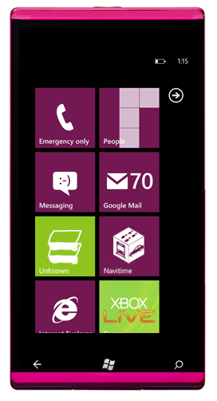

 

<a class="keyword" href="http://d.hatena.ne.jp/keyword/%A5%B9%A5%C6%A5%A3%A1%BC%A5%D6%A1%A6%A5%D0%A5%EB%A5%DE%A1%BC">スティーブ・バルマー</a>CEOがクリスマスシーズンに向けて如何の斯うの言ってたからまだまだ日本での発売は先だろうなとか思ってたのに！（上の画像は<a href="http://nanapho.jp/archives/2011/07/ntt-docomo-maybe-no-plan-for-windows-phone-this-fall/" target="_blank">つやてざさんがつくったもの</a>）

 

***

 

 

 

今日（11/07/16）の午前2時頃という意味のわからない時間に掲載された<a href="http://www.nikkei.com/news/headline/article/g=96958A9C93819696E3E7E297E68DE3E7E2E5E0E2E3E38698E3E2E2E2" target="_blank">日本経済新聞の記事</a>によれば<a class="keyword" href="http://d.hatena.ne.jp/keyword/au">au</a>が8月末頃に<a class="keyword" href="http://d.hatena.ne.jp/keyword/Windows%20Phone%207">Windows Phone 7</a>端末を発売するという情報が。報道によれば<a class="keyword" href="http://d.hatena.ne.jp/keyword/%C9%D9%BB%CE%C4%CC%C5%EC%BC%C7%A5%E2%A5%D0%A5%A4%A5%EB%A5%B3%A5%DF%A5%E5%A5%CB%A5%B1%A1%BC%A5%B7%A5%E7%A5%F3%A5%BA">富士通東芝モバイルコミュニケーションズ</a>が製造する端末で端末名は「IS12T」。3.7インチの液晶ディスプレイを搭載した防水仕様とのことで、3～4万円程度とのこと。

 

なんとなんと日本初どころか世界に先駆けて「Mango」がのったWP7端末が発売されることに！

<a class="keyword" href="http://d.hatena.ne.jp/keyword/au">au</a>いったいどうしたｗ

 

<a class="keyword" href="http://d.hatena.ne.jp/keyword/Android">Android</a> <a class="keyword" href="http://d.hatena.ne.jp/keyword/au">au</a>なんて広告を全面的に出しているのにまさか<a class="keyword" href="http://d.hatena.ne.jp/keyword/Windows">Windows</a> Phoneにも手を出すとは思っても無かったのでびっくり。いや、まぁこれまでにも幾度となく<a class="keyword" href="http://d.hatena.ne.jp/keyword/au">au</a>で出るというような話はあったものの噂の域を出なかったわけで。曲がりなりにも新聞社による正式な記事と言うことで信憑性は結構高いはず。聞くところによると来週あたりａｕの会見があるという話なので詳細なスペックが公表されることに期待。<strong>ジャイロ載るよね！？</strong>

 

ただ私は<a class="keyword" href="http://d.hatena.ne.jp/keyword/%A5%BD%A5%D5%A5%C8%A5%D0%A5%F3%A5%AF%A5%E2%A5%D0%A5%A4%A5%EB">ソフトバンクモバイル</a>ユーザーなので購入することができず・・・。家族割引等の関係で<a class="keyword" href="http://d.hatena.ne.jp/keyword/MNP">MNP</a>も無理だしね。ちなみにドコモはどうやら<strong><a href="http://nanapho.jp/archives/2011/07/ntt-docomo-maybe-no-plan-for-windows-phone-this-fall/" target="_blank">今のところださない</a></strong>みたい。

 

 

 

さて、一番気になるのは日本で<a class="keyword" href="http://d.hatena.ne.jp/keyword/Windows">Windows</a> Phoneが売れるかと言うこと。

今のところ海外でのシェアはWP7端末が発売されているにもかかわらず横ばいもしくは低下気味。聞くところによれば店員が<a class="keyword" href="http://d.hatena.ne.jp/keyword/Android">Android</a>をプッシュしてきてWP7をおすすめしないのだとか。。。そもそも店員がWP7についてよくわかってないというのもあるようでorz

また、現段階の端末に載っているバーションだとちょっと波及性が弱いというのもあるかも。でもその点に置いてはMangoで払拭していると言っても過言ではないんじゃないかな。

日本市場では<a class="keyword" href="http://d.hatena.ne.jp/keyword/iPhone">iPhone</a>はともかく<a class="keyword" href="http://d.hatena.ne.jp/keyword/Android">Android</a>だと全部入り端末が人気なので<a class="keyword" href="http://d.hatena.ne.jp/keyword/%A5%EF%A5%F3%A5%BB%A5%B0">ワンセグ</a>も<a class="keyword" href="http://d.hatena.ne.jp/keyword/%A4%AA%A5%B5%A5%A4%A5%D5%A5%B1%A1%BC%A5%BF%A5%A4">おサイフケータイ</a>も赤外線通信もないWP7端末はぱっと見押しが弱いかもしれない。でも中身は他のプラットフォームに負けず劣らず寧ろ買っている部分だってある。また、まだ日本ではアプリケーションのマーケットが開始されてないし、そんなにすぐに<a class="keyword" href="http://d.hatena.ne.jp/keyword/%A5%AD%A5%E9%A1%BC%A5%A2%A5%D7%A5%EA">キラーアプリ</a>が集まるかというと厳しいかもしれない。でもWP7の開発環境は非常に洗練されており、開発言語も多くの人が使っているものなのでひとたびでれば開発者が増えて徐々にアプリが増えていくはず。

 

この端末は<a class="keyword" href="http://d.hatena.ne.jp/keyword/Android">Android</a>でいう<a class="keyword" href="http://d.hatena.ne.jp/keyword/HT-03A">HT-03A</a>のように日本で<a class="keyword" href="http://d.hatena.ne.jp/keyword/Windows">Windows</a> Phoneを浸透させる土台として活躍して欲しいね。
