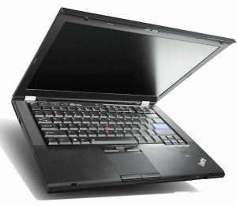

 

ノートパソコン注文しちゃいました。

格安で。

 

***

 

今使っているノートパソコンは<a class="keyword" href="http://d.hatena.ne.jp/keyword/Dell">Dell</a>のStudio <a class="keyword" href="http://d.hatena.ne.jp/keyword/XPS">XPS</a> 13。

大学に入ったときに購入したものでサポート料含めて15万円ほど。性能はこんな感じ。

 

 

 

CPU

<a class="keyword" href="http://d.hatena.ne.jp/keyword/Core%202%20Duo">Core 2 Duo</a> P9600(2.66GHz)

 

 

Memory

DDR3 4GB

 

 

<a class="keyword" href="http://d.hatena.ne.jp/keyword/GPU">GPU</a>

<a class="keyword" href="http://d.hatena.ne.jp/keyword/GeForce">GeForce</a> 9400M G+<a class="keyword" href="http://d.hatena.ne.jp/keyword/GeForce">GeForce</a> 9500M (Hybrid SLI)

 

 

HDD

500GB

 

 

Display

13.3 インチ WXGA Edge-to-Edge 液晶(1280x800)

 

 

Size

319 x 236 x 22.5-34.3mm 2.2kg

 

 

 

 

このパソコン、<a class="keyword" href="http://d.hatena.ne.jp/keyword/Bluetooth">Bluetooth</a>がたまに<a class="keyword" href="http://d.hatena.ne.jp/keyword/%C7%AE%CB%BD%C1%F6">熱暴走</a>のためか突然動かなくなったりバッテリーがあまり持たなかったり、<a class="keyword" href="http://d.hatena.ne.jp/keyword/Ubuntu">Ubuntu</a>入れるとHybrid SLIが邪魔をするのかディスプレイが上手く動かなかったりと問題もありつつなんだかなんだよく使っていたのだけど6月にヒンジ部分が破損。サポートで直るだろうと高をくくってサポートに連絡したら外部は損はサポート対象外なので5万円かかりますなんてよくわからないことを言われ・・・。

5万円かけてヒンジ部分だけ直すくらいなら新しいパソコン買う方が良いよね！？ということで新しいパソコンを購入することに。ちなみに大学の保険で5万円ほど戻ってきたのでそれを軍資金に。

 

<a class="keyword" href="http://d.hatena.ne.jp/keyword/Twitter">Twitter</a>でフォローさせていただいている方に<a class="keyword" href="http://d.hatena.ne.jp/keyword/IBM">IBM</a>勤務の方がいらっしゃり、<a class="keyword" href="http://d.hatena.ne.jp/keyword/%A5%EC%A5%CE%A5%DC">レノボ</a>のファミリー販売使わせていただけるようになったのでそちらで購入することに決定。規約の問題で値段をかけないけど普通に買うより相当安い。

 

はじめはT420を狙っていたけど、価格改定でT420sも手が出せる価格になったのでこちらに変更。スペックは

 

 

 

CPU

<a class="keyword" href="http://d.hatena.ne.jp/keyword/Core%20i5">Core i5</a>-2520M  (2.50GHz, 3MB L3, 1333MHz)

 

 

Memory

2GB PC3-10600 DDR3 (1スロット使用)

 

 

<a class="keyword" href="http://d.hatena.ne.jp/keyword/GPU">GPU</a>

<a class="keyword" href="http://d.hatena.ne.jp/keyword/Intel">Intel</a> HD 3000 + <a class="keyword" href="http://d.hatena.ne.jp/keyword/NVIDIA">NVIDIA</a> <a class="keyword" href="http://d.hatena.ne.jp/keyword/NVS">NVS</a> 4200M Optimus グラフィックス (1GB)

 

 

Storage

320GB 7200rpm

 

 

OS

<a class="keyword" href="http://d.hatena.ne.jp/keyword/Windows%207">Windows 7</a> Home Premium with <a class="keyword" href="http://d.hatena.ne.jp/keyword/Service%20Pack">Service Pack</a> 1 64bit

 

 

Display

14.0型HD+液晶 (1600 x 900 <a class="keyword" href="http://d.hatena.ne.jp/keyword/LED%A5%D0%A5%C3%A5%AF%A5%E9%A5%A4%A5%C8">LEDバックライト</a>) 光沢なし

 

 

Device

ウルトラナビ(<a class="keyword" href="http://d.hatena.ne.jp/keyword/TrackPoint">TrackPoint</a> + タッチパッド)、 指紋センサー、カメラ(HD720p対応)

<a class="keyword" href="http://d.hatena.ne.jp/keyword/Bluetooth">Bluetooth</a> 3.0、<a class="keyword" href="http://d.hatena.ne.jp/keyword/Centrino">Centrino</a> Advanced-N 6205

 

 

Size

343.0×230.1×21.2～26.0mm 1.8kg

 

 

 

こんな感じ。お値段は10万以上だけど超絶お手頃価格。やばい。

メモリーは<a class="keyword" href="http://d.hatena.ne.jp/keyword/%A5%EC%A5%CE%A5%DC">レノボ</a>通販だと馬鹿に高いので個別に購入予定。また、ストレージもHDDベイを使って<a class="keyword" href="http://d.hatena.ne.jp/keyword/SSD">SSD</a>を搭載する予定。というか手元にすでにSSDSA2CW120G310があったりする。

 

到着予定は2週間から3週間後。待ち遠しいなぁ。

 

ちなみにStudio <a class="keyword" href="http://d.hatena.ne.jp/keyword/XPS">XPS</a> 13は父のPCとして余生を送る予定。
