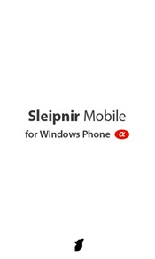
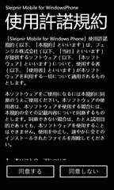
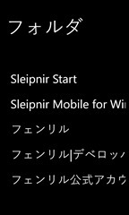
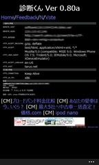

 

<a class="keyword" href="http://d.hatena.ne.jp/keyword/%A5%DE%A5%EB%A5%C1%A5%D7%A5%E9%A5%C3%A5%C8%A5%D5%A5%A9%A1%BC%A5%E0">マルチプラットフォーム</a>展開して以来でるかなでるかなとずっと待ち望んでいた<a class="keyword" href="http://d.hatena.ne.jp/keyword/Sleipnir">Sleipnir</a>の<a class="keyword" href="http://d.hatena.ne.jp/keyword/Windows">Windows</a> Phone版が遂に登場！

 

<a href="http://twitter.com/ch3cooh" target="_blank">酢酸先生</a>が<a class="keyword" href="http://d.hatena.ne.jp/keyword/%A5%D5%A5%A7%A5%F3%A5%EA%A5%EB">フェンリル</a>社のブログからめざとくWP7のタイル画面に<a class="keyword" href="http://d.hatena.ne.jp/keyword/Sleipnir">Sleipnir</a>のアイコンがあることを<a href="http://d.hatena.ne.jp/ch3cooh393/20110901/1314889576" target="_blank">確認してから</a>早数ヶ月。

α版なのでもちろん未実装な機能もあるけれど取り急ぎレビューしてみました。

 

***

 

まずはメニューに登録されている<a class="keyword" href="http://d.hatena.ne.jp/keyword/Sleipnir">Sleipnir</a>。

 

 

<a class="keyword" href="http://d.hatena.ne.jp/keyword/Sleipnir">Sleipnir</a>はこれまで操舵輪のアイコンを利用していたのだけど今後正式リリースされる<a class="keyword" href="http://d.hatena.ne.jp/keyword/Sleipnir">Sleipnir</a> 3ではチェスのナイトの駒になってます（test版ではSleipnir2でもすでに変わっていた）。他のプラットフォーム向け<a class="keyword" href="http://d.hatena.ne.jp/keyword/Sleipnir">Sleipnir</a>もそれに踏襲しているようでWP7の<a class="keyword" href="http://d.hatena.ne.jp/keyword/Sleipnir">Sleipnir</a>もご多分に漏れずチェス駒になってます。右上にはアルファの文字が。

 

 

 

アイコンをタップするとスプラッシュウィンドウが表示された後（一番上の画像）初回起動の場合規約が表示されます。

<a href="http://pandora.thty.net/wp-content/uploads/2011/10/pnir_rule1.jpg"> </a>

 

規約に同意するとメイン画面に。

 

 

<a class="keyword" href="http://d.hatena.ne.jp/keyword/Windows">Windows</a> Phoneの特徴の一つであるタイル構造になってます。タップするとそのサイトに飛ぶことができます。

<a class="keyword" href="http://d.hatena.ne.jp/keyword/Opera">Opera</a>のスピードダイヤルみたいな感じ。今のところ変更はできません。α版ですし。

また、上に検索バーがありますが、ここに入力してから下のタイルをタップすると各サイトでの検索結果が表示されます。

私最初エンターキーを押すか横の虫眼鏡アイコンをタップすると検索されるとばかり思っていたのですがそれだと動かずてっきり未実装だと思ってました。。

<a class="keyword" href="http://d.hatena.ne.jp/keyword/%C1%EB%A4%CE%C5%CE">窓の杜</a>の記事を見て初めて知りました（<a href="http://www.fenrir.co.jp/blog/2011/10/sleipnir-windowsphone-a.html" target="_blank">フェンリルのブログ</a>にも書いてありましたが）。Marketplaceのレビューでも同じように思っていた人もいましたし、このあたり改善希望です。

 

 

 

さて、各タイルをタップするとこのような画面に飛びます。

 

 

上にはURLバーと検索バー、下には最大化ボタンとお気に入りボタンが、右下の…をタップするとさらにメニューが表示されます。タブもありますね。

 

 

現状はブックマーク追加と進むがあるだけですね。

 

最大化ボタンはタップするとURLバーや他のメニューが消えて画面一杯にページを表示することができます。

もういちど表示させたいなら右下の・・・をタップしてもう一度最大化をタップすると元に戻ります。

 

ブックマークはまだとりあえず実装したという感じですね。

 

 

ブックマーク追加をタップすると一番下に登録されます。

 

 

 

ついでに診断くんを開いてみました。

 

<a class="keyword" href="http://d.hatena.ne.jp/keyword/%A5%B9%A5%AF%A5%EA%A1%BC%A5%F3%A5%B7%A5%E7%A5%C3%A5%C8">スクリーンショット</a>を取るために<a class="keyword" href="http://d.hatena.ne.jp/keyword/%A5%A8%A5%DF%A5%E5%A5%EC%A1%BC%A5%BF">エミュレータ</a>使っているので表示されている<a class="keyword" href="http://d.hatena.ne.jp/keyword/UA">UA</a>が若干普通と違いますけど<a class="keyword" href="http://d.hatena.ne.jp/keyword/%A5%EC%A5%F3%A5%C0%A5%EA%A5%F3%A5%B0">レンダリング</a>エンジンに<a class="keyword" href="http://d.hatena.ne.jp/keyword/IE9">IE9</a> Mobileを使っていることがわかります。

ちなみに本家本元の<a class="keyword" href="http://d.hatena.ne.jp/keyword/Sleipnir">Sleipnir</a>はTrident。他のモバイル<a class="keyword" href="http://d.hatena.ne.jp/keyword/%A5%D7%A5%CB%A5%EB">プニル</a>は<a class="keyword" href="http://d.hatena.ne.jp/keyword/WebKit">WebKit</a>みたいです。

なお<a class="keyword" href="http://d.hatena.ne.jp/keyword/Windows">Windows</a> Phoneに搭載されている<a class="keyword" href="http://d.hatena.ne.jp/keyword/%A5%EC%A5%F3%A5%C0%A5%EA%A5%F3%A5%B0">レンダリング</a>エンジンは基本パソコン版と同じとのこと。

 

ちなみに私が持ってるWP7端末、HTC HD7だと

<a class="keyword" href="http://d.hatena.ne.jp/keyword/Mozilla">Mozilla</a>/5.0 (compatible; <a class="keyword" href="http://d.hatena.ne.jp/keyword/MSIE">MSIE</a> 9.0; <a class="keyword" href="http://d.hatena.ne.jp/keyword/Windows">Windows</a> Phone OS 7.5; Trident/5.0; IEMobile/9.0; HTC; HD7 T9292)

という<a class="keyword" href="http://d.hatena.ne.jp/keyword/UA">UA</a>でした。多分WebBrowserコントロールを使ってる以上変わらない。

 

 

 

検索バー、これは<a class="keyword" href="http://d.hatena.ne.jp/keyword/Yahoo%21">Yahoo!</a>の<a class="keyword" href="http://d.hatena.ne.jp/keyword/%B8%A1%BA%F7%A5%A8%A5%F3%A5%B8%A5%F3">検索エンジン</a>を使うみたいです。

 

 

<a href="http://pandora.thty.net/wp-content/uploads/2011/10/pnir_search1.jpg"> </a>

 

他のモバイル<a class="keyword" href="http://d.hatena.ne.jp/keyword/%A5%D7%A5%CB%A5%EB">プニル</a>は検索バーの<a class="keyword" href="http://d.hatena.ne.jp/keyword/%B8%A1%BA%F7%A5%A8%A5%F3%A5%B8%A5%F3">検索エンジン</a>変更するにはBlacｋ Editionという有料版を利用する形になるので<a class="keyword" href="http://d.hatena.ne.jp/keyword/Windows">Windows</a> Phoneでも同じスタイルになるのかな？個人的には<a class="keyword" href="http://d.hatena.ne.jp/keyword/Windows">Windows</a> Phoneでは別アプリとして作らず有料版一つだけにして<a class="keyword" href="http://d.hatena.ne.jp/keyword/%B8%A1%BA%F7%A5%A8%A5%F3%A5%B8%A5%F3">検索エンジン</a>変更以外無制限に使える試用版を提供する形にしてほしいなぁ・・・。

 

 

 

ちなみにタブを閉じるにはタブを下にフリックすればOK。FlickWipeっていうそうです。

 

 

 

今後の実装予定ではブックマーク同期機脳のFenrir Passやジェスチャー機能の拡充、ページ開閉時のアニメーションや<a class="keyword" href="http://d.hatena.ne.jp/keyword/favicon">favicon</a>表示、タブグループ機能などが予定されているそうです。

なかでもFenrir PassはWP7ではキラー機能です。<a class="keyword" href="http://d.hatena.ne.jp/keyword/Windows">Windows</a> Phoneにはブックマークの同期機能が存在しないのですが、Fenrir Passでブックマーク同期ができればWP版<a class="keyword" href="http://d.hatena.ne.jp/keyword/Sleipnir">Sleipnir</a>を使う大きな動機になると思います。

もっともFenrir Passは正式公開されていない<a class="keyword" href="http://d.hatena.ne.jp/keyword/Sleipnir">Sleipnir</a> 3の新機能なので、<a class="keyword" href="http://d.hatena.ne.jp/keyword/Sleipnir">Sleipnir</a> 3が公開されるまではなかなか使えないのですが。。

 

個人的に大いに期待しているアプリなのでどんどん他プラットフォーム向け<a class="keyword" href="http://d.hatena.ne.jp/keyword/Sleipnir">Sleipnir</a>の機能を実装して欲しいですね。

 

 

 

ついでなので使っている最中に気づいたことをいくつか。

 

・タブをすべて閉じると強制終了する

・日本語フォントではなく中国フォントで表示されている（多分<a href="http://blogs.msdn.com/b/shintak/archive/2011/07/24/10189220.aspx" target="_blank">これがされてない</a>）

・一度URLバーもしくは検索バーをタップしてから他をタップしてもバーが元に戻らない

・挙動がかくかくしている（α版なので仕方がない）

・たまにタブを閉じたり他のタブに移動できなくなる
