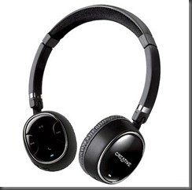

 

これまで使っていた4台目の有線のヘッドフォンがまたしても断線してしまい聞こえなくなってしまったので意を決して<a class="keyword" href="http://d.hatena.ne.jp/keyword/Bluetooth">Bluetooth</a>のヘッドセットを購入してみました。

 

***

 

 

 

購入に当たって決めた要点は

 

・<a class="keyword" href="http://d.hatena.ne.jp/keyword/Bluetooth">Bluetooth</a>であること

・1万円以下であること

・ヘッドバンド型であること

・ある程度音質が良いこと

 

の四点。

 

<a class="keyword" href="http://d.hatena.ne.jp/keyword/Bluetooth">Bluetooth</a>にした理由は、最近の<a class="keyword" href="http://d.hatena.ne.jp/keyword/%A5%DE%A5%B6%A1%BC%A5%DC%A1%BC%A5%C9">マザーボード</a>には<a class="keyword" href="http://d.hatena.ne.jp/keyword/Bluetooth">Bluetooth</a>モジュールが内蔵されているので無線と違ってUSBアダプターなどを取り付ける必要が無いということ。なんだかんだUSB足りなくなくて大変なのでこれは結構重要。ヘッドバンド型であるというのは単に室内でしか使う予定がないからというのが理由。

 

最初は<a class="keyword" href="http://d.hatena.ne.jp/keyword/SONY">SONY</a>のヘッドセットを購入しようと思ったのだけれども少々お高い。

他にいくつか探した物の余り評判の良い物は見当たらず。<a class="keyword" href="http://d.hatena.ne.jp/keyword/%B2%C1%B3%CA.com">価格.com</a>じゃらちがあかないと言うことで一般に有名な音響メーカーのサイト見ていたら発見したのがこのCreativeのWP-350。

 

条件をすべて満たし、レビューブログを見てもまぁまぁの評価だったので購入。

 

 

 

最初見たときの印象は思っていたより小さい。よくよく考えてみたら<a class="keyword" href="http://d.hatena.ne.jp/keyword/Bluetooth">Bluetooth</a>のヘッドセットって屋外でも利用することを念頭に作っているからか小さいのだった。とはいえ頭の大きな私でも普通に使えるので特段問題なし。

 

ペアリングして最初にいつも聞いている曲を聴いてみたところがっかり。<a class="keyword" href="http://d.hatena.ne.jp/keyword/Bluetooth">Bluetooth</a>はどうしても規格上音質が各段に落ちるとは聞いていたけれどもここまでひどいのかという印象。これなら安いヘッドフォン買えば良かったかと後悔したのだけど、そういえばこういった音響装置は<a class="keyword" href="http://d.hatena.ne.jp/keyword/%A5%A8%A1%BC%A5%B8%A5%F3%A5%B0">エージング</a>という処理を行わないと良い音は出ないという話を聞いていたので早速<a class="keyword" href="http://d.hatena.ne.jp/keyword/%A5%A8%A1%BC%A5%B8%A5%F3%A5%B0">エージング</a>の曲を寝ている間に延々と流しておいた。

 

これが大正解。全く違う音になりました。私はそんなに高級な耳をもってないので低音が～とか高音が～とかよくわからないのだけど音が<a class="keyword" href="http://d.hatena.ne.jp/keyword/%A5%A8%A1%BC%A5%B8%A5%F3%A5%B0">エージング</a>する前と比べて各段に通る通る。ノイズも消えてすっきりしました。

もちろん有線のヘッドフォンと比べては行けない音質だと思いますけどそれでも私の利用用途なら十分。

 

今回は買ったWP-350は廉価版としてマイクのないWP-250ってのもあるんですけども今回は<a class="keyword" href="http://d.hatena.ne.jp/keyword/Skype">Skype</a>で利用したかったのでマイクのあるこちらを購入。マイクも思っていたよりノイズがのらず（といいますかノイズ軽減と歌っている以上当たり前）好印象。

 

残念なところはといえばまぁこれはどの<a class="keyword" href="http://d.hatena.ne.jp/keyword/Bluetooth">Bluetooth</a>ヘッドセットでもそうでしょうけどさほどバッテリーが持たずまた交換がきかないこと。バッテリーがへたってしまったら新しい物を購入せざるを得ないでしょうね。ちなみにバッテリーは長く持つわけではないですけどUSBのケーブル刺したまま利用できるので問題ないと言えば問題ないかも。

あとマルチペアリングができるようになると完璧でしたね。
