

思えば長かった・・・。

<a class="keyword" href="http://d.hatena.ne.jp/keyword/Sleipnir">Sleipnir</a> 3の開発表明から待つこと3年。機能とデザインが公表されてから<a href="http://pandora.thty.net/2010/10/18/369/">早1年</a>。ようやく<a class="keyword" href="http://d.hatena.ne.jp/keyword/Sleipnir">Sleipnir</a> 3 for <a class="keyword" href="http://d.hatena.ne.jp/keyword/Windows">Windows</a>が登場しました。

 

 

 

***

 

 

 

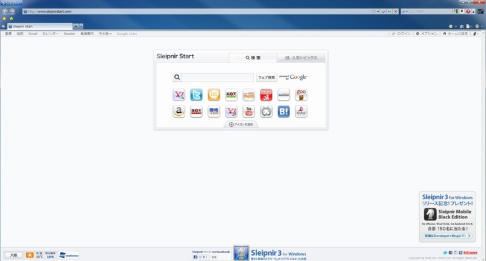

 

起動してまずこれまでの<a class="keyword" href="http://d.hatena.ne.jp/keyword/Sleipnir">Sleipnir</a>と違うのがAero Glassによる<a class="keyword" href="http://d.hatena.ne.jp/keyword/Windows%207">Windows 7</a>との一体感。私自身はそれほどAero Glassが好きではないというか、バックのものが透けて見えるために見にくくていやなのですが、デザインとしては良い感じですね。

 

ちなみにこれまでの<a class="keyword" href="http://d.hatena.ne.jp/keyword/Sleipnir">Sleipnir</a>だとこんな感じ。

 

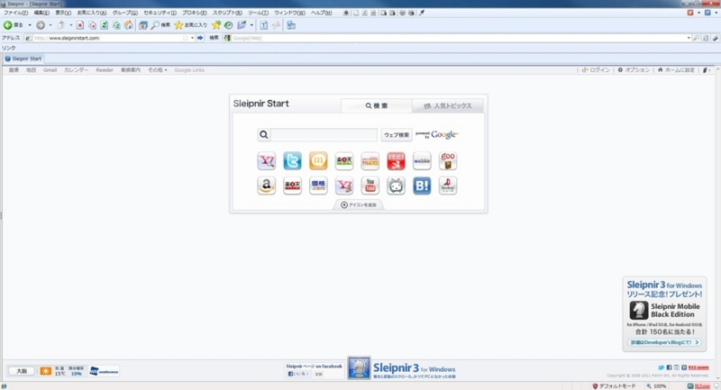

またこれまで存在していたメニューバーが初期状態ではなくなり、そのかわり左上にそれを補うボタンができました。このあたりは<a class="keyword" href="http://d.hatena.ne.jp/keyword/Firefox">Firefox</a>などと同じですね。これによってメニューバーがなくなった分より広く<a class="keyword" href="http://d.hatena.ne.jp/keyword/%A5%D6%A5%E9%A5%A6%A5%B8%A5%F3%A5%B0">ブラウジング</a>できます。なお、メニューバーは設定を変更すれば表示できますが、ボタンはなくなります。

 

Sleipnir3からの新機能として、

・Fenrir Pass

・<a class="keyword" href="http://d.hatena.ne.jp/keyword/FenrirFS">FenrirFS</a>ブックマーク

・Metro風フルスクリーン

・一新されたジェスチャ機能

・タブグループ

などがあげられます。

 

 

まずFenrir Pass。個人的にSleipnir3の新機能の中でも一番重要な機能だと思っています。

これはFenrirのサーバーに自身のブックマークを同期してほかのパソコンや<a class="keyword" href="http://d.hatena.ne.jp/keyword/%A5%B9%A5%DE%A1%BC%A5%C8%A5%D5%A5%A9%A5%F3">スマートフォン</a>でも同じブックマークを利用できるようにするというものです。私はこれまで<a class="keyword" href="http://d.hatena.ne.jp/keyword/Sleipnir">Sleipnir</a>の設定をほかのパソコンと同期させるために<a class="keyword" href="http://d.hatena.ne.jp/keyword/Dropbox">Dropbox</a>を利用していましたがこれさえ利用すればわざわざそんなことをしなくても簡単に同期できます。個人的には今後設定ファイルなどの同期も対応してほしいところです。そういえばベータ版の頃はブックマーク同期時にブックマークが多すぎて同期できないというエラーがありましたが今回はありませんでした。

ちなみにFenrir Passを利用するにはまずアカウントを取得する必要があります。無料です。

また、一度ログインした後メニューからブックマークの同期を行うと現在のブックマークがそのままFenrir Passに送られるようです。逆にFenrir Passからブックマークを取得したいときはブックマークのインポートから「Fenrir Passと同期してインポートする」でできます。

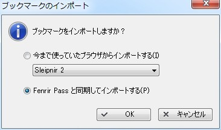

 

 

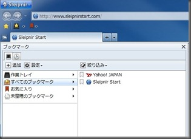

 

<a class="keyword" href="http://d.hatena.ne.jp/keyword/FenrirFS">FenrirFS</a>ブックマークはFenrir社が開発しているファイル管理ソフト、<a class="keyword" href="http://d.hatena.ne.jp/keyword/FenrirFS">FenrirFS</a>を利用してブックマークを管理するという機能。すべてのブックマークにラベリングすることでより探しやすくなる効果があるかと。既存のフォルダブックマークと組み合わせて利用します。ブックマークバー以外に保存されたブックマークを管理できるみたいです。ちょっと気になるのが、<a class="keyword" href="http://d.hatena.ne.jp/keyword/FenrirFS">FenrirFS</a>ブックマークだと少々パネルを広くとる必要があること。画面が狭いパソコンを使っていると少々使いにくいかも。なお、<a class="keyword" href="http://d.hatena.ne.jp/keyword/FenrirFS">FenrirFS</a>ブックマークは<a class="keyword" href="http://d.hatena.ne.jp/keyword/%A5%A4%A5%F3%A5%B9%A5%C8%A1%BC%A5%E9">インストーラ</a>版のみ対応しており、ZIP版では使えないようです。

 

 

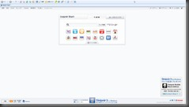

 Sleipnir2のフルスクリーン画面

 

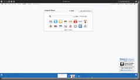

Sleipnir3のフルスクリーン画面

 

今回のSleipnir3でフルスクリーン時のデザインが大きく変わりました。具体的には<a class="keyword" href="http://d.hatena.ne.jp/keyword/Windows">Windows</a> Phoneや<a class="keyword" href="http://d.hatena.ne.jp/keyword/Windows%208">Windows 8</a>で採用されるMetroなデザインになりました。百聞は一見にしかずと言うことでまずは下の<a class="keyword" href="http://d.hatena.ne.jp/keyword/%A5%B9%A5%AF%A5%EA%A1%BC%A5%F3%A5%B7%A5%E7%A5%C3%A5%C8">スクリーンショット</a>を。これまでの<a class="keyword" href="http://d.hatena.ne.jp/keyword/Sleipnir">Sleipnir</a>と比べると、まずタブが下に来たほか、開いているページがグラフィカルに表示されていることがわかります。初期状態ではメニューやタブは表示されたままですが左下のピンボタンをクリックすれば<a class="keyword" href="http://d.hatena.ne.jp/keyword/%BC%AB%C6%B0%C5%AA">自動的</a>に隠れるようになります。また、この状態だとアドレスバーと検索バーが統合されているのも特徴です。

 

これまでの<a class="keyword" href="http://d.hatena.ne.jp/keyword/Sleipnir">Sleipnir</a>にも<a class="keyword" href="http://d.hatena.ne.jp/keyword/%A5%DE%A5%A6%A5%B9%A5%B8%A5%A7%A5%B9%A5%C1%A5%E3%A1%BC">マウスジェスチャー</a>機能は搭載されていました。そもそも<a class="keyword" href="http://d.hatena.ne.jp/keyword/Sleipnir">Sleipnir</a>を使う人はこの多機能な<a class="keyword" href="http://d.hatena.ne.jp/keyword/%A5%DE%A5%A6%A5%B9%A5%B8%A5%A7%A5%B9%A5%C1%A5%E3%A1%BC">マウスジェスチャー</a>に惹かれたという人も多いみたいです。（最も私はキーボードショートカットばかりで<a class="keyword" href="http://d.hatena.ne.jp/keyword/%A5%DE%A5%A6%A5%B9%A5%B8%A5%A7%A5%B9%A5%C1%A5%E3%A1%BC">マウスジェスチャー</a>は無効化してましたが・・・）

今回Sleipnir3にメジャーバージョンアップしてこのジェスチャー機能も一新されました。<a class="keyword" href="http://d.hatena.ne.jp/keyword/Sleipnir%20Mobile">Sleipnir Mobile</a>で搭載されていたジェスチャー機能（TouchPaging）になっています。

たとえば今開いているページを閉じたい場合は右クリックした状態でL字を描くと以下のような表示がされてタブが閉じられます。

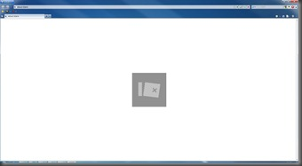

また、右クリックしたまま左もしくは右にマウスを動かせばタブ移動も可能です。

 

<a href="http://pandora.thty.net/wp-content/uploads/2011/11/pnir3_touch2.jpg"> </a>さらにフルスクリーン時ではFlickWipeといってタブを右クリックしたまま下に動かすとタブが閉じられます（普通に×を押せば良いような気がしないでもないですが）。

個人的に好みなのはリンクをクリックしたままほんのちょっと離さないでおくと非アクティブでリンクがタブとして開くところですかね。

ちなみに設定画面から旧来の<a class="keyword" href="http://d.hatena.ne.jp/keyword/%A5%DE%A5%A6%A5%B9%A5%B8%A5%A7%A5%B9%A5%C1%A5%E3%A1%BC">マウスジェスチャー</a>を利用できるように設定もできます。

 

 

 

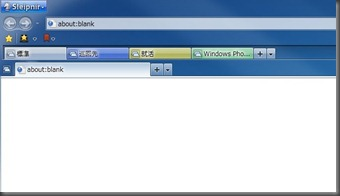

<a href="http://pandora.thty.net/wp-content/uploads/2011/11/pnir3_tabgroup2.jpg"> </a>Sleipnir3ではほかの有名なブラウザにも存在するタブグループ機能が搭載されています。複数つくれるのでそれぞれ自分の使いやすいように登録しておくと便利です。なお、タブグループに表示される<a class="keyword" href="http://d.hatena.ne.jp/keyword/favicon">favicon</a>はタブグループ内で最もよく使われているアイコンが利用されます。

 

 

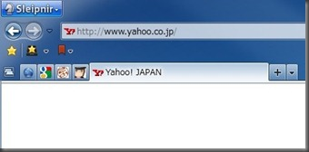

<a href="http://pandora.thty.net/wp-content/uploads/2011/11/pnir3_tablet2.jpg"> </a>また、普通のタブは<a class="keyword" href="http://d.hatena.ne.jp/keyword/Tablet">Tablet</a>機能を使えば小さく表示できます。設定次第では<a class="keyword" href="http://d.hatena.ne.jp/keyword/Tablet">Tablet</a>化したものだけ起動時に復元するということも可能です。

 

 

ほかにもSleipnir2と比べて複数のタブを開く時間を削減するなど細々としたところに改善を行っていると言うことで期待が持てます。

 

最後に現段階での不満点や希望や疑問点などをいくつか。

 

・<a class="keyword" href="http://d.hatena.ne.jp/keyword/%A5%D7%A5%E9%A5%B0%A5%A4%A5%F3">プラグイン</a>機能がまだない

・Sleipnir2に存在した機能が存在しない

 

これに関しては<a href="http://www.fenrir.co.jp/blog/2011/11/sleipnir3forwindows1116.html">Fenrir社のブログにて</a>坪内さんが説明されているので割愛。今後に期待ですね。

 

・まだまだ不安定

 

Sleipnir1.xの<a class="keyword" href="http://d.hatena.ne.jp/keyword/%A5%BD%A1%BC%A5%B9%A5%B3%A1%BC%A5%C9">ソースコード</a>が盗難の憂き目に遭った11月16日をリリース日にするためと言うこともあったのか、まだ強制終了したり挙動がおかしくなることがたまにある印象です。今メインで利用しているSleipnir2 test版よりは安定していますが、やはり強制終了は非常に痛いので何とかしていただきたく。メモ<a class="keyword" href="http://d.hatena.ne.jp/keyword/%A5%EA%A1%BC%A5%EA%A1%BC">リーリー</a>クもある気がします。

 

・設定画面が少々使いにくい

 

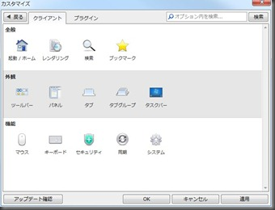

 

デザイン的には格好良くなっていて好印象なんですが、いちいち戻るを押してほかの設定画面にもどるのは少々面倒くさいですね。後、旧来に比べて設定できる内容が少なくなったのが少々残念です。普通の人はたくさん設定できるよりも初期状態で使いやすいほうがいいのでしょうけど、<a class="keyword" href="http://d.hatena.ne.jp/keyword/Sleipnir">Sleipnir</a>の売りはやはりカスタマイズ性の高さですし、このあたり何とかしてほしいです。

 

・タスクトレイ格納が存在しない

 

これ結構つらいです。いやもしかしたらどこかに設定があるのかもしれませんが・・・。

 

・ブックマークを切り替えられない

 

私は必要に応じてブックマークを切り替えて利用しているので、この機能は早急に欲しいです。

Fenrir Passにはメインブックマークを、それ以外は同期しないという感じで。

 

・Fenrir Passの挙動

 

二つのパソコンで同時に同じブックマークを利用しているとして、どちらもそれぞれ別々のブックマークを登録もしくは削除し同期した場合どんな挙動をとるんでしょう。

 

・Aero Glass機能の無効化もしくは透明度の調整ができる設定がほしい

 

ブックマークバーの部分もAero Glassが動いているので少々見にくいのですよね・・・。

 

・ブックマークのフォルダー削除時に確認をしてほしい

 

名前の変更をしようと思ってうっかり削除をクリックして消えてしまったなんてことになったら大惨事です・・・。

 

・Sleipnir2のCtrl+Bで出てきたお気に入り編集の復活

 

一気にブックマークを削除するとき便利だったので。。

 

・ブックマークパネルの広さを変えるとき非常に重い

 

フォルダブックマーク<a class="keyword" href="http://d.hatena.ne.jp/keyword/FenrirFS">FenrirFS</a>ブックマーク共々重いです。あと<a class="keyword" href="http://d.hatena.ne.jp/keyword/FenrirFS">FenrirFS</a>ブックマークだとに挙動がおかしいです。こんな感じ。

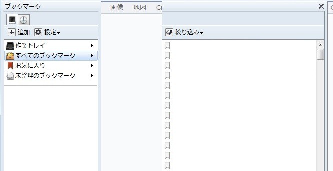

 

 

ちなみに私はSleipnir2で最も利用している<a class="keyword" href="http://d.hatena.ne.jp/keyword/%A5%D7%A5%E9%A5%B0%A5%A4%A5%F3">プラグイン</a>、<a class="keyword" href="http://d.hatena.ne.jp/keyword/Headline-Reader">Headline-Reader</a>が対応するまではメインで利用したくても利用できないです・・・。Sleipnir3にも一応<a class="keyword" href="http://d.hatena.ne.jp/keyword/RSS">RSS</a>の機能がついてますけど正直やはり<a class="keyword" href="http://d.hatena.ne.jp/keyword/Headline-Reader">Headline-Reader</a>には及びません。といいますかこちらを標準搭載してください・・・。

 

まぁそんなこんなでSleipnir3 for <a class="keyword" href="http://d.hatena.ne.jp/keyword/Windows">Windows</a>のレビューでした。

<a class="keyword" href="http://d.hatena.ne.jp/keyword/Sleipnir%20Mobile">Sleipnir Mobile</a> for <a class="keyword" href="http://d.hatena.ne.jp/keyword/Windows">Windows</a> Phoneのベータ版も現在申請中とのことでこちらにも大いに期待しています。

今後とも<a class="keyword" href="http://d.hatena.ne.jp/keyword/Sleipnir">Sleipnir</a>にはお世話になるのでどんどん使い勝手がよくなっていくとうれしいですね。
