
 

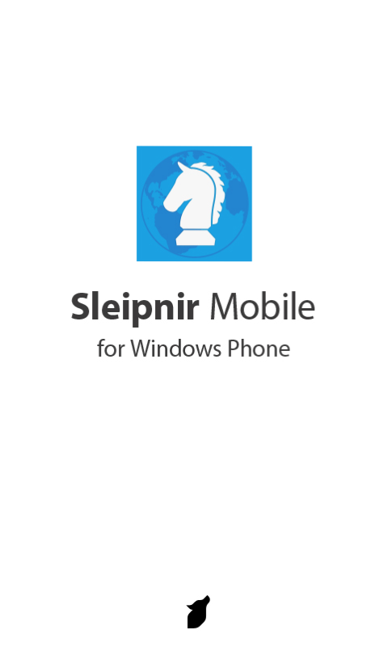

<a href="http://pandora.thty.net/wp-content/uploads/2011/12/pnirm1_0_splash.png" target="_blank"> </a>  10月中旬に公開された<a class="keyword" href="http://d.hatena.ne.jp/keyword/Sleipnir%20Mobile">Sleipnir Mobile</a> for <a class="keyword" href="http://d.hatena.ne.jp/keyword/Windows">Windows</a> Phoneα版から待つこと一ヶ月半、早くも正式版が公開されたので早速レビューしてみました。

ちなみにα版のレビューは<a href="http://pandora.thty.net/2011/10/15/467/">こちら</a>。ベータ版も出てましたがそのときはレビューしてません。以下のレビューもベータ版で変更されていた場所を含みます。

 

***

 

 

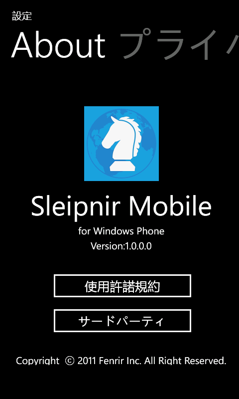

<a href="http://pandora.thty.net/wp-content/uploads/2011/12/pnirm1_0_icon.png" target="_blank"> </a>  まずはアイコン。α版とベータ版では存在していた右上の表記が消えました。  ちなみに<a href="http://blog.fenrir-inc.com/jp/2011/11/sleipnir-family-icon.html" target="_blank">フェンリル社ブログ</a>によると<a class="keyword" href="http://d.hatena.ne.jp/keyword/Sleipnir">Sleipnir</a> Familyのアイコンはそれぞれプラットフォームごとに違いを持たせているのだとか。それによると

<blockquote>

四角いです。<a class="keyword" href="http://d.hatena.ne.jp/keyword/Windows">Windows</a> Phone のタイルのデザインにあわせて色味も単色塗りのあっさりとしたものになっています。

</blockquote>

とのこと。確かにほかのものと比べてあっさりした印象。ほかの<a class="keyword" href="http://d.hatena.ne.jp/keyword/Sleipnir">Sleipnir</a>だとナイトの駒は立体的なのですが、<a class="keyword" href="http://d.hatena.ne.jp/keyword/Windows">Windows</a> Phoneのアイコンだけ真っ平らです。

 

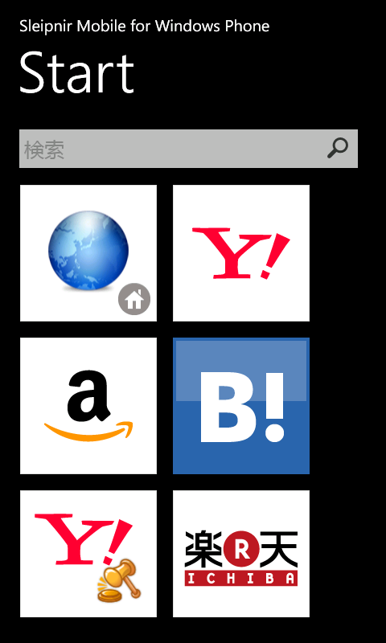

<a href="http://pandora.thty.net/wp-content/uploads/2011/12/pnirm1_0_main.png" target="_blank"> </a>  ここはα版と比べてもほとんど変わりがないですね。見たところなぜか検索バー部分の「検索」という文字が中国フォントになっているくらいでしょうか。  でも機能面では若干変わっています。以前は検索バーに打ち込んでエンターをしても動かなかったのですが、今回は<a class="keyword" href="http://d.hatena.ne.jp/keyword/Yahoo%21">Yahoo!</a>検索で検索してくれるようになっています。でもやっぱり虫眼鏡アイコンは押しても動作せず。  検索バーであることを示すためにあるのでしょうけども、<a class="keyword" href="http://d.hatena.ne.jp/keyword/Windows">Windows</a>の<a class="keyword" href="http://d.hatena.ne.jp/keyword/Sleipnir">Sleipnir</a>では虫眼鏡アイコンで検索が実行されますし、紛らわしいのでいっそのこと機能として搭載して欲しいです。

 

 

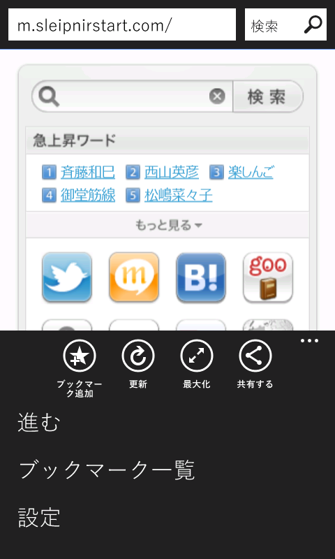

<a href="http://pandora.thty.net/wp-content/uploads/2011/12/pnirm1_0_browsing_icon.png" target="_blank"> </a>  さてさて<a class="keyword" href="http://d.hatena.ne.jp/keyword/%A5%D6%A5%E9%A5%A6%A5%B8%A5%F3%A5%B0">ブラウジング</a>画面なんですが、アプリケーションバーにいくつかアイコンが追加されました。  前回はフルスクリーン表示アイコンとブックマークアイコンしかありませんでしたが今回更新アイコンと「共有する」アイコンが追加され、ブックマークアイコンが「ブックマーク追加」アイコンに変更されています。  右下の・・・をタップして表示されるメニューにはこれまでの「進む」のほか、「設定」が追加され、「ブックマーク追加」が「ブックマーク一覧」に変更されています。  ところでタブに<a class="keyword" href="http://d.hatena.ne.jp/keyword/favicon">favicon</a>が表示されてますけどこれってα版からでしたっけ。<a class="keyword" href="http://d.hatena.ne.jp/keyword/Yahoo%21">Yahoo!</a>など独自のファビコンが用意されているサイトではちゃんとその<a class="keyword" href="http://d.hatena.ne.jp/keyword/favicon">favicon</a>が表示されました。

ページの共有機能は今見ているページの情報を<a class="keyword" href="http://d.hatena.ne.jp/keyword/Windows%20Live">Windows Live</a>や<a class="keyword" href="http://d.hatena.ne.jp/keyword/Twitter">Twitter</a>などに投稿する機能のようです。  なぜか<a class="keyword" href="http://d.hatena.ne.jp/keyword/%A5%A8%A5%DF%A5%E5%A5%EC%A1%BC%A5%BF">エミュレータ</a>上では動かなかったのですが。。

<a href="http://pandora.thty.net/wp-content/uploads/2011/12/pnirm1_0_bkmk1.png" target="_blank">  </a>

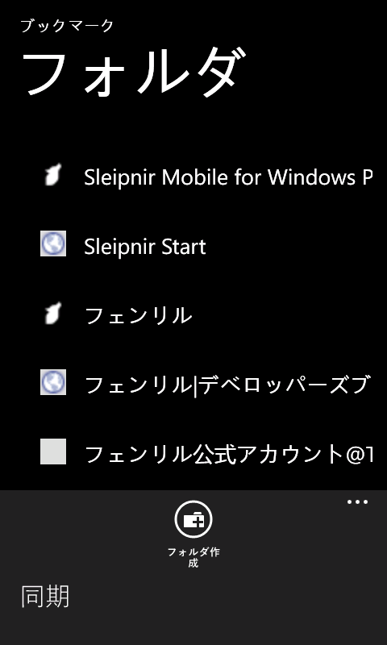

<a href="http://pandora.thty.net/wp-content/uploads/2011/12/pnirm1_0_bkmk1.png" target="_blank"> </a>  ブックマーク画面。  こちらも前回と違って<a class="keyword" href="http://d.hatena.ne.jp/keyword/favicon">favicon</a>が表示されるようになっていますね。ただなんだか見た目が悪いような・・・。  今後直ると期待してます。  新機能としてフォルダー作成機能がついています。後述するFenrir Pass機能がある以上これがなければ困りますしね。アプリケーションバーにあるフォルダ作成アイコンを押すと以下のような画面に映ります。   

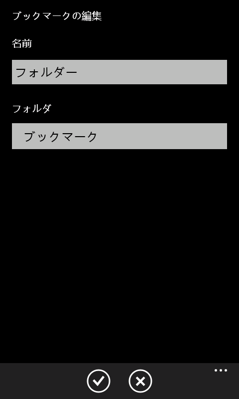

<a href="http://pandora.thty.net/wp-content/uploads/2011/12/pnirm1_0_bkmk2.png" target="_blank"> </a>  名前にフォルダー名を入力し、フォルダというところで階層を選んでしたのチェックをタップすればフォルダーが生成されます。ちなみにフォルダーのアイコンの背景は<a class="keyword" href="http://d.hatena.ne.jp/keyword/Windows">Windows</a> Phoneのテーマの色です。(以下の画像の場合<a class="keyword" href="http://d.hatena.ne.jp/keyword/Windows">Windows</a> Phoneのテーマがレッドになっています)   

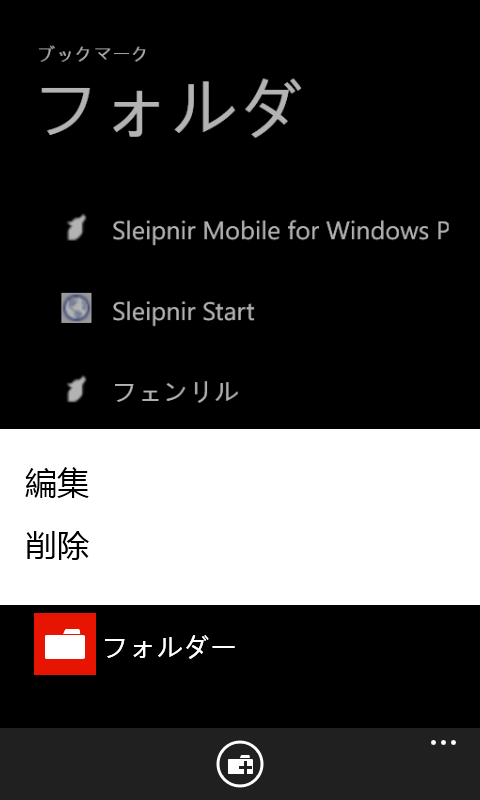

<a href="http://pandora.thty.net/wp-content/uploads/2011/12/pnirm1_0_bkmk4.png" target="_blank"> </a>ところでこのフォルダーアイコン、ほかの<a class="keyword" href="http://d.hatena.ne.jp/keyword/favicon">favicon</a>に対して大きいことも相まって非常に違和感が・・・。  なお、ブックマークもフォルダーも眺めにタップすると編集および削除ができます。    <a href="http://pandora.thty.net/wp-content/uploads/2011/12/pnirm1_0_bkmk.png" target="_blank"> </a>

さて、ブックマーク画面のアプリケーションバーの・・・をタップすると「同期」という設定欄が現れます。  これこそが今回正式版になるにあたって新機能として実装されたFenrir Pass！   

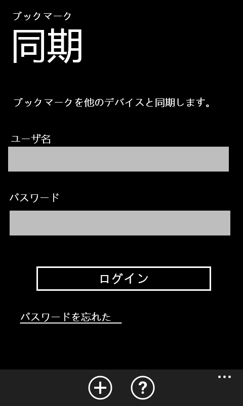

<a href="http://pandora.thty.net/wp-content/uploads/2011/12/pnirm1_0_bkmkdouki1.png" target="_blank"> </a>  前回のレビューで待ち望んでいた機能です。Sleipnir3も公開されさらにFenrir Passの輪が広がりました。  同期画面ではFenrir Passにログインする機能のほか、アカウントを新規作成するアイコンがあります。  とりあえずログインして見たところ以下の画面に。   

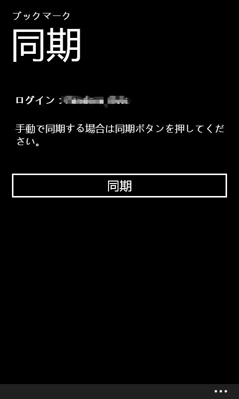

<a href="http://pandora.thty.net/wp-content/uploads/2011/12/pnirm1_0_bkmkdouki2.png" target="_blank"> </a>  ここで同期をタップするとFenrir Passに登録されているブックマークと同期されます。

ちなみに同期後のブックマークはこんな感じ。特別なフォルダは特別なアイコンが使われるようです。 

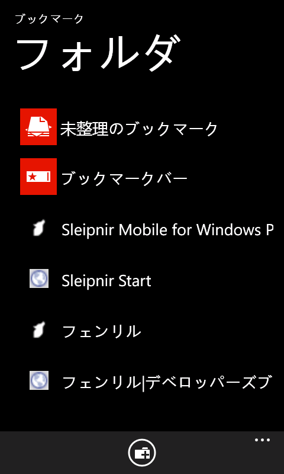

<a href="http://pandora.thty.net/wp-content/uploads/2011/12/pnirm1_0_bkmkdouki3.png" target="_blank"> </a>  なお、同期される際は元からあるブックマークは消されません。そのまま同期されます。というわけでほかの<a class="keyword" href="http://d.hatena.ne.jp/keyword/Sleipnir">Sleipnir</a>にまで元から入っているブックマークが同期されてしまうので気になる人は先に削除しておきましょう。

また、現段階では自動同期には対応していないそうです。同期したいときは再度同期画面から行うことになります。なお、千点以上あるブックマークを同期させましたがさほど時間はかかりませんでした。

<a href="http://pandora.thty.net/wp-content/uploads/2011/12/pnirm1_0_setting.png" target="_blank">  </a>

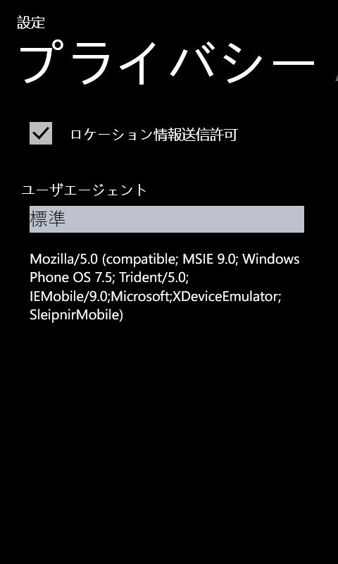

<a href="http://pandora.thty.net/wp-content/uploads/2011/12/pnirm1_0_setting.png" target="_blank"> </a>最後に設定画面。  ここでロケーション情報発信許可とUser-Agentの設定ができます。  最初は標準となっていますが、そちらをタップすると以下のように複数の選択肢が表示されます。   

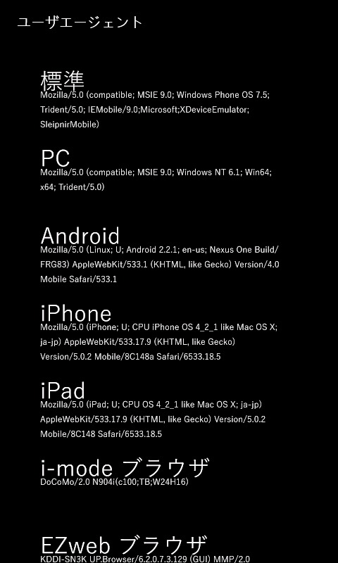

<a href="http://pandora.thty.net/wp-content/uploads/2011/12/pnirm1_0_ua.png" target="_blank"> </a>  User-Agentがいじれるようになったことで、これまで<a class="keyword" href="http://d.hatena.ne.jp/keyword/%A5%B9%A5%DE%A1%BC%A5%C8%A5%D5%A5%A9%A5%F3">スマートフォン</a>表示できなかったいろいろなサイトを表示できるようになります。たとえば<a class="keyword" href="http://d.hatena.ne.jp/keyword/Yahoo%21">Yahoo!</a>だと標準では<a class="keyword" href="http://d.hatena.ne.jp/keyword/Windows">Windows</a> Phoneを<a class="keyword" href="http://d.hatena.ne.jp/keyword/%A5%B9%A5%DE%A1%BC%A5%C8%A5%D5%A5%A9%A5%F3">スマートフォン</a>と認識せずPC向けサイト（しかも非推奨ブラウザと判定して一昔前のデザインに・・・）に飛んでしまいますが、<a class="keyword" href="http://d.hatena.ne.jp/keyword/iPhone">iPhone</a>のUser-Agentならば以下のように<a class="keyword" href="http://d.hatena.ne.jp/keyword/%A5%B9%A5%DE%A1%BC%A5%C8%A5%D5%A5%A9%A5%F3">スマートフォン</a>向けサイトが表示されるようになります。本当はこんなことしなくても対応してくれるとうれしいんですけどね・・・。 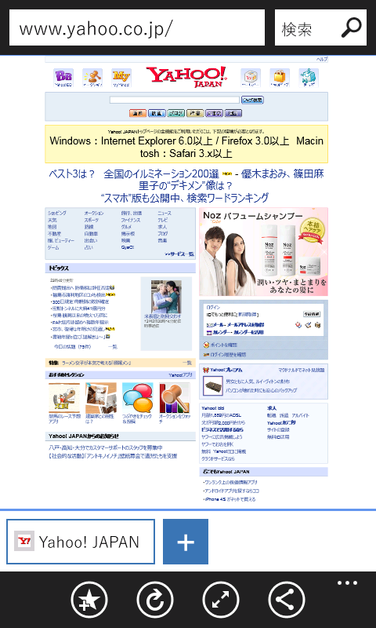

標準 User-Agent

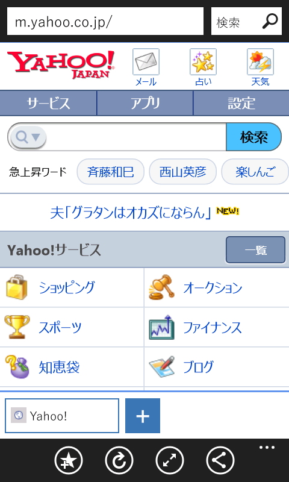

<a class="keyword" href="http://d.hatena.ne.jp/keyword/iPhone">iPhone</a> User-Agent

 

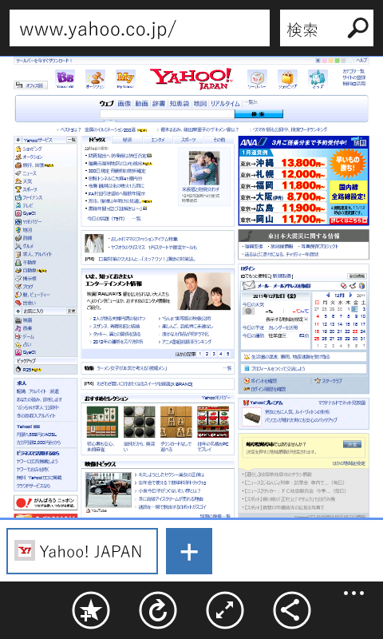

PC版<a class="keyword" href="http://d.hatena.ne.jp/keyword/IE">IE</a> User-Agent

以上簡単なレビューでした。  α版に比べて格段に使いやすくなりました。また、前回のレビューであげていた問題点もいくつか解決しています。  とはいえまだまだ動作がかくついて重く感じるほか、若干挙動が怪しい面もちらほら。今後のアップデートに期待しています。  また、今後のバージョンアップでジェスチャー機能の強化やタブグループ機能、履歴などにも対応するとか。楽しみです。

 

追記。  ふと気になったのですけど、規約などにもロケーションを利用することに関する免責事項などが載ってなかったんですが、どうして審査通ったのでしょう。ほかの方が作られているアプリでは<a class="keyword" href="http://d.hatena.ne.jp/keyword/GPS">GPS</a>を利用する旨をきちんと書いておかないと審査時にリジェクトされたのに・・・。
