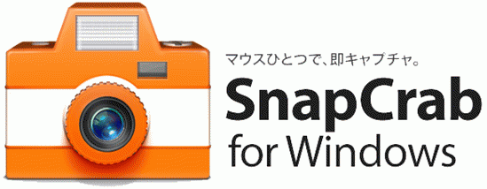
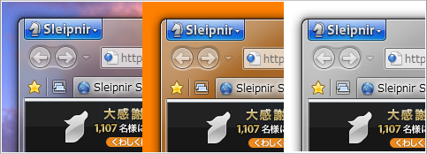
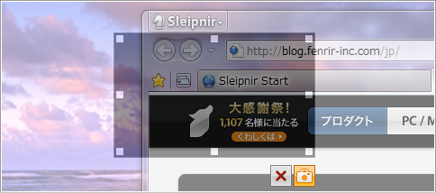
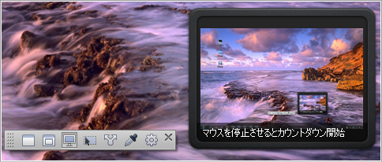
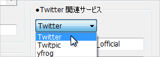

 

 

 

これまで<a class="keyword" href="http://d.hatena.ne.jp/keyword/%A5%B9%A5%AF%A5%EA%A1%BC%A5%F3%A5%B7%A5%E7%A5%C3%A5%C8">スクリーンショット</a>をとるときはOS標準機能かWinShotを利用していたのだけれど、WinShotはマルチモニターに対応していないのが地味に不便でした。

 

そんな折例によってFenrirがSnapCrab for <a class="keyword" href="http://d.hatena.ne.jp/keyword/Windows">Windows</a>を公開したので乗り換えてみました。

 

***

 

 

 

SnapCrab（ついうっかり<a class="keyword" href="http://d.hatena.ne.jp/keyword/ScanSnap">ScanSnap</a>と誤記しそうになる）に乗り換えてまず便利だと思ったのはAero Glassでもきれいにキャプチャできること。WinShotでは裏の壁紙やソフトが映り込んでしまうので気になっていました。アルファチャンネル対応で背景透過もできます。

 

 

 

 

 

 

プレビュー表示も便利ですね。特に指定範囲をキャプチャするときは微調整しやすいです。また範囲指定した後も以下の画像のようにさらに微調整が効きます。Shiftキー＋矢印キーで1ピクセル単位で調整できます。

 

 

 

<a class="keyword" href="http://d.hatena.ne.jp/keyword/Twitter">Twitter</a>などのストレージサービスに画像をアップロードできるという新機能。今のところ<a class="keyword" href="http://d.hatena.ne.jp/keyword/Twitter">Twitter</a>、Twitpic、yfrog、img.ly、<a class="keyword" href="http://d.hatena.ne.jp/keyword/Evernote">Evernote</a>に対応しているようです。gyazowin+みたいに好きなサーバーにアップできたらすてきなんですけどさすがに無理かな。

 

 

 

 

 

 

他にも

・ホットキー割り当て

・縮小保存

・タイマー

・カラーピッカー

などの機能がついてます。

 

 

 

などなど普段使う分には十分すぎる機能がついているんですけどもWinShoｔで良く利用していた機能が無いのが難点。その機能はコントロールをキャプチャする機能。範囲指定で代用できなくもないんですけど利便性が大分変わります。何せワンクリックで範囲できてしまうようなものなので。

 

以下こんなのがあったら良いなぁというもの

・外部アプリケーション提携機能

・カラーピッカーに<a class="keyword" href="http://d.hatena.ne.jp/keyword/CMYK">CMYK</a>追加

・右クリックメニューにセルフタイマーON/OFF機能

・定期実行キャプチャ

 

特に定期実行キャプチャは何としても実装して欲しいです。セルフタイマー＋範囲指定＋続けてキャプチャでいけるかと思ったんですけど範囲指定が解除されてしまう・・・。ウィンドウ全体をキャプチャするならできるんですけどね。。
