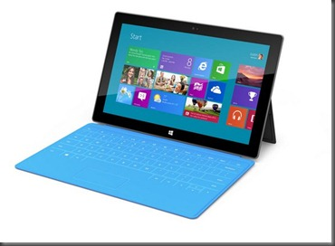

 

<a class="keyword" href="http://d.hatena.ne.jp/keyword/%A5%DE%A5%A4%A5%AF%A5%ED%A5%BD%A5%D5%A5%C8">マイクロソフト</a>が米国時間18日になにやら発表するということで<a class="keyword" href="http://d.hatena.ne.jp/keyword/%A5%BF%A5%D6%A5%EC%A5%C3%A5%C8">タブレット</a>ではないか<a class="keyword" href="http://d.hatena.ne.jp/keyword/Xbox">Xbox</a>関連サービスじゃないかとかいろいろ憶測が飛び交いましたがふたを開けてみたら予想通り<a class="keyword" href="http://d.hatena.ne.jp/keyword/%A5%BF%A5%D6%A5%EC%A5%C3%A5%C8">タブレット</a>端末でした。

 

***

 

 

 

<a class="keyword" href="http://d.hatena.ne.jp/keyword/Surface">Surface</a>。

 

これ、これまで出ていたテーブルのような形をしたコンピュータに使われていたブランドだったのですが、今回<a class="keyword" href="http://d.hatena.ne.jp/keyword/%A5%BF%A5%D6%A5%EC%A5%C3%A5%C8">タブレット</a>ブランドとして生まれ変わったようです。（ちなみにこれまでの<a class="keyword" href="http://d.hatena.ne.jp/keyword/Surface">Surface</a>はブランド名が変更されたようです）

 

今回の発表で一番驚くべきことは<a class="keyword" href="http://d.hatena.ne.jp/keyword/%A5%DE%A5%A4%A5%AF%A5%ED%A5%BD%A5%D5%A5%C8">マイクロソフト</a>自ら<a class="keyword" href="http://d.hatena.ne.jp/keyword/%A5%BF%A5%D6%A5%EC%A5%C3%A5%C8">タブレット</a>を作ったこと。これまでマウスやキーボード、上記にあげたテーブルコンピュータのようなハードウェアを作っていたものの<a class="keyword" href="http://d.hatena.ne.jp/keyword/%A5%DE%A5%A4%A5%AF%A5%ED%A5%BD%A5%D5%A5%C8">マイクロソフト</a>社自らが<a class="keyword" href="http://d.hatena.ne.jp/keyword/%A5%BF%A5%D6%A5%EC%A5%C3%A5%C8">タブレット</a>を開発するのは初めてのことです。<a class="keyword" href="http://d.hatena.ne.jp/keyword/Apple">Apple</a>のようにハードからソフトまですべて一社で完結している（ハードそのものは外注ですが）会社ならともかく<a class="keyword" href="http://d.hatena.ne.jp/keyword/Microsoft">Microsoft</a>は<a class="keyword" href="http://d.hatena.ne.jp/keyword/%B4%F0%CB%DC%C5%AA">基本的</a>にOSを作りそのOSをベンダーがつくるPC、端末に搭載してもらうという関係でした。今回その慣例を破ってまで出したところにMSの本気を感じます。

 

 

 

発表された<a class="keyword" href="http://d.hatena.ne.jp/keyword/%A5%BF%A5%D6%A5%EC%A5%C3%A5%C8">タブレット</a>は「<a class="keyword" href="http://d.hatena.ne.jp/keyword/Surface">Surface</a> for WindowsRT」と「<a class="keyword" href="http://d.hatena.ne.jp/keyword/Surface">Surface</a> for <a class="keyword" href="http://d.hatena.ne.jp/keyword/Windows%208">Windows 8</a> Pro」の2機種。

<a class="keyword" href="http://d.hatena.ne.jp/keyword/Surface">Surface</a> for WindowsRTはARMを用いた<a class="keyword" href="http://d.hatena.ne.jp/keyword/%A5%BF%A5%D6%A5%EC%A5%C3%A5%C8">タブレット</a>で<a class="keyword" href="http://d.hatena.ne.jp/keyword/Surface">Surface</a> for <a class="keyword" href="http://d.hatena.ne.jp/keyword/Windows%208">Windows 8</a> Proは従来と同様<a class="keyword" href="http://d.hatena.ne.jp/keyword/x86">x86</a>互換プロセッサーを用いた<a class="keyword" href="http://d.hatena.ne.jp/keyword/%A5%BF%A5%D6%A5%EC%A5%C3%A5%C8">タブレット</a>となります。

 

どちらも画面は10.6インチ<a class="keyword" href="http://d.hatena.ne.jp/keyword/%A5%BF%A5%D6%A5%EC%A5%C3%A5%C8">タブレット</a>ではあるものの<a class="keyword" href="http://d.hatena.ne.jp/keyword/Surface">Surface</a> for <a class="keyword" href="http://d.hatena.ne.jp/keyword/Windows%208">Windows 8</a> Proは<a class="keyword" href="http://d.hatena.ne.jp/keyword/%A5%D5%A5%EBHD">フルHD</a>解像度をサポートするそうです。その他スペックは以下の通り。

 

 

 

 

<a class="keyword" href="http://d.hatena.ne.jp/keyword/Surface">Surface</a> for WindowsRT

<a class="keyword" href="http://d.hatena.ne.jp/keyword/Surface">Surface</a> for <a class="keyword" href="http://d.hatena.ne.jp/keyword/Windows%208">Windows 8</a> Pro

 

 

OS

WindowsRT

<a class="keyword" href="http://d.hatena.ne.jp/keyword/Windows%208">Windows 8</a> Professional

 

 

厚さ

9.3mm

13.5mm

 

 

重さ

676g

903g

 

 

CPU

<a class="keyword" href="http://d.hatena.ne.jp/keyword/NVIDIA">NVIDIA</a>製 ARMプロセッサ

<a class="keyword" href="http://d.hatena.ne.jp/keyword/Intel">Intel</a> <a class="keyword" href="http://d.hatena.ne.jp/keyword/Ivy%20Bridge">Ivy Bridge</a>プロセッサ

 

 

ディスプレイ

10.6インチ <a class="keyword" href="http://d.hatena.ne.jp/keyword/ClearType">ClearType</a> HD

ゴリラガラス2

10.6インチ <a class="keyword" href="http://d.hatena.ne.jp/keyword/ClearType">ClearType</a> Full HD

ゴリラガラス2

 

 

容量

32GB,64GB

64GB,128GB

 

 

値段

ARMベースの<a class="keyword" href="http://d.hatena.ne.jp/keyword/%A5%BF%A5%D6%A5%EC%A5%C3%A5%C8">タブレット</a>と同程度

同スペックのUltrabook程度

 

 

消費電力

31.5W-h

42W-h

 

 

発売時期

<a class="keyword" href="http://d.hatena.ne.jp/keyword/Windows%208">Windows 8</a>発売と同時

<a class="keyword" href="http://d.hatena.ne.jp/keyword/Windows%208">Windows 8</a>発売から90日後

 

 

その他

・MicroSDスロット

・<a class="keyword" href="http://d.hatena.ne.jp/keyword/USB2.0">USB2.0</a>ポート

・<a class="keyword" href="http://d.hatena.ne.jp/keyword/HDMI">HDMI</a>出力

・デュアル 2x2 MIMO <a class="keyword" href="http://d.hatena.ne.jp/keyword/WiFi">WiFi</a>アンテナ

・フルキーボード・タッチパッド機能カバー

・Office 15 Home

・MicroSDXCスロット

・<a class="keyword" href="http://d.hatena.ne.jp/keyword/USB3.0">USB3.0</a>ポート

・<a class="keyword" href="http://d.hatena.ne.jp/keyword/HDMI">HDMI</a>出力（Mini DisplayPort）

・デュアル 2x2 MIMO <a class="keyword" href="http://d.hatena.ne.jp/keyword/WiFi">WiFi</a>アンテナ

・フルキーボード・タッチパッド機能カバー

・ペン入力とデジタルインク

 

 

 

 

 

<a class="keyword" href="http://d.hatena.ne.jp/keyword/Surface">Surface</a>は<a class="keyword" href="http://d.hatena.ne.jp/keyword/Windows%208">Windows 8</a>が動く最高の<a class="keyword" href="http://d.hatena.ne.jp/keyword/%A5%A4%A5%CE%A5%D9%A1%BC%A5%B7%A5%E7%A5%F3">イノベーション</a>を求めて開発した製品であり<a class="keyword" href="http://d.hatena.ne.jp/keyword/Windows%208">Windows 8</a>と<a class="keyword" href="http://d.hatena.ne.jp/keyword/Surface">Surface</a>は一つの統合されたパッケージとスティーブイ・バルマー氏は壇上で強調したそうで、<a class="keyword" href="http://d.hatena.ne.jp/keyword/Windows%208">Windows 8</a>の性能をフルに使うなら<a class="keyword" href="http://d.hatena.ne.jp/keyword/Surface">Surface</a>を買うべき！という感じですね。

 

カバーがキーボードになっているのも便利ですね。今回このカバーは二種類存在するようです。一つは「Touch Cover」という3mmの薄さながら感圧式のタッチ入力ができるキーボードになっているとのこと。もう一つの「Type Cover」は従来のキーボードと同様に打鍵感のあるものになっているとのこと。これは使う人の好みに左右されるので一度自分で試してみたいところです。

 

今回発表された<a class="keyword" href="http://d.hatena.ne.jp/keyword/Surface">Surface</a>は米国の<a class="keyword" href="http://d.hatena.ne.jp/keyword/Microsoft">Microsoft</a> Storeおよび一部の<a class="keyword" href="http://d.hatena.ne.jp/keyword/Microsoft">Microsoft</a> Storeオンラインで販売されるとのこと。日本での発売はどうなるのか非常に気になります。

何にしても<a class="keyword" href="http://d.hatena.ne.jp/keyword/Microsoft">Microsoft</a>が<a class="keyword" href="http://d.hatena.ne.jp/keyword/Windows%208">Windows 8</a>に社運をかけていることが非常にわかりました。<a class="keyword" href="http://d.hatena.ne.jp/keyword/Windows%20Phone%208">Windows Phone 8</a>もWinRTが導入されより<a class="keyword" href="http://d.hatena.ne.jp/keyword/Windows%208">Windows 8</a>と密接な関係になるという予想もありますし今後とも目が離せそうにないです。

 

関連サイト

<a class="keyword" href="http://d.hatena.ne.jp/keyword/%A5%DE%A5%A4%A5%AF%A5%ED%A5%BD%A5%D5%A5%C8">マイクロソフト</a>本気！自社ブランド端末『<a class="keyword" href="http://d.hatena.ne.jp/keyword/Surface">Surface</a>』で<a class="keyword" href="http://d.hatena.ne.jp/keyword/%A5%BF%A5%D6%A5%EC%A5%C3%A5%C8">タブレット</a>市場に殴り込み【ななふぉ管理人寄稿】

<a href="http://weekly.ascii.jp/elem/000/000/094/94216/">http://weekly.ascii.jp/elem/000/000/094/94216/</a>

 

速報：<a class="keyword" href="http://d.hatena.ne.jp/keyword/%A5%DE%A5%A4%A5%AF%A5%ED%A5%BD%A5%D5%A5%C8">マイクロソフト</a> <a class="keyword" href="http://d.hatena.ne.jp/keyword/Surface">Surface</a> <a class="keyword" href="http://d.hatena.ne.jp/keyword/%A5%BF%A5%D6%A5%EC%A5%C3%A5%C8">タブレット</a>発表、<a class="keyword" href="http://d.hatena.ne.jp/keyword/Windows%208">Windows 8</a>と同時発売 - Engadget Japanese

<a href="http://japanese.engadget.com/2012/06/18/surface/">http://japanese.engadget.com/2012/06/18/surface/</a>
