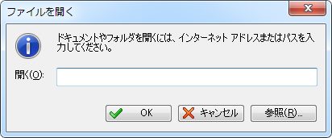
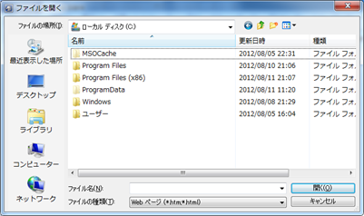

 

これまでメインは<a class="keyword" href="http://d.hatena.ne.jp/keyword/Sleipnir">Sleipnir</a> 2だったのですが<a class="keyword" href="http://d.hatena.ne.jp/keyword/Sleipnir">Sleipnir</a> 3が3.6にアップデートされて<a class="keyword" href="http://d.hatena.ne.jp/keyword/Headline-Reader">Headline-Reader</a>がFeedReaderとしてビルトインされたので<a class="keyword" href="http://d.hatena.ne.jp/keyword/Sleipnir">Sleipnir</a> 3をメインに持ってくることにしました。

 

私の環境では<a class="keyword" href="http://d.hatena.ne.jp/keyword/Sleipnir">Sleipnir</a> 3のほうが<a class="keyword" href="http://d.hatena.ne.jp/keyword/Sleipnir">Sleipnir</a> 2よりも安定していますし一気にタブを開いても固まることがなく、また<a class="keyword" href="http://d.hatena.ne.jp/keyword/%A5%EC%A5%F3%A5%C0%A5%EA%A5%F3%A5%B0">レンダリング</a>エンジンが<a class="keyword" href="http://d.hatena.ne.jp/keyword/Webkit">Webkit</a>なので軽快です。（私は<a class="keyword" href="http://d.hatena.ne.jp/keyword/Webkit">Webkit</a>そのものは好きなんですがかといって<a class="keyword" href="http://d.hatena.ne.jp/keyword/Google%20Chrome">Google Chrome</a>はあまり好きになれず。。。）

 

現段階ではFenrir公式から公開されている<a class="keyword" href="http://d.hatena.ne.jp/keyword/%A5%D7%A5%E9%A5%B0%A5%A4%A5%F3">プラグイン</a>はないのですが<a class="keyword" href="http://d.hatena.ne.jp/keyword/Webkit">Webkit</a>環境なら<a class="keyword" href="http://d.hatena.ne.jp/keyword/Google%20Chrome">Google Chrome</a>のアドインが利用できるのでとりあえずは問題ないです。

 

***

 

ただいくつか2から3に乗り換えて不便と思っている点があったのでいくつか羅列。

 

 

 

<strong>・ブックマークの切り替えができない</strong>

<a class="keyword" href="http://d.hatena.ne.jp/keyword/Sleipnir">Sleipnir</a> 1.66や2ではできたブックマークの切り替えが3には存在しません。私は普段利用しているブックマークと学業で利用するブックマークを完全に分けて利用していたので切り替え機能がないのが非常に不便です。FenrirのたばさんからFenrir Passのアカウントを切り替えて使うという裏ワザを教えていただきましたがうっかりするとブックマークを上書きして悲惨なことになってしまうのであまり使いたくない技です・・・。

<a title="http://twitter.com/tabayan/status/230940102631763968" href="http://twitter.com/tabayan/status/230940102631763968">http://twitter.com/tabayan/status/230940102631763968</a>

<a title="http://twitter.com/tabayan/status/230941146765996032" href="http://twitter.com/tabayan/status/230941146765996032">http://twitter.com/tabayan/status/230941146765996032</a>

 

<strong>・お気に入りグループがない</strong>

2では一時的に開いているタブをまとめて保存しておくときにお気に入りグループを利用していたんですが見たところ3ではないようです。タブグループをブックマークとして保存というのがあるのですが今後はこちらを使うということなんでしょうかね。

 

<strong>・ブックマークに追加のフォルダ選択がしにくい</strong>

2では「お気に入りに追加」ダイアログがそこそこ広く取られており、またフォルダが初期状態では展開されていない状態なのですが3ではダイアログの横幅が狭くなりフォルダが展開されているので逆に探しにくいのです。

私のブックマークは結構深い階層構造になっているので・・・。

 

<strong>・ブックマークに追加ボタンを消せない</strong>

具体的にはのボタン。ダイアログが出るのではなくブックマークバーのルート直下にいきなり保存されるんですよね。設定見た限りボタンを削除したりダイアログを表示するようなオプションがないのが無念。うっかり触ってしまうんです。。。

 

<strong>・ブックマークの整理がしにくい</strong>

2ではパネルにあった整理ボタンをクリックするとブックマークがタブで開かれて整理しやすくなっているんですが3では存在しません。複数選択してフォルダにポイできないのが苦痛かも・・・。

 

<strong>・ブックマークバーの挙動</strong>

これは単に私の癖が悪いだけなんですが。。

3ではブックマークバーからフォルダやアイテムの配置換えができるようになっています。ブックマークパネルを開かなくてもプロパティを開いたりできるので便利です。しかしこの仕様が私の場合ネックに・・・。私はブックマークバーから開きたいアイテムをクリックするまでにマウスをクリックしたまま探そうとする癖があるんです。これまでは開きたいアイテムのところで指を離すと開いてくれていたんですがこの仕様だとアイテムの配置換えをしそうになるんですよね。それはまぁいいんですけど指を離すとブックマークバーが閉じちゃうんです。深い階層まで開いているとついうっかりいつもの癖でクリックしてしまったがためにもう一度階層をもぐる必要が。。3になれるにつれて解消されるとは思いますが。

 

<strong>・Ctrl+Qで一気にタブを閉じると復活できない</strong>

私はタブを閉じるときよくCtrl+Wのショートカットを利用するのですがついうっかりCtrl+Qを押してアクティブタブ以外すべて閉じてしまうなんてことをやってしまいます。2ではそんな場合でも最後に閉じたページを開くボタンかCtrl+Lで一つずつ復活できたのですがなぜか3では復活できません。Ctrl+Wで閉じたページは復活できるのに・・・。

 

<strong>・戻る、進むボタンが時折おかしい</strong>

リンクをクリックしてページ遷移してもたまに戻る、進むボタンの表示が変わらないなんてことが。実際にはちゃんと認識しているようでちゃんと動くんですがなんとなくもにょります。

 

<strong>・プロキシをかませない？</strong>

まぁ私はほとんど使わないんですが、たまにローカルプロキシをかませたいことも。3ではどうやらプロキシをかますには大本のインターネットオプションをいじるしかないようで・・・。

 

<strong>・FeedReaderの挙動がおかしい？</strong>

これは単なるバグな気がするんですけども。

FeedReaderはセキュリティ上の理由から概要ページは強制的にTridentで開かれるようになっています。概要ページのページタイトルをクリックすると新規タブでその記事が開かれるようになっており、それはデフォルトの<a class="keyword" href="http://d.hatena.ne.jp/keyword/%A5%EC%A5%F3%A5%C0%A5%EA%A5%F3%A5%B0">レンダリング</a>エンジンが利用されるようになっています。しかし概要ページの「続きを読む」は新規タブで開かれずそのタブで開こうとするようです。この場合たとえデフォルト<a class="keyword" href="http://d.hatena.ne.jp/keyword/%A5%EC%A5%F3%A5%C0%A5%EA%A5%F3%A5%B0">レンダリング</a>エンジンを<a class="keyword" href="http://d.hatena.ne.jp/keyword/Webkit">Webkit</a>にしていても強制的にTridentで開かれ、また変更不可能です。<a class="keyword" href="http://d.hatena.ne.jp/keyword/Webkit">Webkit</a>がグレーアウトされています。

<a title="http://twitter.com/t_o/status/231307456389734400" href="http://twitter.com/t_o/status/231307456389734400">http://twitter.com/t_o/status/231307456389734400</a>

追記 大倉さんによると仕様だとのこと。

 

<strong>・スタートアップタブがない</strong>

私はブラウザを開いたらまずいくつかの巡回サイトをみるという習慣があります。2ではスタートアップにあらかじめ登録しておくことで起動時に巡回サイトを<a class="keyword" href="http://d.hatena.ne.jp/keyword/%BC%AB%C6%B0%C5%AA">自動的</a>に開いてくれていたのですが3ではなくなってしまったようです。割と便利だったのですが・・・。

 

<strong>・終了時の確認がない</strong>

ついうっかり終了ボタンを押してしまったとき2では設定を変えることで終了ダイアログを表示させることができたんですが3にはそういった設定がなくなってしまったようです。ついうっかり押してしまうなんてことは割とよくあるので実装をお願いしたいです。

 

<strong>・タブグループの保護</strong>

これは私が仕様を理解してなかっただけなんですが、タブグループの保護というのはただ単にそのタブグループそのものがブラウザを落としても保持されるという意味だったんですね。私はうっかりそのタブグループに所属するタブも保護されるものかと思っていました。普段は終了時開いていたタブはサイド起動するときには開いてほしくないので起動時に復元するタブの設定を<a class="keyword" href="http://d.hatena.ne.jp/keyword/Tablet">Tablet</a>のみを復元するにしているんですけども時たま次回起動時も再度開いてほしいタブなんてものも。<a class="keyword" href="http://d.hatena.ne.jp/keyword/Tablet">Tablet</a>にしておけばいい話なのですけどもちょっと面倒くさいんですよね。。。

 

<strong>・外部アプリケーションからURLをもらうと<a class="keyword" href="http://d.hatena.ne.jp/keyword/Sleipnir">Sleipnir</a>にフォーカスが移る</strong>

私は<a class="keyword" href="http://d.hatena.ne.jp/keyword/Twitter">Twitter</a>を利用する際面白そうな話とか興味深い話があったら後で見直すためにfavをしています。大概ふぁぼったものにはURLがついているので一気にそのURLを開きたいんですけども一つURLが<a class="keyword" href="http://d.hatena.ne.jp/keyword/Sleipnir">Sleipnir</a>に送られるたびに<a class="keyword" href="http://d.hatena.ne.jp/keyword/Sleipnir">Sleipnir</a>にフォーカスが移るんですよね。2ではそういうことがなかったので助かっていたんですが（設定でそうしていたのかも）。

 

<strong>・UIで利用できるボタンのデザインがちぐはぐ</strong>

単にアイコンデザインの問題なんですがちょっとこれだとマッチしてないですよね・・・。

 

<strong>・ファイルを開くダイアログの違い</strong>

2ではCtrl+Oで開く「ファイルを開く」ダイアログは

 

このようなデザインでした。

3になってから

 

こんな感じに。OS標準のダイアログに変わったようです。純粋に「ファイルを開く」のならこっちの方がいいんでしょうけども私は主にローカルファイルを開くのではなくURLを入力、というかコピペして開くために利用していました。3ではどうもURL指定で開くことができないようです。おかげでいちいち新規でタブを開いてURLバーに貼り付けてという手間が・・・。これ割と面倒なんですよ。。

 

 

 

以上重箱の隅を突っつきまくったような<a class="keyword" href="http://d.hatena.ne.jp/keyword/%A5%A2%A5%EC%A5%B2">アレゲ</a>な不満点でした。実際には私の勘違いもあったりしそうですが。。。

これ以外は非常に便利に利用しているのでこの不満点が解消されることを祈っています。

 

これまで<a class="keyword" href="http://d.hatena.ne.jp/keyword/Sleipnir">Sleipnir</a>はカスタマイズ性に優れたブラウザというものでしたが3.5から<a class="keyword" href="http://d.hatena.ne.jp/keyword/%A5%B9%A5%DE%A1%BC%A5%C8%A5%D5%A5%A9%A5%F3">スマートフォン</a>ユーザーのためのデスクトップブラウザという位置づけになったようで、<a class="keyword" href="http://d.hatena.ne.jp/keyword/%A5%B9%A5%DE%A1%BC%A5%C8%A5%D5%A5%A9%A5%F3">スマートフォン</a>ユーザーとしてはありがたいのですができるだけカスタマイズもできるようになるとうれしいです。

そして<a class="keyword" href="http://d.hatena.ne.jp/keyword/Windows">Windows</a> Phoneユーザーの私としては<strong><a class="keyword" href="http://d.hatena.ne.jp/keyword/Sleipnir%20Mobile">Sleipnir Mobile</a> for <a class="keyword" href="http://d.hatena.ne.jp/keyword/Windows">Windows</a> Phone</strong>が更新されてもっと使いやすく動作が軽くなってLinker機能も使えるようになったら大歓喜ですね！！！！

 

 

 

追記

FeedReaderの挙動がおかしい？ で書いた続きを読むで開いたページはTridentが強制されるという問題、この状態でアドレスバーのブックマークボタン（星のアイコン）をクリックすると普通ブックマークの追加ダイアログが出るんですけど出ないですね。でもって何度かクリックすると問答無用で強制終了します。フィードバックウィンドウが出たのでついでにフィードバック。

追記の追記 修正されました。
