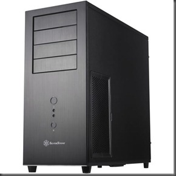
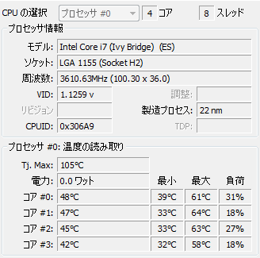
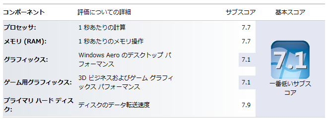

高校二年の夏に初めてパソコンを自分で組み立ててから早5年。その頃は最新鋭のCPUを積んだ高性能PCだったものの今では5万円PCにも下手をしたら劣るスペックになってしまったマイPC。グラフィックボードなどを増設などしてきましたがついに新しいPCに新調することにしました。

最初は前回と同じように自作をする予定でしたけど<a class="keyword" href="http://d.hatena.ne.jp/keyword/Twitter">Twitter</a>で知り合った方が<a class="keyword" href="http://d.hatena.ne.jp/keyword/BTO">BTO</a>パソコンの会社をやっているということだったのでパーツだけこちらで決めて組み立てはそちらでやっていただくことに。

 

***

 

初代<a class="keyword" href="http://d.hatena.ne.jp/keyword/%BC%AB%BA%EEPC">自作PC</a>のスペックは以下の通り（増設後の最終スペック）

<table width="512" border="0" cellspacing="0" cellpadding="0">
<tbody>
<tr>
<td valign="top" width="110">CPU</td>
<td valign="top" width="400"><a class="keyword" href="http://d.hatena.ne.jp/keyword/Core%202%20Quad">Core 2 Quad</a> Q6600 2.4GHz</td>
</tr>
<tr>
<td valign="top" width="110">メモリー</td>
<td valign="top" width="400">DDR2 <a class="keyword" href="http://d.hatena.ne.jp/keyword/SDRAM">SDRAM</a> 8GB</td>
</tr>
<tr>
<td valign="top" width="110"><a class="keyword" href="http://d.hatena.ne.jp/keyword/%A5%DE%A5%B6%A1%BC%A5%DC%A1%BC%A5%C9">マザーボード</a></td>
<td valign="top" width="400">GA-P35-<a class="keyword" href="http://d.hatena.ne.jp/keyword/DQ6">DQ6</a></td>
</tr>
<tr>
<td valign="top" width="110">電源</td>
<td valign="top" width="400">SS-600HM</td>
</tr>
<tr>
<td valign="top" width="110">ドライブ</td>
<td valign="top" width="400">IO-DATA DVR-ABM16C</td>
</tr>
<tr>
<td valign="top" width="110">グラフィック</td>
<td valign="top" width="400">HIS <a class="keyword" href="http://d.hatena.ne.jp/keyword/Radeon">Radeon</a> HD4670</td>
</tr>
<tr>
<td valign="top" width="110">ハードディスク</td>
<td valign="top" width="400">250GB,500GB,2TB,2.5TB HDD  <a class="keyword" href="http://d.hatena.ne.jp/keyword/Intel">Intel</a> <a class="keyword" href="http://d.hatena.ne.jp/keyword/SSD">SSD</a> 120GB</td>
</tr>
<tr>
<td valign="top" width="110">ケース</td>
<td valign="top" width="400">P182</td>
</tr>
<tr>
<td valign="top" width="110">その他</td>
<td valign="top" width="400">PT2</td>
</tr>
</tbody>
</table>

通常利用さえしていれば性能面では問題ないんでしょうけども私の利用用途だと少々動作が重くなってきたのが悩みの種でした。いろいろ起動させたままなので・・・。

そして新しいPCのスペックは以下の通り

<table width="400" border="0" cellspacing="0" cellpadding="2">
<tbody>
<tr>
<td valign="top" width="80">CPU</td>
<td valign="top" width="320"><a class="keyword" href="http://d.hatena.ne.jp/keyword/Intel">Intel</a> <a class="keyword" href="http://d.hatena.ne.jp/keyword/Xeon">Xeon</a> E3-1245 v2 （3.4GHｚ）</td>
</tr>
<tr>
<td valign="top" width="80">メモリー</td>
<td valign="top" width="320">DDR3 <a class="keyword" href="http://d.hatena.ne.jp/keyword/SDRAM">SDRAM</a> 32GB (12800)</td>
</tr>
<tr>
<td valign="top" width="80"><a class="keyword" href="http://d.hatena.ne.jp/keyword/%A5%DE%A5%B6%A1%BC%A5%DC%A1%BC%A5%C9">マザーボード</a></td>
<td valign="top" width="320">P8Z77-V DELUXE</td>
</tr>
<tr>
<td valign="top" width="80">電源</td>
<td valign="top" width="320"><a class="keyword" href="http://d.hatena.ne.jp/keyword/SST">SST</a>-ST75F-G-E</td>
</tr>
<tr>
<td valign="top" width="80">ドライブ</td>
<td valign="top" width="320">BDR-207JBK</td>
</tr>
<tr>
<td valign="top" width="80">グラフィック</td>
<td valign="top" width="320">GAINWARD GTX560Ti 1GB</td>
</tr>
<tr>
<td valign="top" width="80">ハードディスク</td>
<td valign="top" width="320"><a class="keyword" href="http://d.hatena.ne.jp/keyword/INTEL">INTEL</a> SSDSC2CT240A3ほか</td>
</tr>
<tr>
<td valign="top" width="80">ケース</td>
<td valign="top" width="320"><a class="keyword" href="http://d.hatena.ne.jp/keyword/SST">SST</a>-TJ04B-E</td>
</tr>
<tr>
<td valign="top" width="80">その他</td>
<td valign="top" width="320">PT3  RR-212E-20PK-JI</td>
</tr>
</tbody>
</table>

今回のPC新調に当たって自分が新PCに何を望むか考えたわけですけども、私の主な利用用途は

・プログラム開発（<a class="keyword" href="http://d.hatena.ne.jp/keyword/Visual%20Studio">Visual Studio</a>、<a class="keyword" href="http://d.hatena.ne.jp/keyword/Eclipse">Eclipse</a>）  ・ネットサーフィン  ・テレビ視聴・録画  ・動画<a class="keyword" href="http://d.hatena.ne.jp/keyword/%A5%A8%A5%F3%A5%B3%A1%BC%A5%C9">エンコード</a>

という感じ。上三つはさほどスペックが高くなくてもいいんですけども<a class="keyword" href="http://d.hatena.ne.jp/keyword/%A5%A8%A5%F3%A5%B3%A1%BC%A5%C9">エンコード</a>はやはりスペックが高い方が有利です。またすべて一つのPCで、時には同時進行で行うこともあるのでよりスペックの高さが求められます。

というわけで当初の予算は10万円だったんですけどもちょっとさらに奮発して最終金額は12万8000円（初代PCは15万円）。でも非常に満足のいくスペックになりました。

CPUは<a class="keyword" href="http://d.hatena.ne.jp/keyword/Intel">Intel</a>の<a class="keyword" href="http://d.hatena.ne.jp/keyword/Xeon">Xeon</a>。最初は<a class="keyword" href="http://d.hatena.ne.jp/keyword/Ivy%20Bridge">Ivy Bridge</a>のCorei7 3770にしようかと思っていたのですがこちらは同等品ながら安かったので。同じ<a class="keyword" href="http://d.hatena.ne.jp/keyword/Ivy%20Bridge">Ivy Bridge</a>ですので問題ありません。

メモリーはどどんと奮発して32GBに。これまで8GBだとメモリーが足りなくなってしまうこともあったのですがこれだけ積めばそうそうメモリー不足に悩まされることはありませんね。何GBか<a class="keyword" href="http://d.hatena.ne.jp/keyword/RAMDISK">RAMDISK</a>に割り当ててブラウザキャッシュなどを置くことにしました。

今回グラフィックチップは<a class="keyword" href="http://d.hatena.ne.jp/keyword/Radeon">Radeon</a>から<a class="keyword" href="http://d.hatena.ne.jp/keyword/GeForce">GeForce</a>に。本当は660Tiがよかったんですがまだ発表されておらずまた高くなりそうだったので今回はお流れ。そもそも<a class="keyword" href="http://d.hatena.ne.jp/keyword/GeForce">GeForce</a>を選んだのはCUDAを使いたかったからなのでCUDAさえちゃんとしていれば何でもよいといえばよかったんです。

前のPCはちょっとこの時期負荷を少しでもかけるとCPUが70度オーバーしたりしていたのですが（たぶんCPUクーラーにも問題が。。）今回のPCはちょっとPCに負荷をかけたところでそれほど上がることもなくすぐに冷えてくれるのがありがたいですね。 

ちなみに新PCのエクス<a class="keyword" href="http://d.hatena.ne.jp/keyword/%A5%DA%A5%EA%A5%A8">ペリエ</a>ンスインデックスの値はこんな感じ。

若干グラフィックが足を引っ張っていますけども上々です。自分の利用用途には十分ですね。

環境を構築して今実際に使っていますが、通常の動作自体は前のPCも別に悪いものではなかったのでさほど違いを感じません。しかし複数の重いソフトを同時に起動しているときなどのもたつきを感じなくなりました。メモリー不足で怒られることもなくなってストレスが軽減されました。またAviUtlを利用しているときも各動作が機敏になった印象を受けます。特に<a class="keyword" href="http://d.hatena.ne.jp/keyword/%A5%A6%A5%A9%A1%BC%A5%BF%A1%BC%A5%DE%A1%BC%A5%AF">ウォーターマーク</a>除去のためにロゴ検出をしたときなどは特に性能アップを感じさせてくれました。

総じて高い金を出して作った甲斐はあると思います。前メインPCと同じく5年は使い倒したいですね。

PCを作ってくださったすてねこさん、ありがとうございました！！

宣伝：

ゲームPCブランド My-Gear  <a href="http://my-gear.jp/">http://my-gear.jp/</a>

 

追記

新しいパソコンになって躓いた点のメモ書き

・Virtuを有効にする方法  購入時の<a class="keyword" href="http://d.hatena.ne.jp/keyword/UEFI">UEFI</a>の設定の問題で<a class="keyword" href="http://d.hatena.ne.jp/keyword/Intel">Intel</a>グラフィックドライバとVirtuのソフトがインストールできなかった。  <a class="keyword" href="http://d.hatena.ne.jp/keyword/UEFI">UEFI</a>のSystem Agent ConfigurationでInitiate Graphic AdapterをPCIEに、iGPU Multi-MonitorをEnabledにする必要がある。
