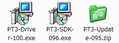
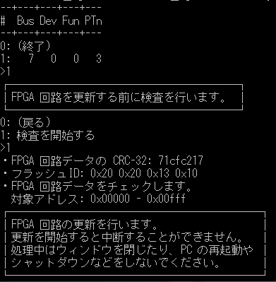
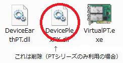
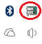
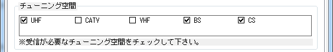
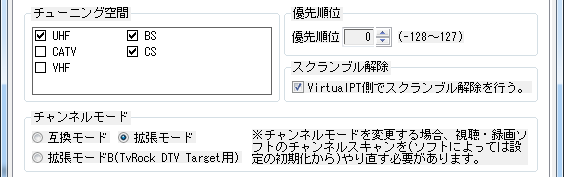

新PC購入に合わせてテレビ環境を一新しました。

前環境：PT2+TvRock+TVTest

↓

新環境：PT3+Virtual PT+EpgDataCap_Bon（EDCB）+TVTest

新しいPCのマザーボードはP8Z77-V DELUXE。PCIスロットがありません。

PT2はPCIですから下駄を履かせない限り使うことはできないのでPT3を購入しました。

PT1やPT2は二つのチューナーを搭載していたため地デジと衛星放送（BS/CS）のアンテナを各チューナーに一つずつ必要だったのですがPT3は一つのチューナーで地デジ*2、衛星放送*2に対応しているので日本のアンテナですむようになりました。

### PT3の稼働準備

1.

まずはPT3のドライバー（PT3-Driver-ｘxx.exe）とSDK（PT3-SDK-xxx.exe）をインストールします。アースソフトのページからそれぞれDLして指示通りクリックすればインストール完了です。  
PT2の頃はx64だとデジタル署名がされておらず有志が配布してくれていたドライバーをインストールする必要があったのですが（少々面倒くさい）、PT3では公式でドライバーに署名されているので非常に簡単になりました。

 

2.

インストールが終わったらFPGA回路の更新を行います。

これはどうやらハードウェアのバグを修正するもののようです。  
ロットによってはすでに最新版が充てられているものもあるようですが私が購入したものはまだ0x03だったので更新を行う必要がありました。

アースソフトからPT3-Update-095.zip（現時点）をダウンロードして解凍、Update.exeを実行します。

コマンドプロンプトが開くので 1 を入力してEnterを押すと更新が必要かどうか検査をするという表示が出るのでもう一度 1 を押してEnterを押すと検査され結果が表示されます。  
私の場合は更新が必要だったのでそのまま更新を行うかどうか尋ねられます。もちろん更新するので 1 を押してEnter。

 

いろいろ表示されるので止まるまで何もしないで待っていましょう。下手なことをするとPT3が故障します。

更新が終わったら一度PCをシャットダウンして電源プラグを引っこ抜いて最低10秒放置してからもう一度プラグを差し直して電源を入れましょう。

### VirtualPTのインストール**

これまではTvRockとTVTestを利用して視聴録画をしていましたがTvRockは更新されなくなってしまったため今後が心配です。  
というわけで現在も更新が続けられており万が一更新がなくなってもソースコードが公開されてるため第三者による更新が期待できるEpgDataCap_Bon（EDCB）を利用することにしました。

ただ残念なことに最新版になって複合化機能が削除されてしまいました。  
ソースコードのコメントアウトされている部分を解除してコンパイルすればいいのですが今後のバージョンアップでコメントアウトされていた部分そのものがばっさり消されることだってあり得るので保留。  
前々から気になっていたVirtualPTというソフトを導入することにしました。

VirtualPTというソフトはPT3などのチューナーを仮想化してソフトウェアから利用できるようにするソフトウェアとのこと。  
正直いまいちわかってなかったりするのですが、これを利用することでTvTestでBon_Driverを切り替えることなく地デジ、BS/CSにチャンネル切り替えをすることができたり録画ソフトと視聴ソフトが同じチャンネルにアクセスする場合本来二つの物理チューナーが必要なところを一つの物理チューナーでまかなったりできるとか。詳細は[こちら](http://blog.livedoor.jp/domamemo/archives/2283600.html)にあるので省きますが、今回はVirtualPTの機能の一つであるストリームのスクランブル解除を利用するために導入するわけです。

1.

まずはVectorからVirtualPTをダウンロードします。

ダウンロードしたZIPファイルを解凍して適切な場所に設置します。私の場合はProgram FilesにTVフォルダを作った上でその中に突っ込みました。  
UAC切っていない場合はCドライブ直下においた方がいいのかも・・・？

2.

x86フォルダとx64フォルダがあるので利用したいアーキテクチャのフォルダを開いてVirtualPT.exeを実行します。  
後述するようにTvTestの場合プラグインの関係でたとえx64なWindowsを利用していてもx86のTvTestを使うことになるのですがVirtualPTの場合は自分が使っているアーキテクチャのものを選んだ方がパフォーマンスが良いそうです。

 

3.

タスクトレイにVirtualPTのアイコン（起動後数秒点滅するPT2のようなデザインのもの）があるので右クリックして設定を開きます。

 

全般タブではチューニング空間を変更します。普通に使う場合UHF、BS、CS以外チェックを外しておけば良いかと思います。無論CATVな人はCATVにチェックを。

 

BCAS関連タブではBCASカードが刺さっているICカードリーダーが表示されているはずです。複数のリーダーを利用していない限り特に変更する必要はないと思います。  
下のECM処理を行うだけチェックを入れておきましょう。これにチェックを入れないとスクランブル解除ができません。

 

EARTH PTシリーズタブではLNB電源を供給するかどうかの設定があります。私の場合ほかの場所で供給しているのでOFFのままです。

BonDriver規定値タブではとりあえずチューニング空間を全般タブで設定したとおりにチェックを外した後「VirtualPT側でスクランブル解除を行う。」にチェックを入れておきましょう。  
私うっかりこれを見逃したためスクランブル解除されず1時間ほど悩みました・・・。

チェン寝るモードは拡張モードに切り替えます。こちらに切り替えないとスクランブル解除ができないとかどうとか。その他の設定はとりあえずいじる必要はないと思います。

 

4.

とりあえずVirtualPTの設定はこれでおしまいです。

次にサービス登録を行います。タスクトレイのVirtualPTのアイコンを右クリックしてサービス未登録→サービス登録をクリックします。これでサービスの登録は終わりです。  
Windowsのサービスとして動いているので表に見えているVirtualPTは終了しても問題ありません。

その2に続く