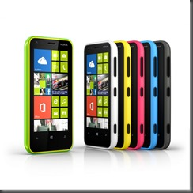
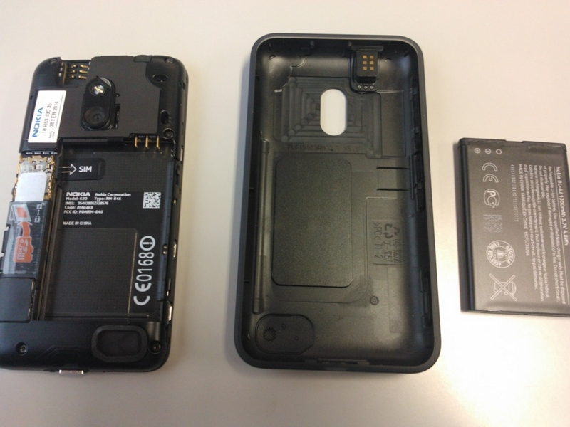
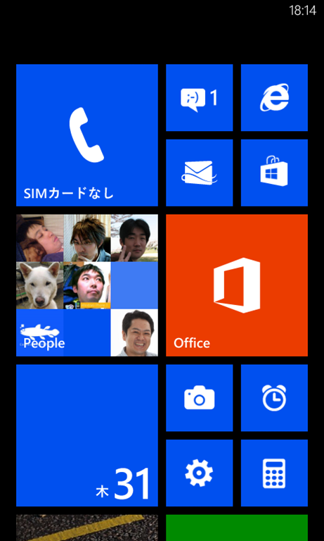
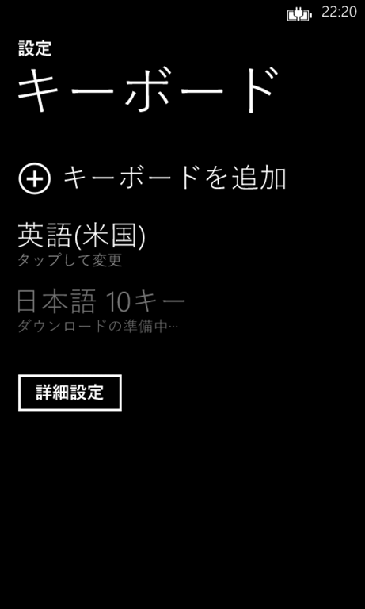

 

表題のままなんですがLumia 620 Blackを購入しました。

 

***

 

 

 

日本では<strong>まだ</strong>未発売の<a class="keyword" href="http://d.hatena.ne.jp/keyword/Windows%20Phone%208">Windows Phone 8</a>。

海外ではLumia 920など搭載端末が発売されているのに日本では何があったのか発売される兆しがありません。直輸入するにも大体4万以上もするので学生にはちょっと敷居が高く、一番安いHTC 8Sは<a class="keyword" href="http://d.hatena.ne.jp/keyword/NFC">NFC</a>非対応など開発用端末としては非力。

 

そんな中今月発売されたのがLumia 620でした。

スペック的にはWP7世代の端末とそう変わりませんが<a class="keyword" href="http://d.hatena.ne.jp/keyword/NFC">NFC</a>、MicroSDXCスロット搭載など開発するにはちょうどいい感じです。おそらく今後発売される端末の中で一番スペック的に低いものかと思いますのでこれでサクサク動くアプリを作ることができればすべてのWP8端末で軽快に動くかと。

この端末、3万円だせば送料など含めてもおつりが返ってきます。これは買うしかないですね。

 

今回は<a class="keyword" href="http://d.hatena.ne.jp/keyword/EXPANSYS">EXPANSYS</a>で購入しました。<a class="keyword" href="http://d.hatena.ne.jp/keyword/EXPANSYS">EXPANSYS</a>より先に1ShopMobileが取り扱いを開始していましたがあらかじめ<a class="keyword" href="http://d.hatena.ne.jp/keyword/EXPANSYS">EXPANSYS</a>で仮予約をしており10ドルオフになるためキャンセルせず待つことに。

 

入荷メールが来たのは1月21日。すぐにオーダー続行の連絡をしたところその日のうちに発送が行われ23日には届きました。香港からでもこれくらいで届くものなんですね。

 

届いた段ボール箱の中にはLumia 620の化粧箱とUSB-ACアダプタが。私はそれほど必要としませんが人によっては非常にありがたいものかと。

 

本体とバッテリーは別に格納されているので装着します。端末カバーはカメラ部分を抑え込むようにするとパカッと開きます。

 

 

バッテリーはそれなりに残量があったのでそのまま起動してみました。起動画面などはWP7と変わりません。

初期起動直後のスタート画面には香港で発売されていた端末ということもあり中国語のアプリがいくつか入っていました。ほかにも<a class="keyword" href="http://d.hatena.ne.jp/keyword/Nokia">Nokia</a>製のアプリが入っていましたが残念ながら日本では使えません。

 

 

<a class="keyword" href="http://d.hatena.ne.jp/keyword/Windows%20Phone%208">Windows Phone 8</a>からタイルサイズのバリエーションが増えとても小さなタイルも利用できるようになりました。

小さいといっても指でタップするには十分ですしメッセージのタイルを見ると分かるようにライブタイルにもちゃんと対応しています。

 

この香港版Lumia 620は日本語<a class="keyword" href="http://d.hatena.ne.jp/keyword/%A5%ED%A5%B1%A1%BC%A5%EB">ロケール</a>に対応していましたが日本語キーボードは入っていません。

とはいえ使えないわけではなくキーボードをダウンロード（この言い回しは違和感があります）することで利用可能です。

 

WP8になって個人的にありがたいと思ったのがPeopleハブにおける紐づけの同期です。

WP7ではせっかくアカウント情報を紐づけしても初期化するともう一度やり直しとなってしまっていたのがWP8ではちゃんと同期されています。この情報は<a class="keyword" href="http://d.hatena.ne.jp/keyword/Windows%208">Windows 8</a>のPeopleとも同期されているのでどちらかで行った変更もきちんともう片方に同期されます。

 

まだほかにも変更点などありますがこの辺で。

Lumia 620は3.8インチと程よいサイズですし<a class="keyword" href="http://d.hatena.ne.jp/keyword/NFC">NFC</a>、MicroSDXC対応と開発に適した端末だと思います。私が買った時よりも若干値下がりしていますしWP8端末を持っていないなら一つ買ってみてはいかがでしょうか。

 

 

 

追記

 

到着後何日かして<a class="keyword" href="http://d.hatena.ne.jp/keyword/FedEx">FedEx</a>から関税請求の封筒が届きました。今回は1200円でした。

銀行以外でもコンビニやオンラインバンキングから振り込みが可能なのでさっさと済ませましょう。
