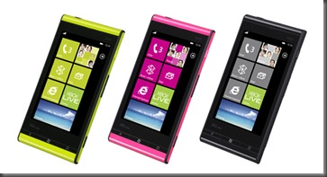

一部の人にしかアップデートがこないままずるずると時が過ぎていたIS12Tですが今日ようやく<a class="keyword" href="http://d.hatena.ne.jp/keyword/au">au</a>から公式発表がありました。

 

***

 

<blockquote>

平素は、<a class="keyword" href="http://d.hatena.ne.jp/keyword/au">au</a><a class="keyword" href="http://d.hatena.ne.jp/keyword/%A5%B9%A5%DE%A1%BC%A5%C8%A5%D5%A5%A9%A5%F3">スマートフォン</a>サービスをご利用いただきまして、誠にありがとうございます。  2013年1月31日から<a class="keyword" href="http://d.hatena.ne.jp/keyword/Windows">Windows</a>® Phone IS12Tの<a class="keyword" href="http://d.hatena.ne.jp/keyword/Windows">Windows</a>® Phone7.8へのOSアップデートを順次開始いたしましたが、アップデート後の<a class="keyword" href="http://d.hatena.ne.jp/keyword/Windows">Windows</a>® Phone7.8において不具合が確認されたことに伴い、現在<a class="keyword" href="http://d.hatena.ne.jp/keyword/Windows">Windows</a>® Phone7.8へのOSアップデートを停止しております。

このたび、2013年3月15日より<a class="keyword" href="http://d.hatena.ne.jp/keyword/Windows">Windows</a>® Phone7.8へアップデート済みの端末を対象に改善版のソフトウェアアップデートの配信が順次開始されておりますのでお知らせいたします。

なお、現在停止しております<a class="keyword" href="http://d.hatena.ne.jp/keyword/Windows">Windows</a>® Phone7.8へのOSアップデートについて、不具合を改善した内容にて近日中に再開する予定です。  再開の準備が整い次第、<a class="keyword" href="http://d.hatena.ne.jp/keyword/au">au</a>ホームページでお知らせいたしますので、お待ちください。

<a class="keyword" href="http://d.hatena.ne.jp/keyword/Windows">Windows</a>® Phone IS12Tをご利用のお客さまには大変ご迷惑をお掛けしますことを深くお詫び申し上げます。  <a title="http://www.au.kddi.com/seihin/ichiran/smartphone/up_date/is12t/up_date_20130315.html" href="http://www.au.kddi.com/seihin/ichiran/smartphone/up_date/is12t/up_date_20130315.html">http://www.au.kddi.com/seihin/ichiran/smartphone/up_date/is12t/up_date_20130315.html</a>

 

</blockquote>

ライブタイルに問題があり更新通知を停止していたというわけでした。  更新通知を止めていたならもっと早く公式発表しなさいよとかいろいろ不満はあるでしょうけど今回のアップデートでその不具合は解消され近日中にこれまでアップデートが来ていなかった人にも通知が来ることでしょう。  ちなみにこの不具合IS12T以外の端末（つまりは海外で発売されている端末ですが）でもおきていたようです。

さて、IS12Tに更新がやってきたわけですが、重要な変更点が今回のアップデートに含まれており割と騒ぎになっています。その変更点とは

<strong>〈注意事項〉</strong>

<blockquote>

本アップデートには、<a class="keyword" href="http://d.hatena.ne.jp/keyword/Google">Google</a> アカウントによる「連絡先」と「カレンダー」への同期サービスがサポート外となる仕様変更が含まれています。  このため、本アップデート実施後に新規で<a class="keyword" href="http://d.hatena.ne.jp/keyword/Google">Google</a>アカウントをIS12Tに登録された場合は、連絡先やカレンダーが同期されません。  アップデート実施前からご利用の<a class="keyword" href="http://d.hatena.ne.jp/keyword/Google">Google</a>アカウントについては引き続き同期されます。

</blockquote>

というもの。<a class="keyword" href="http://d.hatena.ne.jp/keyword/Google">Google</a>アカウントの連絡先とカレンダーを使っている人にとっては非常に問題のある変更点です。  なんでこんな変更を行ったんだといぶかる人も多いかと。いくつかニュースサイトをみましたがなぜ変更を行ったのかについてまで言及されているところはなかったのでMSが外部サービスを排除し始めたと思われる方もいるんじゃないかと思います。

実はこれ、<a class="keyword" href="http://d.hatena.ne.jp/keyword/Google">Google</a>の仕様変更によるものです。  <a class="keyword" href="http://d.hatena.ne.jp/keyword/Google">Google</a>は2012年の冬の大掃除と題していくつかのサービスの終了を発表しました。その中に「<a class="keyword" href="http://d.hatena.ne.jp/keyword/Google">Google</a> Sync」の終了が含まれていました。

この<a class="keyword" href="http://d.hatena.ne.jp/keyword/Google">Google</a> Syncとは<a class="keyword" href="http://d.hatena.ne.jp/keyword/Microsoft">Microsoft</a> Exchange ActiveSyncを用いて<a class="keyword" href="http://d.hatena.ne.jp/keyword/Google">Google</a>アカウントのメール、連絡先、カレンダーをほかの端末と同期するサービスのことです。<a class="keyword" href="http://d.hatena.ne.jp/keyword/Windows">Windows</a> Phoneでは<a class="keyword" href="http://d.hatena.ne.jp/keyword/Google">Google</a>アカウントを紐づけるとこのサービスを用いて同期を行っていました。このサービスが2013年1月30日をもって終了してしまったのです。なお、すでに<a class="keyword" href="http://d.hatena.ne.jp/keyword/Google">Google</a> Syncを利用していた端末ではそのまま利用ができます。

<blockquote>

アップデート実施前からご利用の<a class="keyword" href="http://d.hatena.ne.jp/keyword/Google">Google</a>アカウントについては引き続き同期されます。

</blockquote>

とあったのはそういう理由です。 

ちなみに<a class="keyword" href="http://d.hatena.ne.jp/keyword/Google">Google</a> Syncは<a class="keyword" href="http://d.hatena.ne.jp/keyword/iPhone">iPhone</a>でも用いられていました。しかし<a class="keyword" href="http://d.hatena.ne.jp/keyword/Windows">Windows</a> Phoneと比べて騒ぎが大きくならなかったのはオープン<a class="keyword" href="http://d.hatena.ne.jp/keyword/%A5%D7%A5%ED%A5%C8%A5%B3%A5%EB">プロトコル</a>のCardDAV、CalDAVに対応していたためです。<a class="keyword" href="http://d.hatena.ne.jp/keyword/Windows">Windows</a> Phoneはこれらの<a class="keyword" href="http://d.hatena.ne.jp/keyword/%A5%D7%A5%ED%A5%C8%A5%B3%A5%EB">プロトコル</a>に対応していなかったためちょっとした騒ぎになりました。すったもんだの末<a class="keyword" href="http://d.hatena.ne.jp/keyword/Google">Google</a>は<a class="keyword" href="http://d.hatena.ne.jp/keyword/Windows">Windows</a> Phoneユーザー向けに<a class="keyword" href="http://d.hatena.ne.jp/keyword/Google">Google</a> Syncのサポートを7月31日まで延長することを決定、<a class="keyword" href="http://d.hatena.ne.jp/keyword/Microsoft">Microsoft</a>はCardDAVとCalDAVのサポートに取り組むことを表明していました。（<a href="http://taisy0.com/2013/01/31/13790.html" target="_blank">参考記事</a>）

というわけで今回のアップデートによるサポート外となるものについても今後またサポートされるようになる・・・と思いたかったのですが昨日<a class="keyword" href="http://d.hatena.ne.jp/keyword/Google">Google</a>はまたしてもやらかしてくれました。

<a class="keyword" href="http://d.hatena.ne.jp/keyword/Google">Google</a>春の大掃除でCalDAVが廃止されるのです。今後は<a class="keyword" href="http://d.hatena.ne.jp/keyword/Google%20Calendar">Google Calendar</a> <a class="keyword" href="http://d.hatena.ne.jp/keyword/API">API</a>を使ってくれと。  正直馬鹿じゃないかと思うのですけどね。なんでオープン<a class="keyword" href="http://d.hatena.ne.jp/keyword/%A5%D7%A5%ED%A5%C8%A5%B3%A5%EB">プロトコル</a>を廃止して<a class="keyword" href="http://d.hatena.ne.jp/keyword/Google">Google</a>独自の<a class="keyword" href="http://d.hatena.ne.jp/keyword/API">API</a>を用いなければならないのか。今回の変更は<a class="keyword" href="http://d.hatena.ne.jp/keyword/iPhone">iPhone</a>にも影響するわけですが春の大掃除で<a class="keyword" href="http://d.hatena.ne.jp/keyword/Google%20Reader">Google Reader</a>が廃止されるというニュースのほうが大きいのかあまり大きく取り上げられていません。<a class="keyword" href="http://d.hatena.ne.jp/keyword/%A5%DB%A5%EF%A5%A4%A5%C8%A5%EA%A5%B9%A5%C8">ホワイトリスト</a>に載っている<a class="keyword" href="http://d.hatena.ne.jp/keyword/%A5%C7%A5%D9%A5%ED%A5%C3%A5%D1">デベロッパ</a>ーは対象外という話なのでその中に<a class="keyword" href="http://d.hatena.ne.jp/keyword/Apple">Apple</a>が入っているとかそういうことなのかもしれませんけど。

そんなわけでたぶん<a class="keyword" href="http://d.hatena.ne.jp/keyword/Windows">Windows</a> Phoneでは<a class="keyword" href="http://d.hatena.ne.jp/keyword/Google">Google</a>の連絡先やカレンダーを使うのが非常に難しくなってしまいました。文句がある人は自社製品の囲い込みをしたいのであろう<a class="keyword" href="http://d.hatena.ne.jp/keyword/Google">Google</a>に文句を言うべきかと。何にしても<a class="keyword" href="http://d.hatena.ne.jp/keyword/Google">Google</a>の信念であったはずのDon't be <a class="keyword" href="http://d.hatena.ne.jp/keyword/evil">evil</a>はどこにいってしまったのでしょうかね。

 

ちなみに私はLiveアカウントに全部移行していたので実害はありませんでした。なんだかんだそのOSを開発している会社が運用しているサービスを使うのが一番だということになってしまうわけですが・・・。  サービスなんてものはいつ何時終了してしまうかわかりませんし、何かあってもすぐに対応できるような態勢をとっておくというのも大事かもしれませんね。

 

追記（2013/03/16 11:35）  <a class="keyword" href="http://d.hatena.ne.jp/keyword/Google">Google</a>から公式発表があり<a class="keyword" href="http://d.hatena.ne.jp/keyword/Windows">Windows</a> PhoneにおいてもCalDAVへの使用許可を出したそうです。  これにより今後も<a class="keyword" href="http://d.hatena.ne.jp/keyword/Windows">Windows</a> Phoneで<a class="keyword" href="http://d.hatena.ne.jp/keyword/Google%A5%AB%A5%EC%A5%F3%A5%C0%A1%BC">Googleカレンダー</a>の情報を利用することが可能となります。現在まだ<a class="keyword" href="http://d.hatena.ne.jp/keyword/Windows">Windows</a> PhoneはCalDAVに対応しておらず<a class="keyword" href="http://d.hatena.ne.jp/keyword/Microsoft">Microsoft</a>が急ピッチで開発を行っておりますのでもう少しかかるかとは思いますがとりあえず一安心といったところです。次のアップデートを待ちましょう。
