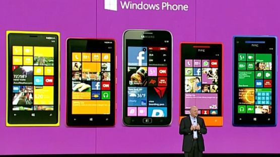
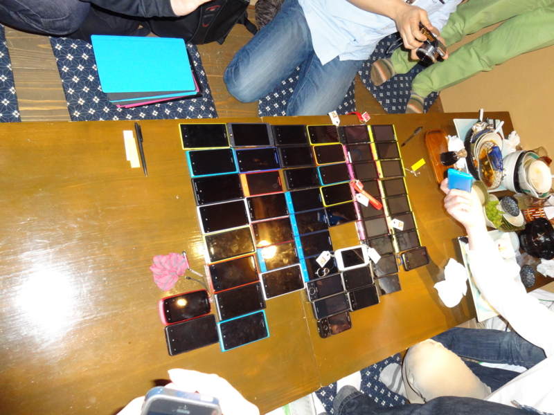

 

いつまでたっても日本で発売されない<a class="keyword" href="http://d.hatena.ne.jp/keyword/Windows">Windows</a> Phone。

業を煮やした<a class="keyword" href="http://d.hatena.ne.jp/keyword/Windows">Windows</a> Phoneファンが署名を始めました。

<blockquote>日本で<a class="keyword" href="http://d.hatena.ne.jp/keyword/au">au</a>から発売された唯一のWindowsPhone7端末IS12Tが発売されて、もうすぐ2年が経ちます。</blockquote>

プラットフォームとしては一部を除き日本<a class="keyword" href="http://d.hatena.ne.jp/keyword/%A5%ED%A1%BC%A5%AB%A5%E9%A5%A4%A5%BA">ローカライズ</a>が既にされているのに「売れる見込み＝需要」が見えないからキャリアが採用しないというのが一因だと思います。

じゃぁどれくらい待ち望んでいる人がいるのか可視化してみようということで署名を募ってみます。

賛同して頂ける人はコメントよろしくお願いします。

この署名を始めたのはいっちゅうさん。TrainTimeTableの作者さんです。

 

いっちゅうさんはこの間静岡県の草薙にある一部<a class="keyword" href="http://d.hatena.ne.jp/keyword/Windows">Windows</a> Phone<a class="keyword" href="http://d.hatena.ne.jp/keyword/%A5%AF%A5%E9%A5%B9%A5%BF">クラスタ</a>の聖地、<a class="keyword" href="http://d.hatena.ne.jp/keyword/au%A5%B7%A5%E7%A5%C3%A5%D7">auショップ</a>草薙の近所の居酒屋でオフ会を開催されまして、私も参加してきました。

 

 

このオフ会の二日後が<a class="keyword" href="http://d.hatena.ne.jp/keyword/au">au</a>の夏機種発表会であり、ほんのちょっとだけ期待していたわけですが案の定<a class="keyword" href="http://d.hatena.ne.jp/keyword/Windows%20Phone%208">Windows Phone 8</a>搭載端末はなく。挙句

 

<a href="https://twitter.com/tezawaly/status/336357596292329472">https://twitter.com/tezawaly/status/336357596292329472</a>

 

なんていう話もありまして<a class="keyword" href="http://d.hatena.ne.jp/keyword/Windows">Windows</a> Phone<a class="keyword" href="http://d.hatena.ne.jp/keyword/%A5%AF%A5%E9%A5%B9%A5%BF">クラスタ</a>は怒り心頭。署名運動に発展したのでありました。

署名ページでは目標1000人となっていますがより強くキャリアにお願いするためにもその数倍の賛同者を集めたいですね。

 

IS12Tが売れなかったがゆえに各キャリアが及び腰になっているのだと思いますが、たった一機種出した程度で決めてしまうのはあまりに惜しい。せめてあと2・3機種は出してほしいものです。

 

日本で出ないのはキャリアだけが悪いわけではなくさまざまな要因が複雑に絡まっているからだというのは分かっているんですけどね。MSは今<a href="http://jp.techcrunch.com/2012/06/21/20120620microsoft-announces-hardware-partners-ota-updates-and-something-special-for-enthusiasts/" target="_blank">4社</a>（<a class="keyword" href="http://d.hatena.ne.jp/keyword/Nokia">Nokia</a>、HTC、<a class="keyword" href="http://d.hatena.ne.jp/keyword/Samsung">Samsung</a>、Huawei）にしかライセンスを提供していませんのでその4社以外から<a class="keyword" href="http://d.hatena.ne.jp/keyword/Windows">Windows</a> Phone搭載端末が出ることはないんですが、<a class="keyword" href="http://d.hatena.ne.jp/keyword/Nokia">Nokia</a>は事実上日本撤退、<a class="keyword" href="http://d.hatena.ne.jp/keyword/%A5%B5%A5%E0%A5%B9%A5%F3">サムスン</a>は<a class="keyword" href="http://d.hatena.ne.jp/keyword/Android">Android</a>とTizen押し。HTCには期待したいところですがなんかHTCという会社自体が消えそうなごたごたがあるみたいですし・・・。

MSとしてもできればグローバルに販売できるだけの力があるところにお願いしたいでしょうから日本国内のメーカーには海外でも十分訴求力のある端末がだせるようになってくれると嬉しいです。

 

MSには地図の改善やユーザー辞書の実装などユーザーが望む最低限の機能を早く実装するようこちらも強く求めたいですね。

 

追記

なんかスティーブバルマーが日本でも<a class="keyword" href="http://d.hatena.ne.jp/keyword/Windows%20Phone%208">Windows Phone 8</a>端末を出せるよう全力で取り組んでいると発言したそうで。

<a href="https://twitter.com/tezawaly/status/337434075398815744">https://twitter.com/tezawaly/status/337434075398815744</a>

 

まぁ<a class="keyword" href="http://d.hatena.ne.jp/keyword/%A5%EA%A5%C3%A5%D7%A5%B5%A1%BC%A5%D3%A5%B9">リップサービス</a>何でしょうけど期待してしまいますね。

***