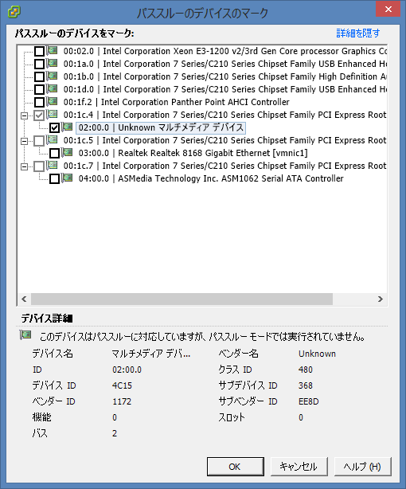

 これまで録画マシン＝メインマシンだったのですが電力を結構喰う構成なのに24時間起動しっぱなしという非常に電気代がもったいない状況でした。さすがに一人暮らしで自分で電気代を払っていかねばならない状況でこれはちょっと辛いので録画マシンを別に作ることに。

 

とはいえ単なる録画マシンだけではちょっともったいないと思ったのでこの機会にESXiサーバーを構築し、その中で<a class="keyword" href="http://d.hatena.ne.jp/keyword/%B2%BE%C1%DB%A5%DE%A5%B7%A5%F3">仮想マシン</a>として動く録画サーバーを稼働させることにしてみました。

 

***

 

以下が今回作成したマシンの構成です。

 

 

 

CPU

<a class="keyword" href="http://d.hatena.ne.jp/keyword/Intel">Intel</a> Corei5 3570T

\18980

 

 

メモリー

TED316G1333C9DC

\8400

 

 

<a class="keyword" href="http://d.hatena.ne.jp/keyword/%A5%DE%A5%B6%A1%BC%A5%DC%A1%BC%A5%C9">マザーボード</a>

H77Pro4M

\7980

 

 

HDD

WD10EZEX

\6070

 

 

電源

SPCRN500P

\6980

 

 

ケース

MONOBOX <a class="keyword" href="http://d.hatena.ne.jp/keyword/ATX">ATX</a>

\7900

 

 

 

今回利用する<a class="keyword" href="http://d.hatena.ne.jp/keyword/VMWare">VMWare</a> ESXiはハードウェア、とくにネットワークの制約が厳しいので注意が必要。<a class="keyword" href="http://d.hatena.ne.jp/keyword/Intel">Intel</a>製の<a class="keyword" href="http://d.hatena.ne.jp/keyword/NIC">NIC</a>なら問題ないみたいです。CPUは仮想化サポートがないものは使えません。<a class="keyword" href="http://d.hatena.ne.jp/keyword/Intel">Intel</a>だとVT-dですね。

24時間稼働させるのでできるだけ電力消費が少ないものにしたいと思い3570Tを選択しました。<a class="keyword" href="http://d.hatena.ne.jp/keyword/TDP">TDP</a>が45Wとなかなか優秀です。できれば35Wと行きたいですけど性能との兼ね合いで断念。明日発売のHaswellはそのあたり期待できそうです。

 

1時間ほどで組み立ててESXiのインストールです。

今回は<a class="keyword" href="http://d.hatena.ne.jp/keyword/USB%A5%E1%A5%E2%A5%EA">USBメモリ</a>ーにESXiをインストールしてみました。インストール自体はハードウェアが対応してないとかそういう問題がない限りはあっという間にインストールが終了するはずです。

起動したら黄色い画面になるのでF2を押して設定を変更しておきましょう。特に<a class="keyword" href="http://d.hatena.ne.jp/keyword/IP%A5%A2%A5%C9%A5%EC%A5%B9">IPアドレス</a>あたり。

 

ここからはvSphere Clientを利用します。

ESXiのISOイメージをダウンロードするついでにClientもダウンロードしてインストールしておきましょう。ESXいのバージョンとあってないものをインストールしても使えないので注意。

起動すると以下のような画面になるのでESXiサーバーの<a class="keyword" href="http://d.hatena.ne.jp/keyword/IP%A5%A2%A5%C9%A5%EC%A5%B9">IPアドレス</a>とユーザー名、パスワードを入力します。

 

 

初回時はセキュリティ警告が表示されますが気にしないで無視を選択しましょう。今後も表示させたくないなら

「この証明書をインストールし、「<a class="keyword" href="http://d.hatena.ne.jp/keyword/IP%A5%A2%A5%C9%A5%EC%A5%B9">IPアドレス</a>」に対するセキュリティ警告をすべて表示しない」

にチェックを入れておけばOKです。

 

ライセンスが切れるまであと60日というダイアログが出ますがあとで登録するのでOKを押して閉じてください。

 

vSphere Clientのメイン画面が表示されます。

 

 

まだ<a class="keyword" href="http://d.hatena.ne.jp/keyword/%B2%BE%C1%DB%A5%DE%A5%B7%A5%F3">仮想マシン</a>を設置するデータストア（データ領域）の設定が済んでいないためエラーが表示されています。

「今すぐストレージを追加するには、ここをクリックしてデータストアを作成」

をクリックするか構成タブ→ハードウェア→ストレージにあるストレージの追加を選択すると以下の画面が表示されます。

 

 

今回はESXiサーバーマシンに内蔵したHDDを利用するのでディスク/LUNのまま次へを選択します。

 

 

利用するHDDを選択して（今回は一台しか搭載していないので一個しか表示されてませんが）次へ。

 

 

データストアのファイルバージョンはVMFS-5のままで問題ないはずなのでこのまま次へ。

 

 

データストア名は後々のことを考えると短い名前のほうがよいかもしれません。

 

 

ESXi以外には利用しないので使用可能な最大領域のまま次へ。

 

 

設定に問題なければ終了を選択してください。データストアが作成されます。

 

データストアの作成が行われている間にESXiのライセンスを登録しておきましょう。

 

構成タブ→ソフトウェア→ライセンス機能を選択し、右上の編集をクリックします。

<a href="http://pandora.thty.net/wp-content/uploads/2013/06/client_licence1.png"> </a>

 

以下のようなダイアログが表示されますので

このホストに新規のライセンスキーを割り当てる

を選択し、 キーを入力 ボタンからあらかじめ手に入れておいたライセンスキーを入力します。これでライセンスは有効になります。

<a href="http://pandora.thty.net/wp-content/uploads/2013/06/client_licence2.png"> </a>

 

とりあえず<a class="keyword" href="http://d.hatena.ne.jp/keyword/%B2%BE%C1%DB%A5%DE%A5%B7%A5%F3">仮想マシン</a>を設置するための下準備は終わったので<a class="keyword" href="http://d.hatena.ne.jp/keyword/%B2%BE%C1%DB%A5%DE%A5%B7%A5%F3">仮想マシン</a>を作成します。

 

左の<a class="keyword" href="http://d.hatena.ne.jp/keyword/IP%A5%A2%A5%C9%A5%EC%A5%B9">IPアドレス</a>が表示されているツリーを右クリックし新規<a class="keyword" href="http://d.hatena.ne.jp/keyword/%B2%BE%C1%DB%A5%DE%A5%B7%A5%F3">仮想マシン</a>を選択します。

 

 

構成は標準とカスタムから選ぶことができますが、あとから編集できるのでとりあえず標準で行きます。

 

 

<a class="keyword" href="http://d.hatena.ne.jp/keyword/%B2%BE%C1%DB%A5%DE%A5%B7%A5%F3">仮想マシン</a>の名前を入力します。<a class="keyword" href="http://d.hatena.ne.jp/keyword/VMware">VMware</a>の識別名になるので英数字だけにしておいたほうがよさそう。

 

<a class="keyword" href="http://d.hatena.ne.jp/keyword/%B2%BE%C1%DB%A5%DE%A5%B7%A5%F3">仮想マシン</a>の格納先は先ほど作成したデータストアしかないのでそのまま次へ。

 

 

インストールするOSの種類を入力します。ここで選択した情報は<a class="keyword" href="http://d.hatena.ne.jp/keyword/VMWare">VMWare</a> Toolsインストール時に判定材料として使われるらしいので正しいものを選択しましょう。

今回私は<a class="keyword" href="http://d.hatena.ne.jp/keyword/Windows">Windows</a> Serverをインストールするので「<a class="keyword" href="http://d.hatena.ne.jp/keyword/Microsoft">Microsoft</a> <a class="keyword" href="http://d.hatena.ne.jp/keyword/Windows%20Server%202012">Windows Server 2012</a>（64ビット）」を選択しています。<a class="keyword" href="http://d.hatena.ne.jp/keyword/%B2%BE%C1%DB%A5%DE%A5%B7%A5%F3">仮想マシン</a>の名前からある程度<a class="keyword" href="http://d.hatena.ne.jp/keyword/%BC%AB%C6%B0%C5%AA">自動的</a>に判定してくれますが若干違うときもあるのできちんと確認しておきましょう。

 

ネットワーク接続の作成は私の場合<a class="keyword" href="http://d.hatena.ne.jp/keyword/NIC">NIC</a>が一つしかありませんし、よくわからないのでこのまま次へを選択。

<a href="http://pandora.thty.net/wp-content/uploads/2013/06/client_newmachine6.png"> </a>

 

<a class="keyword" href="http://d.hatena.ne.jp/keyword/%B2%BE%C1%DB%A5%DE%A5%B7%A5%F3">仮想マシン</a>の使用データ容量を入力します。三つ選択できる部分がありますが私はシックプロビジョニング（Lazy Zeroed）にしてます。ここの違いは<a href="http://shakaijin-life.net/2012/02/26/esxi5%E3%81%AE%E4%BB%AE%E6%83%B3%E3%83%87%E3%82%A3%E3%82%B9%E3%82%AF%E3%83%97%E3%83%AD%E3%83%93%E3%82%B8%E3%83%A7%E3%83%8B%E3%83%B3%E3%82%B0%E3%81%AE%E9%81%95%E3%81%84%E3%81%AB%E3%81%A4%E3%81%84/" target="_blank">このサイト</a>が詳しい。

 

これで<a class="keyword" href="http://d.hatena.ne.jp/keyword/%B2%BE%C1%DB%A5%DE%A5%B7%A5%F3">仮想マシン</a>の領域と設定が終わりました。終了を選択すると領域が作成されるので少し待ちます。

 

作成された<a class="keyword" href="http://d.hatena.ne.jp/keyword/%B2%BE%C1%DB%A5%DE%A5%B7%A5%F3">仮想マシン</a>は左のツリーに表示されます。右クリックして設定の編集を選択するとメモリーの割り当てサイズなどが変更できます。

 

それでは<a class="keyword" href="http://d.hatena.ne.jp/keyword/Windows">Windows</a> Serverをインストールします。

<a class="keyword" href="http://d.hatena.ne.jp/keyword/%B2%BE%C1%DB%A5%DE%A5%B7%A5%F3">仮想マシン</a>の電源を入れ、<a class="keyword" href="http://d.hatena.ne.jp/keyword/Windows">Windows</a> Serverのイメージを読み込み普通にインストールするだけなのでここは割愛。

 

インストールが終わったら<a class="keyword" href="http://d.hatena.ne.jp/keyword/Windows">Windows</a> Serverを起動します。

起動すると自動でサーバーマネージャが立ち上がります。役割と機能の追加を選択して

・<a class="keyword" href="http://d.hatena.ne.jp/keyword/.Net%20Framework">.Net Framework</a> 3.5

・Media Foundation

・デスクトップ エクス<a class="keyword" href="http://d.hatena.ne.jp/keyword/%A5%DA%A5%EA%A5%A8">ペリエ</a>ンス

を有効にします。これで<a class="keyword" href="http://d.hatena.ne.jp/keyword/Windows">Windows</a> Serverを普通の<a class="keyword" href="http://d.hatena.ne.jp/keyword/Windows%208">Windows 8</a>のように利用することができます。

 

それでは録画環境を構築します。

まずこのままでは<a class="keyword" href="http://d.hatena.ne.jp/keyword/%B2%BE%C1%DB%A5%DE%A5%B7%A5%F3">仮想マシン</a>はPT3を認識してくれません。ESXiでPT3をパススルー設定してあげる必要があります。

 

まず構成→ハードウェア→詳細設定を選択し、パススルーの構成をクリックします。

<a href="http://pandora.thty.net/wp-content/uploads/2013/06/client_pass-through1.png"> </a>

 

以下のウィンドウが表示されたらUnknown マルチメディア デバイスにチェックを入れOKを選択します。

<a href="http://pandora.thty.net/wp-content/uploads/2013/06/client_pass-through2.png"> </a>

これでESXiでPT3を触れるようになります。

 

次に<a class="keyword" href="http://d.hatena.ne.jp/keyword/%B2%BE%C1%DB%A5%DE%A5%B7%A5%F3">仮想マシン</a>からPT3を扱えるようにします。

 

まず<a class="keyword" href="http://d.hatena.ne.jp/keyword/%B2%BE%C1%DB%A5%DE%A5%B7%A5%F3">仮想マシン</a>が起動しているならシャットダウンをして、設定を開きます。

 

 

追加ボタンを選択すると以下のような画面が表示されるので<a class="keyword" href="http://d.hatena.ne.jp/keyword/PCI">PCI</a>デバイスを選択して次へ。

<a href="http://pandora.thty.net/wp-content/uploads/2013/06/client_pass-through4.png"> </a>

 

ここはこのまま次へ。次の画面で終了を選択。

これで<a class="keyword" href="http://d.hatena.ne.jp/keyword/%B2%BE%C1%DB%A5%DE%A5%B7%A5%F3">仮想マシン</a>上でPT3が認識されます。あとは普通に<a class="keyword" href="http://d.hatena.ne.jp/keyword/Windows">Windows</a>上からドライバや<a class="keyword" href="http://d.hatena.ne.jp/keyword/SDK">SDK</a>などをインストールするだけです。

 

 

SoftCasを使っているｱﾁｬｰな人やBonCasLinkを利用している人はともかくESXiマシンにUSBカードリーダーを接続して利用したいと思っている方はUSBデバイスのパススルーも行いましょう。

 

こちらは先ほどのハードウェアの追加からまずUSBコントローラを追加して、そのあとUSBデバイスを追加するだけです。これだけでUSBパススルーが行われます。あとは<a class="keyword" href="http://d.hatena.ne.jp/keyword/%A5%EA%A5%E2%A1%BC%A5%C8%A5%C7%A5%B9%A5%AF%A5%C8%A5%C3%A5%D7">リモートデスクトップ</a>時に切断されないようサービス化したりしてください。

 

さて、これで録画サーバーとしては完成しました。録画したファイルは保存されているフォルダを<a class="keyword" href="http://d.hatena.ne.jp/keyword/Windows">Windows</a>ファイル共有でメイン機につなげればメイン機でも録画したものが見られます。ただ、このままだとメイン機からテレビを見ることはできませんし録画設定できないのでネットワーク越しに接続できるようにしておきましょう。

とはいってもVirtualPTとEDCBの機能をいじるだけです。

メイン機からテレビを見るようにするにはVirtualPT用のBonDriverのiniファイルを編集し、録画サーバーの<a class="keyword" href="http://d.hatena.ne.jp/keyword/IP%A5%A2%A5%C9%A5%EC%A5%B9">IPアドレス</a>を記入しておくだけです。それだけで視聴可能になります。

録画設定はEDCBに入っているEPGTimerNW.exeを利用するだけ。起動するとサーバー<a class="keyword" href="http://d.hatena.ne.jp/keyword/IP%A5%A2%A5%C9%A5%EC%A5%B9">IPアドレス</a>とポートを記入する画面が表示されるので録画サーバーの<a class="keyword" href="http://d.hatena.ne.jp/keyword/IP%A5%A2%A5%C9%A5%EC%A5%B9">IPアドレス</a>とあらかじめ録画サーバーで起動しているEDCBの設定に記しておいたポート番号を入力し接続を選択するだけ。これで録画サーバーにあるEDCBをメイン機から制御できます。ちなみに私の環境ではEPGTimerNWを管理者権限で実行しないとうまく動きませんでした。たぶんProgram Filesにおいているのが原因です。

 

おまけ

 

ついでなので<a class="keyword" href="http://d.hatena.ne.jp/keyword/radiko">radiko</a>を録音しようと思ったのですが標準状態だと単純にradikaをインストールするだけでは駄目だったのでメモ。

 

<a class="keyword" href="http://d.hatena.ne.jp/keyword/Windows">Windows</a> Serverでは<a class="keyword" href="http://d.hatena.ne.jp/keyword/Internet%20Explorer">Internet Explorer</a>の設定が厳しくなっているため標準状態では<a class="keyword" href="http://d.hatena.ne.jp/keyword/Flash">Flash</a>が利用できません。

サーバーマネージャを起動してローカルサーバーのプロパティから<a class="keyword" href="http://d.hatena.ne.jp/keyword/IE">IE</a>セキュリティ強化の構成を選択し無効化してください。これで<a class="keyword" href="http://d.hatena.ne.jp/keyword/Flash">Flash</a>が利用可能になります。

もちろん<a class="keyword" href="http://d.hatena.ne.jp/keyword/DirectX">DirectX</a> 9.0cは入っていないのでインストールしてくださいね。
