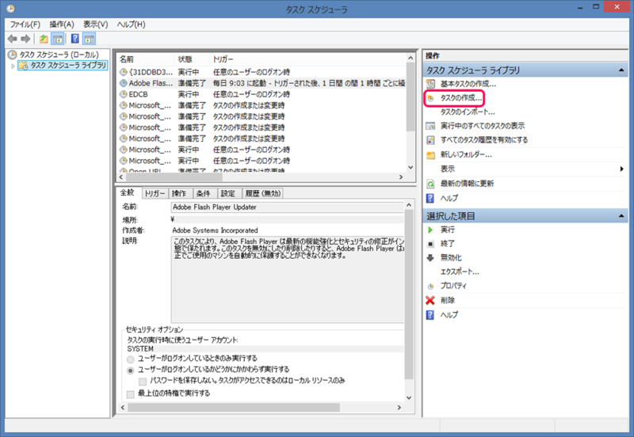
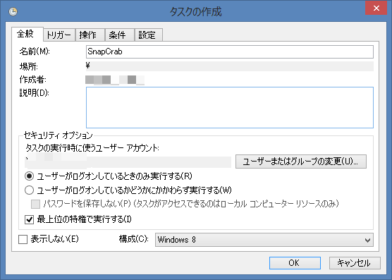
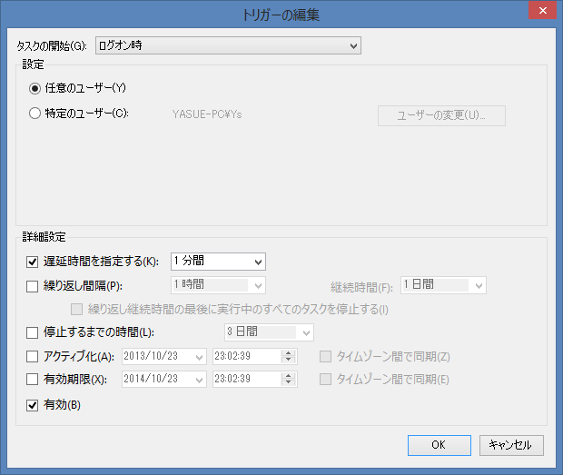
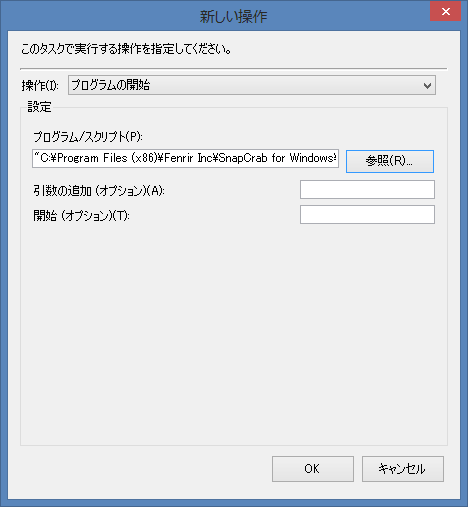
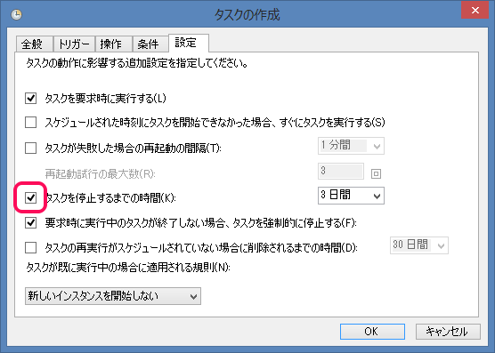

初めに懺悔。

 

この間<a class="keyword" href="http://d.hatena.ne.jp/keyword/Windows%208">Windows 8</a>を再インストールするまで<a class="keyword" href="http://d.hatena.ne.jp/keyword/UAC">UAC</a>切ってました（白目

 

<blockquote class="twitter-tweet" lang="ja">

<a href="https://twitter.com/Pandora_Ovis">@Pandora_Ovis</a> ゆるさない

— ゆたか (@tmyt) <a href="https://twitter.com/tmyt/status/393010684641808384">2013, 10月 23</a></blockquote>

 

***

 

 

 

というわけで今はちゃんと<a class="keyword" href="http://d.hatena.ne.jp/keyword/UAC">UAC</a>がオンの状態で使ってますが、この状態だと普通にSnapCrab起動しても（別にSnapCrabに限らないことですけど）管理者権限で動いているアプリの<a class="keyword" href="http://d.hatena.ne.jp/keyword/%A5%B9%A5%AF%A5%EA%A1%BC%A5%F3%A5%B7%A5%E7%A5%C3%A5%C8">スクリーンショット</a>が起動しません。

 

スタートアップフォルダにショートカットを置いてブート時に起動するようにしてるので、そのショートカットの設定かえて管理者権限付与してみましたがこれだとうまく動きませんでした。ちょっと調べてみたところ以下の記事を発見したので紹介。

 

【＃モリトーク】第73話：スタートアップと管理者権限 - <a class="keyword" href="http://d.hatena.ne.jp/keyword/%C1%EB%A4%CE%C5%CE">窓の杜</a>

<a href="http://www.forest.impress.co.jp/docs/serial/moritalk/20130917_615661.html">http://www.forest.impress.co.jp/docs/serial/moritalk/20130917_615661.html</a>

<blockquote>コントロール パネル\システムとセキュリティ\管理<a class="keyword" href="http://d.hatena.ne.jp/keyword/%A5%C4%A1%BC%A5%EB">ツール</a></blockquote>

からタスクスケジューラを起動します。Win+Rでtaskschd.<a class="keyword" href="http://d.hatena.ne.jp/keyword/msc">msc</a>と入力しても起動します。

 

 

右メニューのタスクの作成をクリックして全般タブの名前欄に適当な名前を付けます。今回はSnapCrabを起動するタスクを作るので名前欄にSnapCrabと入力しました。

 

そして最上位の特権で実行するにチェックを入れ、構成を今使っているOSと同じものにします。私は<a class="keyword" href="http://d.hatena.ne.jp/keyword/Windows%208">Windows 8</a>なので<a class="keyword" href="http://d.hatena.ne.jp/keyword/Windows%208">Windows 8</a>にしました。

 

 

次にトリガータブの新規ボタンを押してトリガーを作成します。

タスクの開始をログオン時に変えておけばOKです。お好みで起動のタイミングをずらしておくとよいかと。私は1分遅延させておきました。

 

 

操作タブの新規ボタンを押して起動したいアプリケーションを指定します。起動時オプションを指定したいなら引数の追加欄に入力してください。

 

 

設定タブを開いてタスクを停止するまでの時間のチェックを外します。

 

 

これで設定はおしまいです。あとはOKを押すだけで今後ブートしたときに管理者権限でアプリケーションが起動します。
