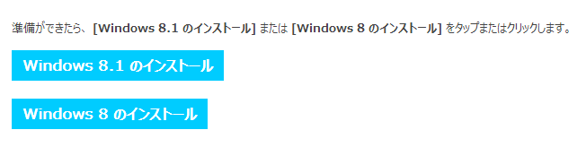

<a class="keyword" href="http://d.hatena.ne.jp/keyword/Windows%208.1">Windows 8.1</a>公開されましたね。私の周りは<a class="keyword" href="http://d.hatena.ne.jp/keyword/MSDN">MSDN</a>や<a class="keyword" href="http://d.hatena.ne.jp/keyword/TechNet">TechNet</a>ですでに使ってる人が多かったので非常に悔しい思いをしてましたがようやく使えます。

ただ現状だと<a class="keyword" href="http://d.hatena.ne.jp/keyword/Windows%208">Windows 8</a>をアップグレードインストールで8.1にするかパッケージを買ってくるしかインストール方法がないようです。アップグレードインストールは余計なごみが残ったり誤動作の原因になることがあるのでできれば<a class="keyword" href="http://d.hatena.ne.jp/keyword/%A5%AF%A5%EA%A1%BC%A5%F3%A5%A4%A5%F3%A5%B9%A5%C8%A1%BC%A5%EB">クリーンインストール</a>したいところ。

<a class="keyword" href="http://d.hatena.ne.jp/keyword/Microsoft">Microsoft</a>がISOイメージを公開してくれればいいんですが、公開してくれる兆しがないのであきらめてました。そしたらCNETでISOイメージを手に入れる方法がのっていたので紹介。

 

***

 

まず<a href="http://windows.microsoft.com/ja-jp/windows-8/upgrade-product-key-only" target="_blank">マイクロソフトのサイト</a>から<a class="keyword" href="http://d.hatena.ne.jp/keyword/Windows%208">Windows 8</a>のアップグレードソフトをダウンロードします。二つともダウンロードしてください。

ダウンロードしたソフトウェアのうち<a class="keyword" href="http://d.hatena.ne.jp/keyword/Windows%208">Windows 8</a>向けのソフト（<a class="keyword" href="http://d.hatena.ne.jp/keyword/Windows8">Windows8</a>-Setup.exe）を起動します。 起動したら<a class="keyword" href="http://d.hatena.ne.jp/keyword/Windows%208">Windows 8</a>のプロダクトキーを入力して次へを選択します。

次へ。

下の画面になったら×ボタンでソフトを終了してください。タイミングが遅れてダウンロードが始まると失敗します。 もしもタイミングが遅れてしまった場合は ・C:\Users\ユーザー名\AppData\Local\<a class="keyword" href="http://d.hatena.ne.jp/keyword/Microsoft">Microsoft</a>\WebSetup\ ・C:\ESD\ を削除してしまえばOKみたいです。

次に<a class="keyword" href="http://d.hatena.ne.jp/keyword/Windows%208.1">Windows 8.1</a>向けのソフト（WindowsSetupBox.exe）を起動します。起動すると自動的にダウンロードが始まります。

ダウンロードが終了すると以下のような画面になりますのでメディアを作ってインストールにチェックを入れて次へ。 の前にC:\ESD\<a class="keyword" href="http://d.hatena.ne.jp/keyword/Windows">Windows</a>\Sourcesにei.cfgというファイルを作り以下の文面を記入して保存しておいてください。(<a class="keyword" href="http://d.hatena.ne.jp/keyword/%A3%B2%A4%C1%A4%E3%A4%F3%A4%CD%A4%EB">２ちゃんねる</a>情報)

<blockquote>

[EditionID] [Channel] Retail [VL] 0

</blockquote>

今回は<a class="keyword" href="http://d.hatena.ne.jp/keyword/USB%A5%E1%A5%E2%A5%EA">USBメモリ</a>ーにインストールするのではなくISOイメージを作るのでISOファイルにチェックを入れて保存。

これで<a class="keyword" href="http://d.hatena.ne.jp/keyword/Windows%208.1">Windows 8.1</a>のインストールメディアが完成します。あとはDVDに書き込んでしまえば終了です。

ためしに作成したイメージでブートしてみましたがちゃんと<a class="keyword" href="http://d.hatena.ne.jp/keyword/Windows%208.1">Windows 8.1</a>がインストールできました。

ei.cfgで<a class="keyword" href="http://d.hatena.ne.jp/keyword/%A5%A4%A5%F3%A5%B9%A5%C8%A1%BC%A5%E9">インストーラ</a>をごまかすなど、ライセンス面で問題がないかちょっと気になりますが。。。
