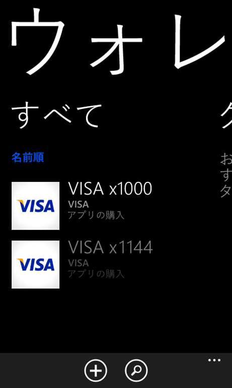
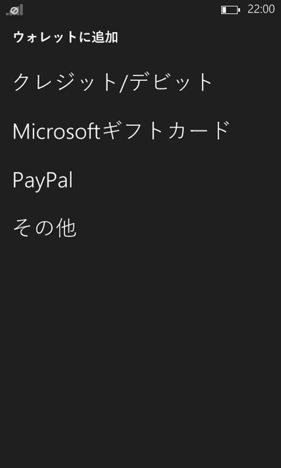
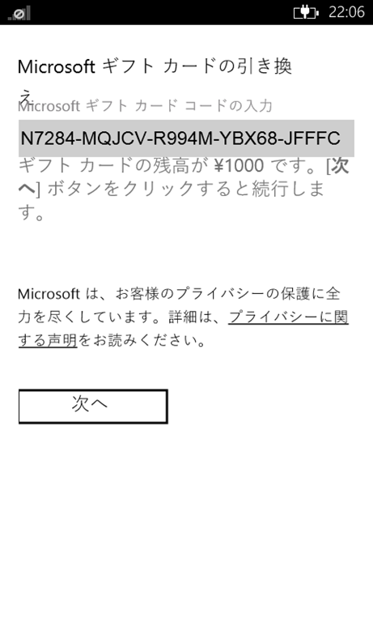
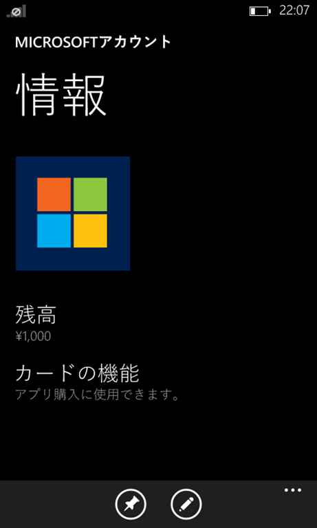
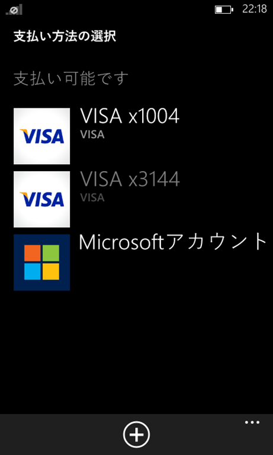
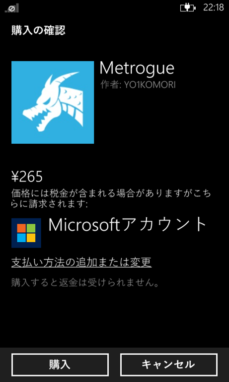

Windows 8.1が公開されるのと同時にWindowsストアギフトカードが発売されました。

xboxも以前は専用のポイントでしたが、9月から同じシステムとなっています。

Windows Phoneも勿論対応しています。残念ながら日本で発売されているIS12TはWindows Phone 7.5のため利用できませんが。

ギフトコードはウォレットで管理します。

 

ウォレットを起動し追加ボタンをタップすると選択肢が表示されます。

 

今回手元に用意したのはセブンイレブンで購入したxboxギフトカードですが、前述の通りシステム的には同じものなのでMicrosoft ギフトカードを選択します。

 

入力画面に遷移するので購入したコードを入力します。コードを入力するとそのコードの残高が表示されるようです。

 

後は次へのボタンをタップするだけで反映されます。

 
 

購入時にはストアで支払方法をギフトカードにするだけです。

これならクレジットカードを持ってない学生でもアプリを購入できますね。

ちなみにWindowsギフトカードは2000円と5000円の二種類ですが、xboxギフトカードは1000円からなので2000円分もいらないって人はコンビニへ行きましょう。

ところで気になったのが入力画面で引き換えの「え」の文字が改行されてしまい、下の行とかぶってしまっています。

あとコードの手打ちが面倒なのでiPhoneのようにカメラで認識してくれるようになると嬉しいですね。