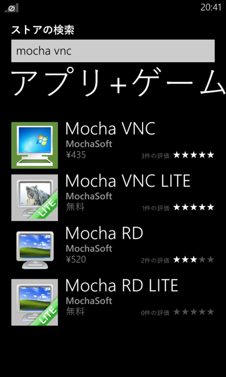
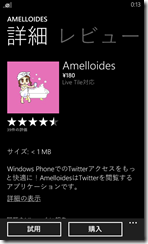
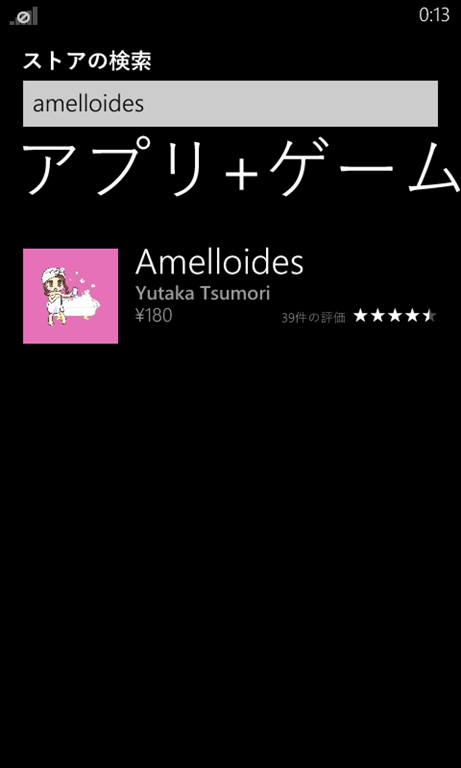
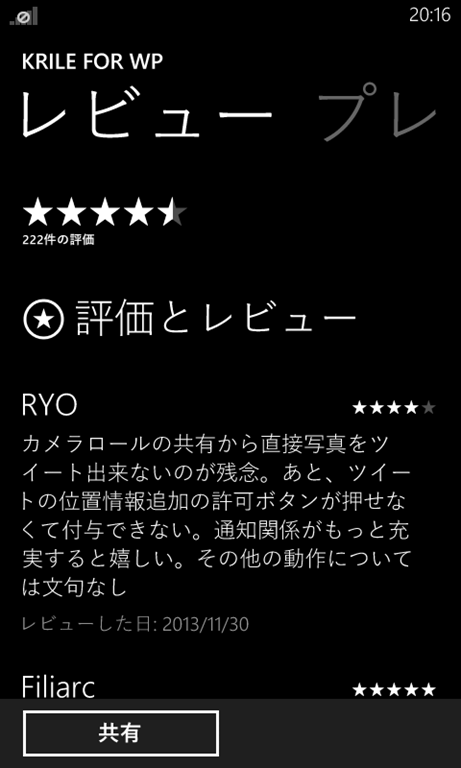

最近海外では<a class="keyword" href="http://d.hatena.ne.jp/keyword/Windows">Windows</a> Phoneが第三のOSとしての地位を固めつつあります。

 

勿論Lumiaの独擅場でしかも低価格端末によるシェア拡大ということ、他のOSも決して勢力争いから外れたわけではなく依然として第三のOS争いの強力なライバルなわけですが、とりあえずここまで来たことにファンの私としては感慨深いものがあります。

 

***

 

 

 

こうしてそれなりのシェアを確立させていることもあってか企業の公式アプリも少しずつではありますが増えてきています。

 

最近ですととうとう<a class="keyword" href="http://d.hatena.ne.jp/keyword/Instagram">Instagram</a>が公式にアプリを出して話題になりました。まだベータアプリで機能が追いついてはいませんが、これまでは非公式アプリしかなかったことを考えると大きな前進です。

また6秒動画共有サービスの<a class="keyword" href="http://d.hatena.ne.jp/keyword/Vine">Vine</a>公式アプリが登場したのも記憶に新しいところです。

 

さらに驚いたのはあの<a class="keyword" href="http://d.hatena.ne.jp/keyword/Google">Google</a>がWP向けにWaveを出したことですね。

<a class="keyword" href="http://d.hatena.ne.jp/keyword/Google">Google</a>は<a href="http://techtarget.itmedia.co.jp/tt/news/1212/28/news01.html">Windows 8やWindows Phone向けにはアプリを提供しない</a>としており、最近ですと<a class="keyword" href="http://d.hatena.ne.jp/keyword/%A5%DE%A5%A4%A5%AF%A5%ED%A5%BD%A5%D5%A5%C8">マイクロソフト</a>が開発した<a class="keyword" href="http://d.hatena.ne.jp/keyword/YouTube">YouTube</a>アプリに対してアクセス制限をかけるなど(<a class="keyword" href="http://d.hatena.ne.jp/keyword/Google">Google</a>側の言い分も分かるのですが)お世辞にも良い関係ではありませんでした。

その<a class="keyword" href="http://d.hatena.ne.jp/keyword/Google">Google</a>がアプリを出してきたということは、敵に塩を送ったつもりなのか無視できない程度にWPのシェアが上がったからなのかは定かではありませんがユーザーにとっては実に良い傾向です。

 

ユーザーはOSそのものよりもその端末で何ができるかを重視していると思われます。少なくともOSで選ぶのはそれなりに知識のある人でありこだわりのある人でしょう。

特に自分が使いたい、遊びたいアプリやゲームが配信されているかは重要なポイントです。そういう意味で海外は一つの大きな峠を越したといえるのではないかと思います。

 

日本は残念ながらたった一機種しか発売されず、一部のWP対応コンテンツもサービス終了が告知されるなど実に残念な状況にありますが、LINEが音声通話に対応したという話もあったように決して絶望する必要はないと言い聞かせています思っています。

 

ただ、気になっていることがあります。それはストアの残念な作りです。

 

<a class="keyword" href="http://d.hatena.ne.jp/keyword/Windows">Windows</a> Phoneはストアからしかアプリをインストールすることはできません。

だからこそストアの使い勝手は非常に重要になってくるのではないかと思うのですがいくつか気になるというかこういう風にしてほしいなというところがありまして。

 

まず同じアプリなのに有料無料分けて公開しているものが多いということ。

 

 

勿論それはアプリ開発者が意図的に分けているわけなのでMS自体が悪いわけではないのですが、せっかく一つのアプリで無料有料を切り替えられる<a class="keyword" href="http://d.hatena.ne.jp/keyword/API">API</a>が存在しているのになぜ使われないのか。

他のプラットフォームにない機能だということ、<a class="keyword" href="http://d.hatena.ne.jp/keyword/API">API</a>があまり認知されていないなどあると思いますが、ストアのUIも一因となっているのではないかと思うのです。

 

たとえばアプリを検索してみるとこんな感じ。

Amelloidesは試用版が存在しているのですがこの画面からはそれがわかりません。無料アプリを探している人はこの段階で候補から外してしまうことでしょう。せっかく試用版を用意していても、これでは触ってすらもらえないかもしれません。

また、試用版という表現も誤解を生みかねません。無料版でもすべての機能が使え、気に入った場合に購入してほしいとか広告を表示する代わりに機能制限なしというようなパターンもあるわけですので。

さらに言うと、一度買ったアプリを再度インストールしたいと思いアプリの詳細ページを開いたら購入ボタンが出てくること。初めての人はまた購入する必要があるのかってびっくりしますよきっと。というか私は初めてその場面に遭遇したとき戸惑いました。

 

次に気になるのがレビュー。

 

アプリをインストールするときは説明文と<a class="keyword" href="http://d.hatena.ne.jp/keyword/%A5%B9%A5%AF%A5%EA%A1%BC%A5%F3%A5%B7%A5%E7%A5%C3%A5%C8">スクリーンショット</a>だけでなく人がどのような評価を下しているかというのもとても気になります。

特に星が一つだけなんてアプリはインストールする気にはなれなかったりするものです。ストアには5段階の評価だけでなくレビューもかけるわけですが、何時のバージョン時点でのレビューなのかがわかるとうれしいですね。

○○の機能がなかったから評価を下げたというレビューの後その機能がバージョンアップで実装されたとしてもレビューがそのまま掲載されていたら古い情報を拡散するだけになるので。

できれば開発者からの返信もできるようになるとよいかなと。さらにいえば人のレビューに対する評価を第三者が付けられるようになるとより公平さが出てよいかなと思います。このあたり<a class="keyword" href="http://d.hatena.ne.jp/keyword/Android">Android</a>はすでに実装してますね。

 

次にアプリの購入方法。

 

最近<a class="keyword" href="http://d.hatena.ne.jp/keyword/Windows">Windows</a> ギフトカードでアプリが購入できるようになりクレジットカードがなくてもアプリを購入できるようになりました。学生のようにカードを持っていないユーザーには朗報ですね。

これに加えてもう一つ実装してほしいのがプロモーションコード機能。友人に自分が作っている有料アプリを使ってもらいたいとかレビューをほかの人に頼むときとか、あると便利な機能なので是非。<a class="keyword" href="http://d.hatena.ne.jp/keyword/iPhone">iPhone</a>にはありますね。

 

あともう一つ、これはほかのプラットフォームだとどうなのかしらないのですけど、更新履歴が見られるとうれしいなと。人によっては詳細欄に書いているようですが、専用の欄があるとありがたいのです。どんな新機能が加わったのかとかそういう情報、割と知りたくて。

 

あれこれ書きましたけど、これ一部の機能は<a class="keyword" href="http://d.hatena.ne.jp/keyword/Windows">Windows</a> ストアでは実装されているんですよね。リストにちゃんとお試し版があると明記されていたりレビューの第三者評価ができるとか。ぜひとも<a class="keyword" href="http://d.hatena.ne.jp/keyword/Windows">Windows</a> Phoneのストアもバージョンアップで対応していただきたいものです。
