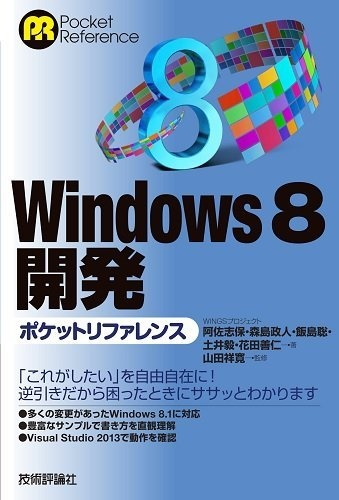

<a class="keyword" href="http://d.hatena.ne.jp/keyword/Twitter">Twitter</a>にてレビュー募集が行われていたので思わず募集してしまいました。

ポケットリファレンスシリーズの最新刊、<a class="keyword" href="http://d.hatena.ne.jp/keyword/Windows%208">Windows 8</a>から登場したストアアプリの開発で詰まった時にぱぱっと調べて疑問が氷解する便利な逆引き本です。
ストアアプリといえば<a class="keyword" href="http://d.hatena.ne.jp/keyword/Windows%208.1">Windows 8.1</a>で大幅に変更が施されましたが、もちろんその8.1開発に対応しています。確か現時点で8.1対応の開発本って出てなかったような気がするのである意味貴重です。

第一章のイントロダクションではまず<a class="keyword" href="http://d.hatena.ne.jp/keyword/Windows">Windows</a>ストアアプリとは何かから始まり、開発の前段階にあたる<a class="keyword" href="http://d.hatena.ne.jp/keyword/Visual%20Studio">Visual Studio</a>のインストール方法から開発後どのように公開するかまでが記載されています。
アプリケーションの非常に簡潔な作成方法は載っていますがそれ以上のことは記載されていません。逆引き本なので当然といえば当然ですね。

第二章は<a class="keyword" href="http://d.hatena.ne.jp/keyword/XAML">XAML</a>コントロールによるデザイン部分の逆引き情報が載っています。
この本の中で一番ページ数が割かれています。標準コントロールの利用方法について記述されていますので初心者はここでどのようにコントロールを利用すればいいか学べそうです。<a class="keyword" href="http://d.hatena.ne.jp/keyword/XAML">XAML</a>に記述した後どのようにコーディングすればよいかも記載されてます。

第三章は様々なビューの作成。ジェスチャーやライブタイルなど視覚的な点についての逆引きです。ストアアプリは<a class="keyword" href="http://d.hatena.ne.jp/keyword/%A5%BF%A5%D6%A5%EC%A5%C3%A5%C8">タブレット</a>に最適化されたアプリとなるためジェスチャーはぜひ利用したいところ。

第四章はハードウェア操作です。ストアアプリは既存のWin32APIを利用することができないため<a class="keyword" href="http://d.hatena.ne.jp/keyword/%A5%D5%A5%A1%A5%A4%A5%EB%A5%B7%A5%B9%A5%C6%A5%E0">ファイルシステム</a>アクセスなどはストアアプリ用<a class="keyword" href="http://d.hatena.ne.jp/keyword/API">API</a>を利用します。割と引っかかりやすいところのようなので必読です。
ストアアプリ<a class="keyword" href="http://d.hatena.ne.jp/keyword/API">API</a>って<a class="keyword" href="http://d.hatena.ne.jp/keyword/Windows">Windows</a> PhoneだとできなかったShift-JIS対応してるんですね・・・。

第五章のアプリ間連携は必ずしも必要というわけじゃないですけど実装しておくとアプリの幅が広がるのでぜひ実装しておきたいところ。外部のファイルを読み込む方法もこの賞に記載されています。

第六章はほかの章で取り上げられなかった各<a class="keyword" href="http://d.hatena.ne.jp/keyword/API">API</a>について。多言語化方法も簡単に取り上げられています。<a class="keyword" href="http://d.hatena.ne.jp/keyword/XML">XML</a>や<a class="keyword" href="http://d.hatena.ne.jp/keyword/JSON">JSON</a>、<a class="keyword" href="http://d.hatena.ne.jp/keyword/RSS%A5%D5%A5%A3%A1%BC%A5%C9">RSSフィード</a>などを読み込む方法も記載されていますのでウェブ連携を行うアプリを作るとき役立ちそうです。

第七章は非同期プログラミングについて。時間のかかる処理の場合処理の完了を待たずにほかの処理を並行して実行しないとユーザーにストレスを与えてしまうため、非同期処理はストアアプリ開発において非常に重要な役割を果たす・・・ということはわかっているもののasyncやawaitは最近出てきたもので何ぞやって人は多いはず。
私もいまいちわかってなかったので章初めの説明は助かりました。

所感としては痒い所に手が届く非常によい逆引き本だと思います。私のようなストアアプリ初心者の人はもちろんバリバリ開発している人も購入しておいたほうがよいのではないかという印象でした。
サンプルコードは残念ながらシンタックスハイライトされていませんが、すべてのコードがダウンロードできるのでそれで十分ですね。
コードはすべて<a class="keyword" href="http://d.hatena.ne.jp/keyword/C%23">C#</a>で描かれているのでVBerにはちょっと辛いかもしれません。そもそもストアアプリ開発は<a class="keyword" href="http://d.hatena.ne.jp/keyword/VB">VB</a>情報が少ないので・・・。

***