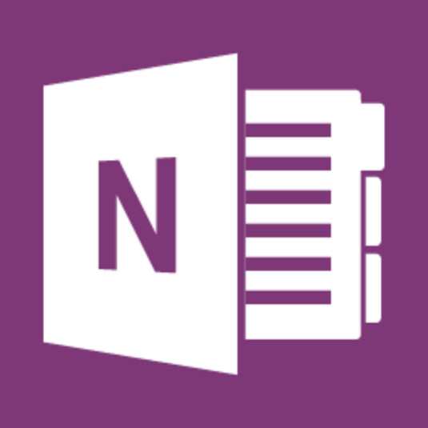

あの<a class="keyword" href="http://d.hatena.ne.jp/keyword/OneNote">OneNote</a>が無料になったらしいですよ！！！！

デジタ<a class="keyword" href="http://d.hatena.ne.jp/keyword/%A5%EB%A5%CE%A1%BC">ルノー</a>トとしては使いやすいもののOfficeスイートの一つのためあまり知名度は高くなかった<a class="keyword" href="http://d.hatena.ne.jp/keyword/OneNote">OneNote</a>。
なんと無料で公開されたそうです。

<a href="http://www.onenote.com/">Microsoft OneNote</a>

デジタ<a class="keyword" href="http://d.hatena.ne.jp/keyword/%A5%EB%A5%CE%A1%BC">ルノー</a>トの有名どころ、<a class="keyword" href="http://d.hatena.ne.jp/keyword/Evernote">Evernote</a>との相違は以下のリンクを参照。

<a href="http://www.microsoft.com/ja-jp/atlife/tips/archive/umall/office2010/1008_2/">人気のデジタル ノート Microsoft OneNote 2010 と Evernote の機能を比較｜Microsoft atLife TIPS アーカイブ</a>

本来は有料ソフトなだけあって高性能。もちろんモバイル対応もばっちりです。<a class="keyword" href="http://d.hatena.ne.jp/keyword/iPhone">iPhone</a>や<a class="keyword" href="http://d.hatena.ne.jp/keyword/Android">Android</a>はもちろん<a class="keyword" href="http://d.hatena.ne.jp/keyword/Windows">Windows</a> Phoneも対応してます。ここ重要。<a href="http://blogs.office.com/2014/03/17/onenote-now-on-mac-free-everywhere-and-service-powered/?WT.mc_id=CIC_TWITTER_Outgoing%20-%20Product%20Updates_20140317_48982341_Office">公式ブログ</a>によればすべてのプラットフォームで無償で利用できるとか。

ノートはOneDriveに保存されるので少なくとも7GBは無料ですね。無償版だと毎月40MBまでの<a class="keyword" href="http://d.hatena.ne.jp/keyword/Evernote">Evernote</a>と比べると雲泥の差です。<a class="keyword" href="http://d.hatena.ne.jp/keyword/%A5%AF%A5%E9%A5%A6%A5%C9">クラウド</a>で同期しないならローカルに保存できますのでその場合はローカル容量依存です。

なお公式サイトのリンクからだと<a href="http://www.onenote.com/Download/win32/x86/ja-JP">x86版</a>しかDLできないですね。
一応<a href="http://www.onenote.com/Download/win32/x64/ja-JP">x64版</a>もあるみたいです。

要注意なのは無償版では商用利用できないということ。
まぁ商用利用なら<a class="keyword" href="http://d.hatena.ne.jp/keyword/SharePoint">SharePoint</a>を使える有料版使ったほうがいいでしょうし問題ないと思いますけど。

***