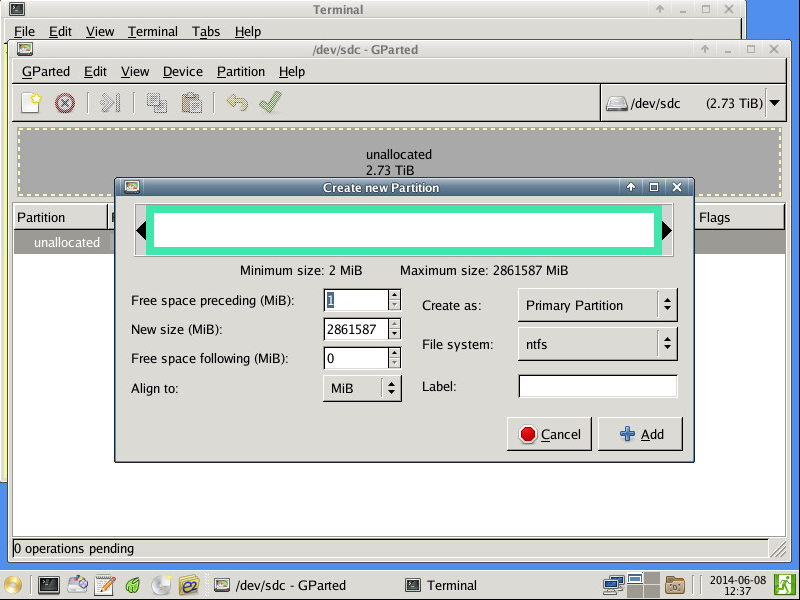

一年前にESXiサーバーを構築し、録画サーバーを<a class="keyword" href="http://d.hatena.ne.jp/keyword/%B2%BE%C1%DB%A5%DE%A5%B7%A5%F3">仮想マシン</a>として運用しているのですが、録画ファイルを置いておく仮想ディスクはvmdkファイルなのでパフォーマンス面で気になるところが。 
あとHDDを抜き取ってほかのマシンに差してもそのままでは中のデータを取り出せないのもなんとなく気持ちが悪い。

そんなわけでパススルーで直接HDDを<a class="keyword" href="http://d.hatena.ne.jp/keyword/%B2%BE%C1%DB%A5%DE%A5%B7%A5%F3">仮想マシン</a>から使えるようにしようと<a class="keyword" href="http://d.hatena.ne.jp/keyword/SATA">SATA</a>アダプター買ってきたりドライバいじったりしてたのですが残念ながら大失敗。
なので今回は<a class="keyword" href="http://d.hatena.ne.jp/keyword/RDM">RDM</a>（Raw Device Mapping）を使うことにしました。

***

<a class="keyword" href="http://d.hatena.ne.jp/keyword/RDM">RDM</a>はHDDを<a class="keyword" href="http://d.hatena.ne.jp/keyword/%A5%DE%A5%C3%A5%D4%A5%F3%A5%B0">マッピング</a>ファイルで紐づけて利用するものらしく、データストアに<a class="keyword" href="http://d.hatena.ne.jp/keyword/%A5%DE%A5%C3%A5%D4%A5%F3%A5%B0">マッピング</a>ファイルを置く必要があります。<a class="keyword" href="http://d.hatena.ne.jp/keyword/%A5%D1%A1%BC%A5%C6%A5%A3%A5%B7%A5%E7%A5%F3">パーティション</a>を分けることはできずHDD丸ごと使う形になるみたいです。 
まずはvSphere ClientからHDDのシリアル番号を取得します。

ほかの参考にしたサイトだとESXi上に<a class="keyword" href="http://d.hatena.ne.jp/keyword/SSH">SSH</a>でログインしてから

<blockquote>
ls -l /vmfs/devices/disks/
</blockquote>

を実行してシリアル番号を取得してましたけど多分vSphere Clientからシリアル番号を取得するほうがわかりやすい気がします。

次は<a class="keyword" href="http://d.hatena.ne.jp/keyword/%A5%DE%A5%C3%A5%D4%A5%F3%A5%B0">マッピング</a>ファイル（という名のvmdkファイル）を作成します。 
ESXiサーバーに<a class="keyword" href="http://d.hatena.ne.jp/keyword/SSH">SSH</a>でログインして以下のコマンドを実行。

<blockquote>
vmkfstools -z /vmfs/devices/disks/HDDのシリアル番号 "/vmfs/volumes/データストア名/マウントしたい<a class="keyword" href="http://d.hatena.ne.jp/keyword/%B2%BE%C1%DB%A5%DE%A5%B7%A5%F3">仮想マシン</a>ディレクトリ名/適当な名前.vmdk" -a lsilogic
</blockquote>

-zオプションはPhysicalモードでVMKernelを仲介しない方式、-rオプションだとVirtualモードでスナップショット機能などを使うことができるようになるそうなのですが、Virtualモードだと2TB以上のHDDを認識できないそうなので利用しません。 
2015/4/13追記 
ESXi 6.0では-a lsilogicは不要になりました。 
というかあると警告が出ます。（作成はされる模様）

あとはこれを<a class="keyword" href="http://d.hatena.ne.jp/keyword/%B2%BE%C1%DB%A5%DE%A5%B7%A5%F3">仮想マシン</a>に追加します。
既存の仮想ディスクを使用を選択したのち先ほど作成したvmdkファイルを選べばOKです。

これでHDDを<a class="keyword" href="http://d.hatena.ne.jp/keyword/RDM">RDM</a>を用いてマウントすることができるのですが、2TB以上のHDDを<a class="keyword" href="http://d.hatena.ne.jp/keyword/Windows">Windows</a>で利用したい場合はもうちょっと面倒な作業が必要みたいです。 
<a class="keyword" href="http://d.hatena.ne.jp/keyword/%BB%F6%BE%DD">事象</a>について日本語で言及、解決策を記載してるサイトが見つからなかったのですが、今回3TBのHDDを<a class="keyword" href="http://d.hatena.ne.jp/keyword/RDM">RDM</a>でマウントして<a class="keyword" href="http://d.hatena.ne.jp/keyword/Windows">Windows</a>の管理マネージャから確認すると以下の通り。

3TBのHDDなのに0MBのHDDとして認識されて何もできないという。 
ESXiのバグなのかよくわからないのですが英語サイトを物色していると解決策が見つかりました。

まずレスキューCDでもCDブートできる<a class="keyword" href="http://d.hatena.ne.jp/keyword/Linux">Linux</a>でもなんでもいいのでGPartedを使える環境を用意。 
GPartedを起動したら該当するHDDに<a class="keyword" href="http://d.hatena.ne.jp/keyword/%A5%D1%A1%BC%A5%C6%A5%A3%A5%B7%A5%E7%A5%F3">パーティション</a>テーブルを作成してNTFSでフォーマット。

これでOKです。

もう一度ディスク管理を見ればちゃんとNTFSフォーマットされた3TBのHDDが認識されています。

参考にしたサイト 
ESXi5におけるRaw Device Mappingのやりかたについて - k32ru's blog 
<a href="http://k32ru.hatenablog.com/entry/2013/07/14/223030">http://k32ru.hatenablog.com/entry/2013/07/14/223030</a> 
ESXi上の<a class="keyword" href="http://d.hatena.ne.jp/keyword/VM">VM</a>に、DAS(内蔵HDD)を追加する（<a class="keyword" href="http://d.hatena.ne.jp/keyword/RDM">RDM</a>) - Think threshold 
<a href="http://makoro.hatenablog.jp/entry/2014/01/23/160700">http://makoro.hatenablog.jp/entry/2014/01/23/160700</a> 
ESXi + <a class="keyword" href="http://d.hatena.ne.jp/keyword/RDM">RDM</a> = 0MB drive in <a class="keyword" href="http://d.hatena.ne.jp/keyword/Windows">Windows</a> - [H]ard|Forum 
<a href="http://hardforum.com/showthread.php?t=1731949">http://hardforum.com/showthread.php?t=1731949</a>

