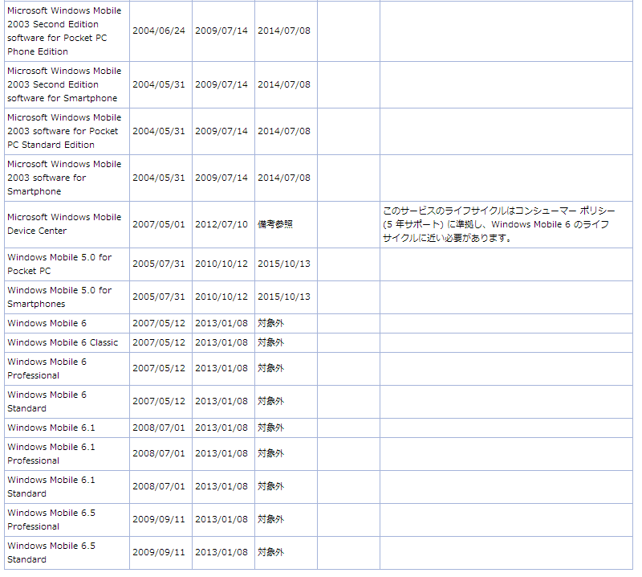

<blockquote class="twitter-tweet" lang="ja">
WM5ってまだサポート対象なんかよｗｗｗ
&mdash; ゆたか (@tmyt) <a href="https://twitter.com/tmyt/status/511148007664783360">2014, 9月 14</a></blockquote>

全く持って驚きの事実なんですが、<a class="keyword" href="http://d.hatena.ne.jp/keyword/Windows%20Mobile">Windows Mobile</a> 5.0のサポートはまだまだ続いてるんです。

<a href="http://support.microsoft.com/lifecycle/search/default.aspx?sort=PN&amp;alpha=windows+mobile&amp;Filter=FilterNO">Microsoft Product Lifecycle Search</a>

非常に不可解なんですが、<a class="keyword" href="http://d.hatena.ne.jp/keyword/Windows%20Mobile">Windows Mobile</a> 5.0 for <a class="keyword" href="http://d.hatena.ne.jp/keyword/Pocket%20PC">Pocket PC</a>と<a class="keyword" href="http://d.hatena.ne.jp/keyword/Windows%20Mobile">Windows Mobile</a> 5.0 for Smartphonesのサポート期限は2015/10/13。まだ1年もあったりします。

その次のバージョンにあたる<a class="keyword" href="http://d.hatena.ne.jp/keyword/Windows%20Mobile">Windows Mobile</a> 6.xはすでに切れているにもかかわらずなぜか5.0はまだまだ生き続けているんです。 
ついでにいうと<a class="keyword" href="http://d.hatena.ne.jp/keyword/Windows%20Mobile">Windows Mobile</a> 6.xより<a class="keyword" href="http://d.hatena.ne.jp/keyword/Windows%20Mobile">Windows Mobile</a> 2003のほうがサポート期限が長く、今年の7月までサポートされてました。なぜだ。

***