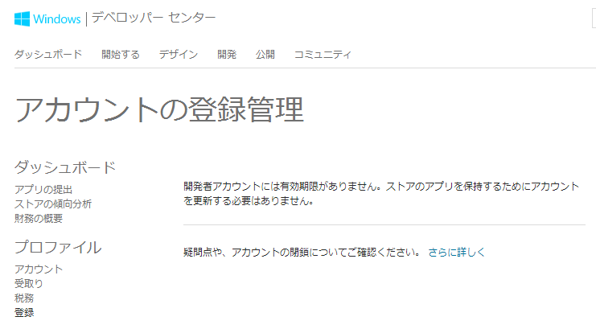

<blockquote class="twitter-tweet" lang="ja">
本日より、ストアアプリの開発者登録費用は、初回登録時の$19(個人登録)だけとなりました。1年ごとの更新は廃止されました。&#10;<a href="http://t.co/klwoOPWVoW">http://t.co/klwoOPWVoW</a>&#10;<a href="https://twitter.com/hashtag/win8dev_jp?src=hash">#win8dev_jp</a> <a href="https://twitter.com/hashtag/wpdev_jp?src=hash">#wpdev_jp</a>&#10;<a href="https://twitter.com/biac">@biac</a> <a href="http://t.co/72GaOmfYNv">pic.twitter.com/72GaOmfYNv</a>
&mdash; 山本康彦＠BluewaterSoft (@biac) <a href="https://twitter.com/biac/status/512147289293336578">2014, 9月 17</a></blockquote>

TLを眺めていたら@biacさんがこんなつぶやきをされてました。

<a class="keyword" href="http://d.hatena.ne.jp/keyword/Windows">Windows</a>ストアおよび<a class="keyword" href="http://d.hatena.ne.jp/keyword/Windows">Windows</a> Phoneストアの開発者登録にはこれまで登録料金および更新料金として年間1847円（米ドル19ドル）かかっていましたが、9月17日付で更新料金が撤廃され、初年度に登録料金を支払うだけで開発者登録ができるようになったようです。

もともとは<a class="keyword" href="http://d.hatena.ne.jp/keyword/Windows">Windows</a>ストアと<a class="keyword" href="http://d.hatena.ne.jp/keyword/Windows">Windows</a> Phoneストアの開発者登録は別々で、しかもそれぞれ年間49ドル、99ドルかかっていましたが、統合、値段改訂の末ここまで安くなったようです。 
ちなみに<a class="keyword" href="http://d.hatena.ne.jp/keyword/iOS">iOS</a>の開発者登録費用は年間7800円、<a class="keyword" href="http://d.hatena.ne.jp/keyword/Android">Android</a>の開発者登録費用は25ドル（初年度のみ）なので、<a class="keyword" href="http://d.hatena.ne.jp/keyword/Windows">Windows</a>ストア開発者の登録料金が一番安くなりました。

なお、biacさんのほかのつぶやきによれば企業向けアカウントも初年度のみの料金ですむようになったようです。

<blockquote class="twitter-tweet" lang="ja">
法人登録(9800円)も同様です。&#10;アカウントの登録画面で「開発者アカウントには有効期限がありません…」と表示されるのを確認しました。&#10;<a href="https://twitter.com/biac">@biac</a>
&mdash; 山本康彦＠BluewaterSoft (@biac) <a href="https://twitter.com/biac/status/512149127589675008">2014, 9月 17</a></blockquote>

実際に私も確認してみましたが、確かに開発者アカウントには有効期限がありませんと記載されてます。

これで毎年金がかかるからと登録を躊躇していた開発者が増えるかどうかは・・・わかりませんが、少なくとも大きなメリットかと思います。

あとは、<b>日本ででるかどうかですね</b>（白目

***