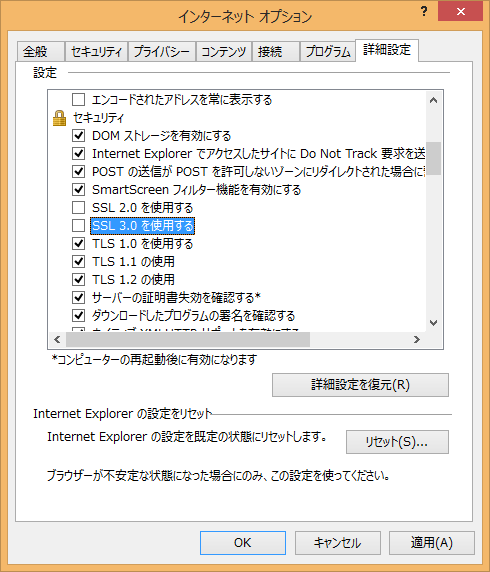

今日未明にTwitter、Facebookなど一部のサービスがSSL3.0経由での接続を遮断したそうです。

どうやらSSL3.0に脆弱性が発見されたとか。

[グーグルのセキュリティチーム、SSL 3.0の脆弱性「POODLE」を説明](http://japan.cnet.com/news/service/35055155/)

これが原因でInternet ExplorerからTwitterやFacebookが開けない！とそれなりに騒ぎになっているようで。

そんな人はまずツールバーのツールメニューからインターネットオプションを開き、詳細設定タブのセキュリティカテゴリにある

```
* SSL 3.0 を使用する  
```

のチェックを外して以下の項目にチェックを入れてください。

- TLS 1.0 を使用する
- TLS 1.1 の使用
- TLS 1.2 の使用

 

あとはInternet Explorerを一度終了してもう一度起動させてください。  
もしかしたらこれでうまくいくかもしれません。

なお、Saezuri、Azureaなど一部のTwitterアプリケーションもこの設定に影響されるそうなので、うまく動かないとお嘆きの方もこの設定を見直すとよいかと。

### 参考
[マイクロソフト セキュリティ アドバイザリ 3009008](https://technet.microsoft.com/ja-jp/library/security/3009008)

### 追記  
SSL3.0を無効化したことで一部のサイトでは逆に表示されなくなることもあります（e-TAXのサイトなど）。  
その場合はSSL3.0を有効にしてください。

また、Internet Explorer 11からTLSが標準で使用されるようになっています。  
Windows 7を利用されている方はできるだけInternet Explorer 11にアップグレードしましょう。  
Windows Vistaを利用されている方はInternet Explorer 9が最新版ですので、上記の設定を適用するか、別のブラウザを利用する必要があります。  
Windows XPを利用されている方は早急にOSそのもののアップグレードを行ってください。XPのサポートはとっくに切れています。
