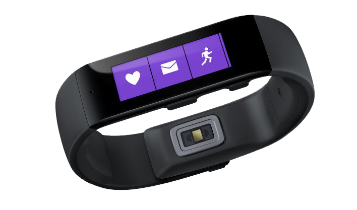
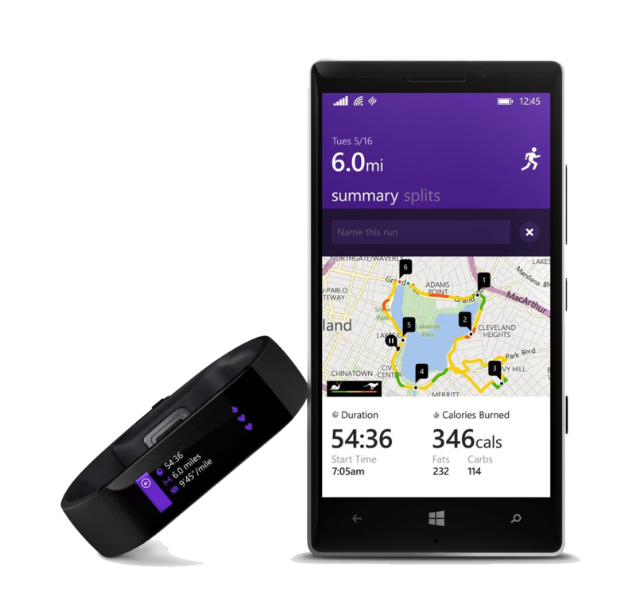
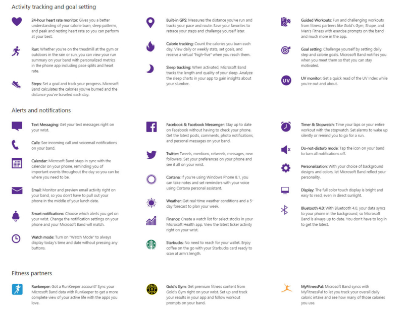

！？なんてつけるほどのものでもないですけどね。さんざん噂は流れていましたし。

正直<a class="keyword" href="http://d.hatena.ne.jp/keyword/%A5%A6%A5%A7%A5%A2%A5%E9%A5%D6%A5%EB">ウェアラブル</a>デバイスはあまり興味がなかったのですが、とりあえずお値段を聞いてぽちることが確定しました。 
199ドル。現在の米ドルレートでも22000円くらい。安い<a class="keyword" href="http://d.hatena.ne.jp/keyword/Windows">Windows</a> Phone端末と同じくらいのお値段ですね。

画面サイズは1.4インチ（解像度は310×102）フルカラーのタッチスクリーン。 
電話着信、ボイスメール、<a class="keyword" href="http://d.hatena.ne.jp/keyword/SNS">SNS</a>、カレンダーリマインダーの通知あたりは<a class="keyword" href="http://d.hatena.ne.jp/keyword/%A5%A6%A5%A7%A5%A2%A5%E9%A5%D6%A5%EB">ウェアラブル</a>デバイスなので当然（？）実装されています。

まず特筆すべき点としてはセンサー類が豊富なことでしょうか。 
<a href="http://japanese.engadget.com/2014/10/30/microsoft-band-microsoft-health-windows/">光学心拍、3軸ジャイロ/加速、環境光、UV、皮膚温度、電気皮膚反応のセンサーを内蔵</a>し、<a href="http://www.itmedia.co.jp/enterprise/articles/1410/30/news110.html">心拍数、歩数、カロリー消費量、睡眠品質、紫外線モニターの機能</a>を持つそうです。 
特にUV（紫外線）センサーを持つ<a class="keyword" href="http://d.hatena.ne.jp/keyword/%A5%A6%A5%A7%A5%A2%A5%E9%A5%D6%A5%EB">ウェアラブル</a>デバイスというのは聞いたことがないのですが、「今紫外線量が多いから外出るのはやめよう」とかそういう判定には使えそうですね。

<a class="keyword" href="http://d.hatena.ne.jp/keyword/Microsoft">Microsoft</a>が発売したデバイスですが、<a class="keyword" href="http://d.hatena.ne.jp/keyword/Windows">Windows</a> OSにしか対応しないというわけではなく、<a class="keyword" href="http://d.hatena.ne.jp/keyword/iOS">iOS</a>/<a class="keyword" href="http://d.hatena.ne.jp/keyword/Android">Android</a>にもばっちり対応しています。アプリもでました。（ただし日本を除く） 
ただしCortana（音声コマンド）に関しては<a class="keyword" href="http://d.hatena.ne.jp/keyword/Windows">Windows</a> Phoneでしか使えないみたいです。（※）

<a class="keyword" href="http://d.hatena.ne.jp/keyword/Apple">Apple</a> Watchのように時計を<a class="keyword" href="http://d.hatena.ne.jp/keyword/%A5%B9%A5%DE%A1%BC%A5%C8%A5%C7%A5%D0%A5%A4%A5%B9">スマートデバイス</a>化したというよりはJawboneなどの腕に巻くデバイスに液晶を付けたといった感じで、実際前面に押し出してるのはフィットネス機能。 
<a class="keyword" href="http://d.hatena.ne.jp/keyword/Microsoft">Microsoft</a> Healthという同時発表の<a class="keyword" href="http://d.hatena.ne.jp/keyword/Web%A5%B5%A1%BC%A5%D3%A5%B9">Webサービス</a>と連携し、蓄積した情報をもとに分析を行ってくれるそうです。

そのほか機能は割とたくさんあるので以下の画像を参照。 
今後<a class="keyword" href="http://d.hatena.ne.jp/keyword/%A5%B5%A1%BC%A5%C9%A5%D1%A1%BC%A5%C6%A5%A3">サードパーティ</a>向けに<a class="keyword" href="http://d.hatena.ne.jp/keyword/SDK">SDK</a>も公開するそうなのでそっちも期待ですね。

気になるバッテリーの持ちですが、100mAhのバッテリーが2つ搭載されており、48時間の稼働が可能だそうです。 
もうちょっと持ってほしいのですが、バッテリーのブレイクスルーでもないかぎり厳しいかな・・・。
充電は付属しているマグネット式USBケーブルを用いて1時間半ほどだそうです。 
ちょっと残念なのは完全防水ではないところ。汗くらいは全然平気だそうですが、<a class="keyword" href="http://d.hatena.ne.jp/keyword/%A5%A6%A5%A7%A5%A2%A5%E9%A5%D6%A5%EB">ウェアラブル</a>デバイスならやっぱり生活防水程度は対応してほしかったです。

とりあえずJawboneを買おうかと思って金を貯めていたのでそのお金でぽちります。 
日本じゃ売らないんじゃないかと思うので、来月MVP Global Summitに参加するために渡米する<a href="https://twitter.com/garicchi">がりっち</a>に買ってきてもらう予定。
在庫あればいいんだけど・・・。

***