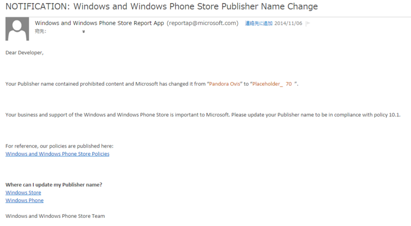

困った。

今のところアプリを公開してませんが、私は<a class="keyword" href="http://d.hatena.ne.jp/keyword/Windows">Windows</a>ストアアプリの開発者ライセンスを取得しています。
発行者名は「Pandora_Ovis」。<a class="keyword" href="http://d.hatena.ne.jp/keyword/Twitter">Twitter</a>のIDと同じです。

***

11月6日にこんなメールが届きました。

・・・？ 
何のこっちゃ。 
最初は<a class="keyword" href="http://d.hatena.ne.jp/keyword/%A5%B9%A5%D1%A5%E0%A5%E1%A1%BC%A5%EB">スパムメール</a>かと思ったのですがどうやら<a class="keyword" href="http://d.hatena.ne.jp/keyword/Windows">Windows</a>ストアの運営スタッフからのようです。 
よく読んでみると

<blockquote>
Your Publisher name contained prohibited content and <a class="keyword" href="http://d.hatena.ne.jp/keyword/Microsoft">Microsoft</a> has changed it from “Pandora Ovis” to “Placeholder_ 70 ”.
（あなたのストア発行者名はストアの禁止事項に抵触しているため、<a class="keyword" href="http://d.hatena.ne.jp/keyword/Microsoft">Microsoft</a>が発行者名を変更しました）

Please update your Publisher name to be in compliance with policy 10.1.
(ストアポリシー10.1項に従った発行者名に更新してください。)
</blockquote>

・・・。なんてこったい。 
どうやら私の発行者名はストアポリシーの10.1項に抵触していたらしいです。

なおストアのポリシーはこちら。 
<a href="http://msdn.microsoft.com/library/windows/apps/dn764939.aspx">ストアのポリシーと倫理規定 - Windows app development</a>

今回抵触していたストアポリシー10.1項は以下のようになっています。

<blockquote>
・アプリと関連する<a class="keyword" href="http://d.hatena.ne.jp/keyword/%A5%E1%A5%BF%A5%C7%A1%BC%A5%BF">メタデータ</a>は、アプリの開発元、機能、および特徴を正確かつ明確に反映している必要があります。 
・アプリと共に提供される<a class="keyword" href="http://d.hatena.ne.jp/keyword/%A5%B9%A5%AF%A5%EA%A1%BC%A5%F3%A5%B7%A5%E7%A5%C3%A5%C8">スクリーンショット</a>、アプリ名、開発者名、タイル、カテゴリ、アプリの説明、およびその他関連する<a class="keyword" href="http://d.hatena.ne.jp/keyword/%A5%E1%A5%BF%A5%C7%A1%BC%A5%BF">メタデータ</a>は、ユーザーにとって、アプリの機能、特徴、あらゆる重要な制限事項を簡単に理解できるものでなければなりません。 
・アプリで別のアプリと類似する名前やアイコンを使用することはできません。 
・アプリが特定の会社、政府機関、その他の組織に由来すると表明する場合は、そうした表明を行うことに対して必ず許諾を得てください。 
・所定の言語、市場、または地理的条件に制限されたコンテンツまたは機能がアプリに含まれる場合、その他重要な制限事項がアプリにある場合は、それらを明確に説明する必要があります。 
・アプリは完全に機能し、ユーザーに独特かつ独創的な価値または実用性を提供する必要があります。 
・アプリで特定のファイルの種類または機能拡張ポイントとの関連付けが宣言されている場合、その関連付けを考慮して、通常のユーザーが期待する機能を提供する必要があります。たとえば、.jpg というファイルの種類との関連付けをアプリで宣言した場合、アプリでは、表示または編集するためにイメージを開くことができます。
</blockquote>

この中で抵触していそうな項目は

<blockquote>
・アプリと共に提供される<a class="keyword" href="http://d.hatena.ne.jp/keyword/%A5%B9%A5%AF%A5%EA%A1%BC%A5%F3%A5%B7%A5%E7%A5%C3%A5%C8">スクリーンショット</a>、アプリ名、開発者名、タイル、カテゴリ、アプリの説明、およびその他関連する<a class="keyword" href="http://d.hatena.ne.jp/keyword/%A5%E1%A5%BF%A5%C7%A1%BC%A5%BF">メタデータ</a>は、ユーザーにとって、アプリの機能、特徴、あらゆる重要な制限事項を簡単に理解できるものでなければなりません。 
・アプリで別のアプリと類似する名前やアイコンを使用することはできません。 
・アプリが特定の会社、政府機関、その他の組織に由来すると表明する場合は、そうした表明を行うことに対して必ず許諾を得てください。 
このあたりでしょうか。
</blockquote>

また、<a href="http://msdn.microsoft.com/ja-JP/library/windows/apps/dn764941.aspx">開発者倫理規定</a>によると

<blockquote><ol>
<li>発行者名 
お客様の発行者名は一意でなければなりません。 
お客様のアカウントが特定の会社、政府機関、その他の組織に由来すると表明する場合は、そうした表明を行うことに対して必ず許諾を得てください。 
これには、誤解を招きやすい発行者名や、よく知られた個人または法人の名前と類似する発行者名を使用することが含まれますが、これに限定されません。</li>
</ol>
</blockquote>

という項目も。

つまりは私の発行者名「Pandora_Ovis」は何かしらの企業や個人が持ってる商標などに抵触してるから使うなってことですね。。 
おそらく「Pandora」がアメリカの<a class="keyword" href="http://d.hatena.ne.jp/keyword/%A5%A4%A5%F3%A5%BF%A1%BC%A5%CD%A5%C3%A5%C8%A5%E9%A5%B8%A5%AA">インターネットラジオ</a>放送会社、Pandora Media社の商標とぶつかるということなのかなと。

しかし困りました。別に私は「Pandora」をPandora Mediaからとったわけでなく、<a class="keyword" href="http://d.hatena.ne.jp/keyword/%A5%D1%A5%F3%A5%C9%A5%E9%A4%CE%C8%A2">パンドラの箱</a>からとったつもりだったので。 
とはいえ<a class="keyword" href="http://d.hatena.ne.jp/keyword/%BE%A6%C9%B8%B8%A2">商標権</a>はあちらにあります。新たな発行者名を考えないと・・・。

ところでTwitterIDまで変更しろってことにはならないですよね・・・？？

