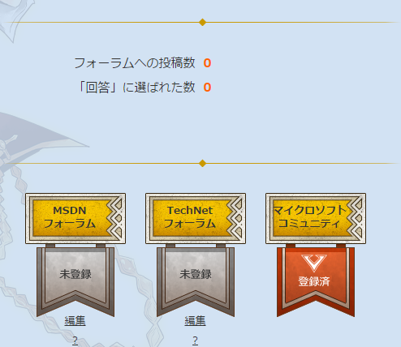

MSCCのコミュニティアカウントがどうがんばっても登録できないので事務局に連絡して代理登録をしてもらいました。 
（登録できないって悩んでる方、サイト側の問題なので事務局に連絡しましょう）

登録が終わったと連絡をいただいたので確認したところ、確かに登録はされていたのですが、なぜかそれなりに回答をしているはずなのにカウント数は0のまま。

登録情報間違えていたかなと思ってもう一度事務局に聞いてみたところ以下の回答。

<blockquote>
ラウンド1のカウントについて回答いたします。 
■カウント期間：2014/11/3 - 2015/1/23 
■カウント更新頻度：隔週1回の更新予定です。次回の更新は、来週になります。
</blockquote>

ああ、あれ隔週1回で更新されるんですね。 
というわけで私と同じくカウント数増えないなぁと思っていた方、来週まで待ちましょう。

***