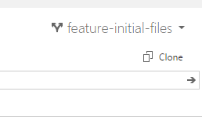

備忘録。

<a class="keyword" href="http://d.hatena.ne.jp/keyword/Visual%20Studio">Visual Studio</a>から<a class="keyword" href="http://d.hatena.ne.jp/keyword/Visual%20Studio">Visual Studio</a> Onlineのプロジェクトをクローンしたいとき、

のCloneをクリックして

このURLを使えばいいよってことらしいんですがこれをどう使ったらいいのかわからなくて調べてました・・・。たぶんこれ常識ですよねorz

大切なことはすべてここに書いてありました。 
<a href="http://msdn.microsoft.com/en-us/library/vstudio/ms181475.aspx">Connect to team projects in Team Foundation Server</a>

クローンするには<a class="keyword" href="http://d.hatena.ne.jp/keyword/Visual%20Studio">Visual Studio</a>のチーム<a class="keyword" href="http://d.hatena.ne.jp/keyword/%A5%A8%A5%AF%A5%B9%A5%D7%A5%ED%A1%BC%A5%E9">エクスプローラ</a>から<a class="keyword" href="http://d.hatena.ne.jp/keyword/Team%20Foundation%20Server">Team Foundation Server</a>に接続する必要があります。 
<a class="keyword" href="http://d.hatena.ne.jp/keyword/Visual%20Studio">Visual Studio</a> Onlineに接続するとき必要なURLは

<blockquote>
<a class="keyword" href="http://d.hatena.ne.jp/keyword/https">https</a>://○○.visualstudio.com/DefaultCollection/
</blockquote>

とのこと。これを登録すると<a class="keyword" href="http://d.hatena.ne.jp/keyword/Microsoft">Microsoft</a>アカウントの確認画面が出るので、登録してあるMSアカウントを入力すればチーム<a class="keyword" href="http://d.hatena.ne.jp/keyword/%A5%A8%A5%AF%A5%B9%A5%D7%A5%ED%A1%BC%A5%E9">エクスプローラ</a>にプロジェクトが表示されます。

***