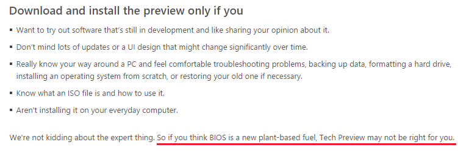

TLでこんなつぶやきをみまして。

<blockquote class="twitter-tweet" lang="HASH(0x192be48)">
日本MSの<a class="keyword" href="http://d.hatena.ne.jp/keyword/Windows">Windows</a> 10 配布ページにある「<a class="keyword" href="http://d.hatena.ne.jp/keyword/BIOS">BIOS</a> が新しい植物由来の燃料だと思うのなら、Technical Preview をインストールしないことをお勧めします。」の一文で朝から爆笑してしまった <a href="https://twitter.com/hashtag/windows10?src=hash">#windows10</a>
&mdash; 特殊魔界天使 <a class="keyword" href="http://d.hatena.ne.jp/keyword/%B1%A9%BA%AC%B8%CD">羽根戸</a>涼狐(非社交性動物) (@kyokolisianthus) <a href="https://twitter.com/kyokolisianthus/status/538491127158951937">November 29, 2014</a></blockquote>

<blockquote class="twitter-tweet" lang="HASH(0x192be48)">
マジだった <a href="http://t.co/QIn0COorxM">pic.twitter.com/QIn0COorxM</a>
&mdash; もやしきんぐ(一稀) (@kazuki_kaihatu) <a href="https://twitter.com/kazuki_kaihatu/status/538700472735895553">November 29, 2014</a></blockquote>

日本語文はこれですね。

<a href="http://windows.microsoft.com/ja-jp/windows/preview-faq#faq=tab0">Windows Technical Preview &#x3092;&#x30A4;&#x30F3;&#x30B9;&#x30C8;&#x30FC;&#x30EB;&#x3059;&#x308B;&#x524D;&#x306B; - Microsoft Windows</a>

確かに書いてあります。

なんのこっちゃかわからなかったのでとりあえず原文を参照することにしました。
<a class="keyword" href="http://d.hatena.ne.jp/keyword/Microsoft">Microsoft</a>のページは大体ja-jpをen-usに変えれば原文が出てきます。（つまりは英語）

<a href="http://windows.microsoft.com/en-us/windows/preview-faq#faq=tab0">Before you install Windows Technical Preview - Microsoft Windows</a>

<blockquote>
We're not kidding about the expert thing. So if you think <a class="keyword" href="http://d.hatena.ne.jp/keyword/BIOS">BIOS</a> is a new plant-based fuel, Tech Preview may not be right for you.
</blockquote>

おー、原文にもちゃんとnew plant-based fuelなんて書いてあるわ・・・。 
ということで<a class="keyword" href="http://d.hatena.ne.jp/keyword/%B5%A1%B3%A3%CB%DD%CC%F5">機械翻訳</a>がおかしいといいますか、文章を忠実に訳した結果だったようです。 
しかしアメリカンジョーク（？）はよくわからない・・・。植物由来の燃料に<a class="keyword" href="http://d.hatena.ne.jp/keyword/BIOS">BIOS</a>に似た名前のものがあるんですかね。

追記

<blockquote class="twitter-tweet" lang="HASH(0x192be48)">
<a class="keyword" href="http://d.hatena.ne.jp/keyword/BIOS">BIOS</a> =&gt; BIO + なんたら、って感じ？
&mdash; のぶ＠ひぐまブ<a class="keyword" href="http://d.hatena.ne.jp/keyword/%A5%EA%A5%EA%A5%A2%A5%F3">リリアン</a>トパーク (@kumar0001) <a href="https://twitter.com/kumar0001/status/538702645846765568">November 29, 2014</a></blockquote>

あー、納得。

追記の追記

<blockquote class="twitter-tweet" lang="ja">
こんなニュースとかあったし… &quot;<a class="keyword" href="http://d.hatena.ne.jp/keyword/BIOS">BIOS</a> Marine Algae Sargasso Sea <a class="keyword" href="http://d.hatena.ne.jp/keyword/Alternative">Alternative</a> Energy Biofuel&quot; <a href="http://t.co/63IqxBeO5B">http://t.co/63IqxBeO5B</a>&#10;<a href="https://twitter.com/Pandora_Ovis">@Pandora_Ovis</a> <a href="http://t.co/FRX8lWOXQI">pic.twitter.com/FRX8lWOXQI</a>
&mdash; 山本康彦＠BluewaterSoft (@biac) <a href="https://twitter.com/biac/status/539212421697523712">2014, 12月 1</a></blockquote>

<blockquote class="twitter-tweet" lang="ja">
こんなのもあるし… &quot;<a class="keyword" href="http://d.hatena.ne.jp/keyword/BIOS">BIOS</a>-FIN system = Algae Biofiltration to Biofuel Building Facade… | <a class="keyword" href="http://d.hatena.ne.jp/keyword/Bios">Bios</a> Design Collective&quot;&#10;<a href="https://twitter.com/Pandora_Ovis">@Pandora_Ovis</a> <a href="http://t.co/s2V7qLUdKY">pic.twitter.com/s2V7qLUdKY</a>
&mdash; 山本康彦＠BluewaterSoft (@biac) <a href="https://twitter.com/biac/status/539213234775941120">2014, 12月 1</a></blockquote>

***