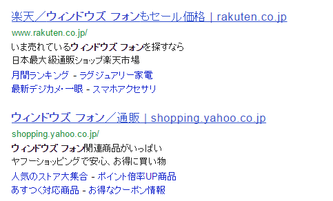
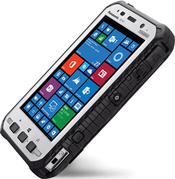

アドベントカレンダーを書くためにちょっとぐぐったところ
 

とかでてきて白目りましたひつじです。

とうとう2014年も12月、みなさん進捗どうですか？
私？ 
 

2014年も終わりということで今年のWindows Phoneをざっくり振り返ってみました。   
時系列にまとめたりするのが面倒だったので思いついた順に記載してます。  

####Windows Phone 8.1の登場
まずはやっぱりこれですね！  
Windows Phone 8以前の使いにくかった部分が（個人的にはカレンダーが特に）改善されたほか、新機能としてアクションセンターやパーソナル・アシスタントのCortanaなど様々な変更・追加が加えられて非常に使いやすくなりました。  
残念ながらCortanaは現時点では一部の国でしかサポートされておらず、日本でのサポートはされていませんが、Windows 10でCortanaが搭載されるという噂なので、そのあたりで日本語対応しないかなと期待しています。

#### Nokia買収完了
Microsoftからのトロイの木馬ことスティーヴン・エロップCEOのもとLumiaというWindows Phone端末にかけてきたNokiaですが、最終的に携帯事業をMicrosoftに売却し、一つの時代を終えましたね。  
もっとも買収間際にAndroid端末（NokiaX）をだしたり、最近もAndroidタブレットを出したりよくわからない動きもしてますが・・・。  

端末製造の力を得たMicrosoftですが、今のところ割と普通な端末を出すだけで1020のような面白い端末を出してません。
2015年はもっとニッチな端末も出していただきたいところです。

#### マイナーメーカーによる新機種続々
今年は様々なメーカーがWindows Phone端末を出した年だったかなという印象があります。
やはりWindows PhoneのOSライセンスが無償化されたことが影響しているのでしょうか。
[http://itpro.nikkeibp.co.jp/article/NEWS/20140403/548167/:embed]

MicrosoftもWindows Phoneを無償で出すことにより、より多くのベンダーが参入できるようになったというのは多種多様な端末をユーザーが選択できるという点でいいことです。
新端末情報を数多く紹介されているblog of mobileさんの記事をいくつか紹介します。

[http://blogofmobile.com/article/16396:embed]
[http://blogofmobile.com/article/17036:embed]
[http://blogofmobile.com/article/20358:embed]
[http://blogofmobile.com/article/22397:embed]

ロシア、ベトナム、インドでは割といろいろ新端末が出ているようです。  
日本のように一キャリアですべてのエリアをカバーしてるケースが少ないこともあってか新興国での端末は複数のキャリアで利用できるようデュアルSIMになっていたり、お買い求めしやすい1万～2万円程度の価格。  
新興国はまだスマートフォンが浸透していないエリアでもあるので、土着のメーカーが参入してくれることでシェア拡大への足掛かりになるとうれしいです。

しかし、逆に撤退するメーカーもありました。  
[Huawei: 「Windows Phoneでは誰も利益を上げることはできない」](http://www.businessnewsline.com/biztech/201412021107050000.html)

Huaweiといえば世界でも指折りのメーカーであるだけにこの発言は非常に重いです。  
iPhoneとAndroidがほぼシェアを独占している今、Windows Phoneが入り込む隙を見つけるのは非常に難しいでしょう。  
Huaweiが撤退することが今後のWindows Phoneの発展に悪影響を及ぼさないことを祈るばかりです。

####Windows Phone 7.8のサポート終了
2014年10月14日をもってとうとうWindows Phone 7.8のサポートが終了してしまいました。  
これにより日本で発売された唯一のWindows Phone端末であるIS12Tも完全に終わってしまった感があります。  
本来7.8のサポート終了日であった9月9日に一か月間の延長があり、何があるのかとわくわくしてるうちに結局二度目の終了日が来てしまうというわけのわからないこともありましたね。  
一体全体何がしたかったんだか・・・。
[http://ayano.hateblo.jp/entry/2014/09/09/002158:embed]
[http://blog.thty.net/entry/2014/10/15/215341:embed]

さらに、来年からはWindows Phone 7.8端末の開発者アンロックができなくなります。  
Windows Phone 7.8端末しか持っていない人は実機デバッグができませんし、そもそも（建前上）Windows Phone 8端末は某技適の関係で実機デバッグができませんので、必然的にWindows Phoneアプリ開発をするにはエミュレータを使うしかないという状況です。  
とてもつらい。

####FZ-E1
なんてことを書きましたけど、例外的にWindows Phone 8アプリを実機開発することができる端末が「一応」日本で発売されましたね。
PanasonicのFZ-E1。
 

Windows Phone 8ではなくハンドヘルド端末用のOSであるWindows Embedded 8 Handheldが搭載されているのですが、Windows Embedded 8 Handheld自体がWindows Phone 8をもとに作られているので問題なくWindows Phoneアプリが動きます。  
そしてちゃんと技適を通過してますので、日本でも合法的にWindows Phoneアプリを実機でデバッグすることができるわけです。  
ただしお値段は13万円。一般的なスマートフォンのお値段の2倍ですね。そもそも一般の人が買う代物ではないので当たり前なのですが。  
触ってみたい人は[@od_10z](https://twitter.com/od_10z)さんあたりに聞くと嬉々として触らせてくれることでしょう。まさしく鈍器です。

FZ-E1は海外でもなかなか受けがよいらしく、最近ではニューヨーク市警が採用するなんてニュースも流れてました。
[http://blogofmobile.com/article/26496:embed]

この勢いでWindows Phoneにも参入しませんか？Panasonicさん。

####開発者更新費用が無償化
Windows Phoneアプリの公開には開発者登録が必要で、年間19ドル必要だったのですが、更新料が撤廃されました。  
一度支払えばずっと開発者アカウントが使えるなんてお得ですね！！！！！
[http://kazuakix.hatenablog.jp/entry/2014/09/18/000310:embed]

####日本での今後
あまりにWindows Phoneの日本向けネタがなさ過ぎて※=ただし日本は除く なんてネタが生まれている昨今ですが、来年はどうなるのでしょう。  
少なくとも今年はWindows Phoneクラスタの皆さんのSAN値がゴリゴリ削られ、見限ったという方もちらほらいらっしゃいますね・・・。  

日本はすでにスマートフォン市場が完成されつつある状況で今参入してもぼっこぼこにされるのがオチという意見はもっともなんですけど、やっぱりここまで付き合ってきた以上やっぱり応援したいんですよね。  
とりあえずFirefoxOSには負けてほしくないです（
[http://au-fx.kddi.com/:embed]

ただ、これまで何度も何度も言っている話ですが、まず端末が出ないことにはユーザーサイドでやれることは限られてます。  
端末あってのユーザーですし、とりあえずとにもかくにも開発者が法律違反をしなくても使える端末がちゃんと普通に手に入ること。まずはここからです。  

個人的に勝機があるとしたらMVNOキャリアとタッグを組むといいんじゃないかと思っています。  
2014年はMVNOが一気に普及の兆しを見せた年でした。来年も成長すると思われる市場で、MVNOキャリア向けに端末を卸すメーカーも出てきています。  
キャリアと交渉がうまくいかずこのままずるずると何も出さないままより、まずはここで足がかりを作って普及に努めるとかできないかな？どうなのかな・・・？  

2015年、吉報が春風に乗ってやってくることを祈ってます。

というわけで今年のWindows Phoneの適当な振り返りでした。  
明日はけきょさん（@kekyo2)。どんなネタが飛び出してくるのでしょうか。楽しみです。
