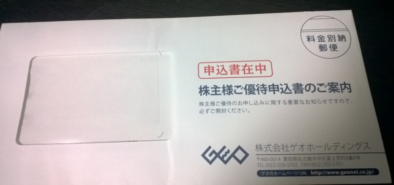
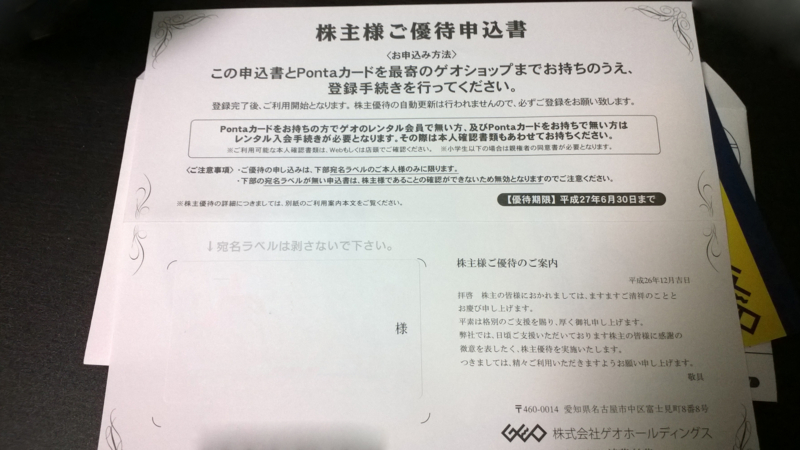

<a class="keyword" href="http://d.hatena.ne.jp/keyword/%B3%F4%BC%E7%CD%A5%C2%D4">株主優待</a>がほしくてゲオの株を買って2か月ほど、ようやく<a class="keyword" href="http://d.hatena.ne.jp/keyword/%B3%F4%BC%E7%CD%A5%C2%D4">株主優待</a>申込書が届きました。

***

こんな封筒に入ってます。 
そういえばゲオって名古屋の会社だったんですね。株持ってるのに知らなかった（

優待申込書はこんな感じ。 
店頭に持って行って手続きをすればその場で使えるみたいです。

期間は半年間で特典はレンタル全品半額。 
ほかのキャンペーンと併用できるので非常に安くレンタルできます。 
借りたかったCDを一気に借りようかな・・・。

