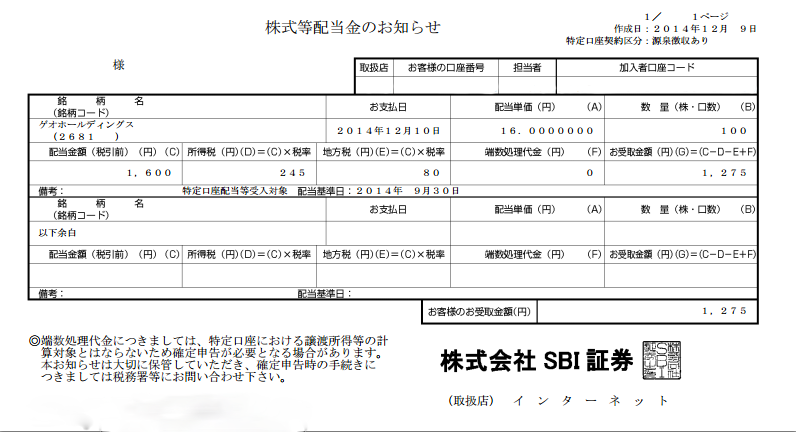

昨日ゲオの<a class="keyword" href="http://d.hatena.ne.jp/keyword/%B3%F4%BC%E7%CD%A5%C2%D4">株主優待</a>申込書が届いたと思ったら今日は配当金計算書が届いてました。

今回一株当たりの配当金は16円。 
私は100株持ってるので配当金額は1600円。<a class="keyword" href="http://d.hatena.ne.jp/keyword/%BD%EA%C6%C0%C0%C7">所得税</a>が245円、<a class="keyword" href="http://d.hatena.ne.jp/keyword/%C3%CF%CA%FD%C0%C7">地方税</a>が80円かかるので1275円が今回の収益。 
株を買った時よりちょっと株価が安くなっていて500円ほどマイナスなんですが、まぁ<a class="keyword" href="http://d.hatena.ne.jp/keyword/%B3%F4%BC%E7%CD%A5%C2%D4">株主優待</a>と配当金でお得感ありますね。

株は確実に儲けられるわけじゃないので気を付けないといけないわけですけど、これからもちょこっとずつ株生活していきたいです。

***