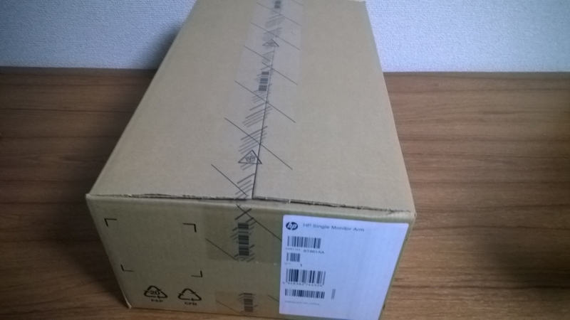
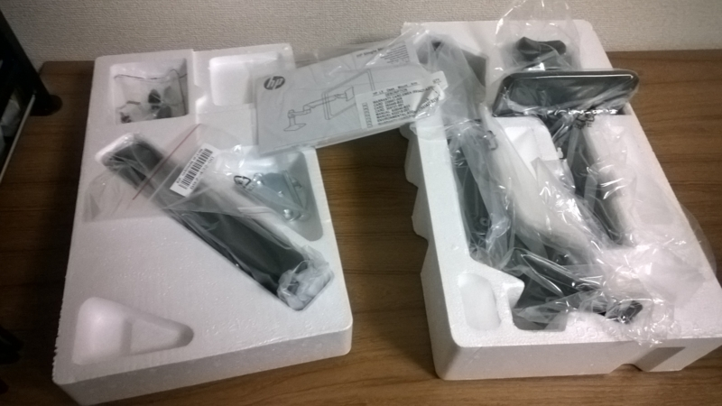
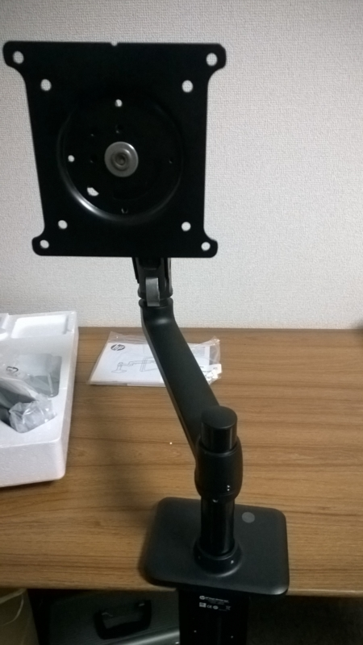
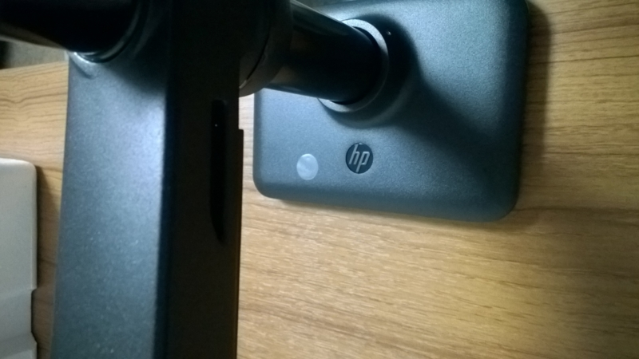
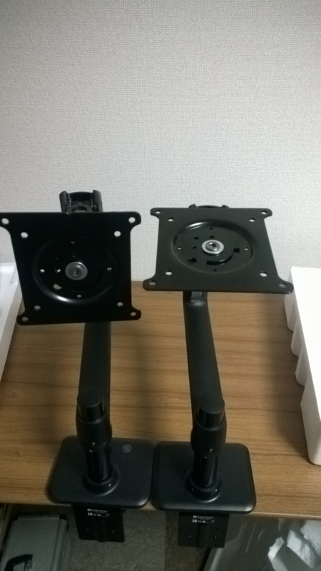

何で買ったのかというとなんで買ったんだろうという感じですが前々からいいなーと思っていたモニターアームをとうとう購入しました。

普通の人だったらモニターを机の上に置いておくだけでいいわけですが、机の前で作業するときだけでなく、机の前以外でもモニターを見たいときもたまにあります。  
そんな時わざわざモニターの足を置く場所にあるものをどかしてそこにモニターを動かしてって面倒くさいことこの上ない。

あと割とモニターアームを使ってらっしゃる方が多くて憧れていたというのもあります（

そんなわけでモニターアームを買いたいなぁと思っていたんですが、自分の場合ちょっと問題がありました。  
モニターアームを取り付けるにはCクランプと呼ばれる机の端に固定する方法、または机に直接穴をあけて固定する方法があるのですが、私が使っていた机は天板に固定しようにも背板（？）が邪魔で奥まで差し込めず、クランプによる設置ができないという致命的問題。机に穴開けてというのも正直無理。

というわけで机も買い換えました。  
1年半しか使わなかったんですが最近引き出しがぶっ壊れたりして正直イラッとしていたので良い機会です。（そう自分に言い聞かせました。）  
新しい机は9000円くらいのシンプルな机。やっぱシンプルな方が長く使えますね・・・。

机の話はそのくらいで、本題のモニターアーム。  
モニターアームって安いものは2000円くらいから、高いと3万くらいで値段の差が激しいです。  

自分が製品を選んだ時のポイントとしては  

* VESA規格対応  
まぁよっぽどのことがない限り対応してないことはないと思いますが。モニター背面のねじ穴の位置の統一規格です。  
* 対応ディスプレイサイズ  
私が使っているのは24インチなのでそれに対応しているものを選びました。大体の製品は24～27インチくらいまでは対応している印象です。
* 総耐荷重量  
モニターアームが支えきれるディスプレイの重量です。  
自分が使っているディスプレイはそんな重くないのですが（2～3kg）、ある程度の重さに耐えきれるものじゃないと不安。  
ただし、製品によっては4～8kgみたいに重さの下限が設定されているものもあります。軽すぎると逆に使えないなんてことがあるので注意。
* 軸  
単純に左右に動かせればいいとかなら2軸で十分ですが、モニターアームを最大限に使いたいなら4軸の製品を買うっきゃない。  
4軸なら上下左右と前後に動かせます。

上記のポイントに合うものはそこそこ見つかりましたが、製品情報を見ただけでは判断がつかずいろいろレビューサイトとか見てみました。
一番参考になったのは以下のサイト。

[http://pc.usy.jp/wiki/158.html:title]

いろいろ見ていて一番評判のいいものがエルゴトロン社製のモニターアーム。  

<?# AmazonAffiliate B00358RIRC /?>

信頼性の面で高評価。
昨年までは1万円を切っていたみたいですけど円安の関係で今では1万3000円程度。ちょっと高い。  
ほかに良いのないかなぁと思って探していたら見つけました。

<?# AmazonAffiliate B006PYJD44 /?>

ヒューレットパッカードのモニターアーム、BT861AA。  
上に挙げたエルゴトロンLXモニターアーム（45-241-026）のOEM版とのこと。  
全く同じものというわけではなくデザインなど違いますが機能面で劣らず1000円～2000円安い。  

大きな違いはLXモニターアームはシルバーを基調にしているのに対してBT861AAは黒。  
ここは好みだと思いますが、モニターアームは裏方なので別にそれほどデザインは気にならないかなと思います。シルバーのほうが指紋が目立つデメリットもありますし。  
もう一つはサポート期間の長さ。BT861AAは1年の保障に対してLXモニターアームはなんと10年。  
1000円ちょっとの違いでこの保証期間の違いなので、心配な人はLXモニターアームを買ったほうがいいです。

で、私はブラックのほうが好きだったのでBT861AAにしました。

 

届いた箱はこんな感じ。OEM版なだけあって箱は非常にシンプル。

 

箱を開けるとこんな感じでものが入っています。  
クランプで止めるためのパーツと机に穴をあけて設置するためのパーツどちらも入っているので好きな方を選べばOK。私は穴を開けたくないのでクランプを使いました。  

 

パーツ自体は単純に差し込むだけで簡単に設置できます。  

 

HPのOEMなのでHPのロゴが。

 

そんなわけで二つ買いまして、

<?# Twitter 543028106995306497 /?>

こんな感じになりました。縦置きだって軽々できちゃいます。  

とりあえず使用感ですが、部屋の隣の台所で調理してる最中でもアームを台所側に延ばせば調理しながらテレビを見るというなかなか素敵な環境になってとても良いです！（  
ディスプレイ下の隙間もものが置きやすくなったのも個人的にすごくありがたい。

とりあえずよい買い物をしました。  
机の上にどんとおいてあるディスプレイが邪魔って人はモニターアームの導入を考えてみるとよいかもです。