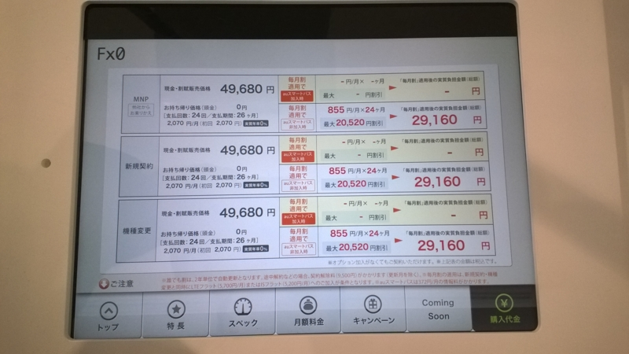

<?# Twitter 547690748817059842 /?>

12月23日に発表されたau初のFirefox OSスマートフォン、「Fx0」が24日からau直営店で先行展示するとのことだったので見に行ってきました。  

<?# Twitter 547691431247089664 /?>
ホームボタンはFirefoxのロゴが立体的に見えていい感じ。ただこれのために10回近く試行錯誤したそうで・・・。

<?# Twitter 547693258051039232 /?>

ホーム画面上のアプリアイコンは形状は丸いですがどことなくiPhoneのフラットなアイコンにも見える感じ。  
ホーム画面を適当にスクロールさせてみましたが結構ぬるぬる動いてました。  

<?# Twitter 547694555194068992 /?>

FirefoxOSの開発者向け端末としてすでに発売されているFlame(19800円）だと日本語入力をするにはいろいろ手順が必要だったそうなのですが、今回Fx0用に開発したというIMEは割といい感じにフリックできてました。  
ちょっと触っただけなので使いこんでみないとわからないところはあると思いますが、とりあえず入力でイライラすることは少なそう。  

  

Windows Phoneユーザーとしては気になる地図アプリなんですが、Fx0ではNAVITIMEがプリインストールされており、FirefoxOS標準なものはありませんでした。  
以前[Hereマップが採用されている](http://telematicswire.net/firefox-os-to-feature-here-maps-from-nokia/)って聞いた気がしてたんですが、

<?# Twitter 547729846214750209 /?>

とのこと。[あと酢酸先生のブログ記事が詳しい。](http://blog.ch3cooh.jp/entry/20141224/1419398379)  
まぁ何にしても、Fx0ユーザーは白地図に悩む必要はないようです。  

ただ、なぜか私が展示されている端末でNAVITIMEを開いたところ
 
となぜか白地図どころか地図がロードされず・・・。  
ネット自体にはつながっているのにほかのアプリでも時折ネットがつながらないと怒られたんですがなんだったんだろ・・・。  

<?# Twitter 547693958860513280 /?>

アプリはまだそれほどそろってないようではありますが、Twitter、LINEなど有名どころはすでにあるみたいです。  
ところで、Windows Phoneには出さないと明言していたGoogle謹製YouTubeアプリがFirefoxOSにはあるんですね・・・。  

ちなみに持ってみた感触ですが、田中プロがプッシュしていたスケルトンな外装、正直チープな印象を受けました。  
先行展示品ということで製品版とは違う外装なのかもですけど。  

Windows Phoneユーザー視点で見ると「あ、ここWindows Phoneより劣ってる」とか思うところはあるんですが、ハイエンド端末なだけあって動きはサクサクしていましたし、思っていたより遊べそうな感じです。  
  
  
価格表では
 

のように端末価格が49680円とお高いんですが、こちらの[ブログ記事](http://mnpwhitebelt.blog.fc2.com/blog-entry-1224.html)によると~~Fx0おトク割自体はLTEプランを契約しなくとも使えるということなので、運用自体は月々3円で行ける感じです。 ~~
 
嘘かいてました。  
LTEプランは必須、パケット定額プランが不要の間違いです。とりあえず月々3円はあってるはず。

実際触ってみておもちゃとしてはなかなか遊べるんじゃないかと思う端末だったので、安かったら買ったかもですね。  
今後アプリが増えていくかについては正直望みはないと思いますが、auがIS12Tをちゃんと教訓としているならまぁIS12Tよりは売れるかもしれません。  
ソーシャルゲームを味方につけることができれば化けるかも。  

#### 追記
FirefoxOSの標準地図機能の件、

<?# Twitter 547782813802430465 /?>

らしいんですが真相は如何に。。