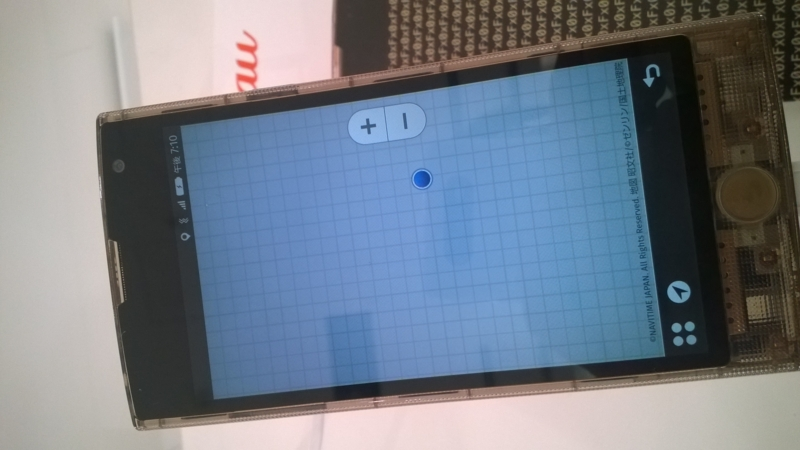

<blockquote class="twitter-tweet" lang="ja">
来ました <a href="http://t.co/NgAiombu5S">pic.twitter.com/NgAiombu5S</a>
&mdash; Ovis (@Pandora_Ovis) <a href="https://twitter.com/Pandora_Ovis/status/547690748817059842">2014, 12月 24</a></blockquote>

12月23日に発表された<a class="keyword" href="http://d.hatena.ne.jp/keyword/au">au</a>初の<a class="keyword" href="http://d.hatena.ne.jp/keyword/Firefox%20OS">Firefox OS</a><a class="keyword" href="http://d.hatena.ne.jp/keyword/%A5%B9%A5%DE%A1%BC%A5%C8%A5%D5%A5%A9%A5%F3">スマートフォン</a>、「Fx0」が24日から<a class="keyword" href="http://d.hatena.ne.jp/keyword/au">au</a>直営店で先行展示するとのことだったので見に行ってきました。

***

<blockquote class="twitter-tweet" lang="ja">
特注と噂の <a href="http://t.co/hHlAFCpW4k">pic.twitter.com/hHlAFCpW4k</a>
&mdash; Ovis (@Pandora_Ovis) <a href="https://twitter.com/Pandora_Ovis/status/547691431247089664">2014, 12月 24</a></blockquote>
ホームボタンは<a class="keyword" href="http://d.hatena.ne.jp/keyword/Firefox">Firefox</a>のロゴが立体的に見えていい感じ。ただこれのために10回近く試行錯誤したそうで・・・。

<blockquote class="twitter-tweet" lang="ja">
Musicとかはアプリじゃなくて他のアプリをまとめるスペース？ <a href="http://t.co/Th7duFhthO">pic.twitter.com/Th7duFhthO</a>
&mdash; Ovis (@Pandora_Ovis) <a href="https://twitter.com/Pandora_Ovis/status/547693258051039232">2014, 12月 24</a></blockquote>

ホーム画面上のアプリアイコンは形状は丸いですがどことなく<a class="keyword" href="http://d.hatena.ne.jp/keyword/iPhone">iPhone</a>のフラットなアイコンにも見える感じ。 
ホーム画面を適当にスクロールさせてみましたが結構ぬるぬる動いてました。

<blockquote class="twitter-tweet" lang="ja">
<a class="keyword" href="http://d.hatena.ne.jp/keyword/%A5%D5%A5%EA%A5%C3%A5%AF%C6%FE%CE%CF">フリック入力</a>は割とよくできてる <a href="http://t.co/JctncmvK9W">pic.twitter.com/JctncmvK9W</a>
&mdash; Ovis (@Pandora_Ovis) <a href="https://twitter.com/Pandora_Ovis/status/547694555194068992">2014, 12月 24</a></blockquote>

FirefoxOSの開発者向け端末としてすでに発売されているFlame(19800円）だと日本語入力をするにはいろいろ手順が必要だったそうなのですが、今回Fx0用に開発したという<a class="keyword" href="http://d.hatena.ne.jp/keyword/IME">IME</a>は割といい感じにフリックできてました。 
ちょっと触っただけなので使いこんでみないとわからないところはあると思いますが、とりあえず入力でイライラすることは少なそう。

<a class="keyword" href="http://d.hatena.ne.jp/keyword/Windows">Windows</a> Phoneユーザーとしては気になる地図アプリなんですが、Fx0では<a class="keyword" href="http://d.hatena.ne.jp/keyword/NAVITIME">NAVITIME</a>がプリインストールされており、FirefoxOS標準なものはありませんでした。 
以前<a href="http://telematicswire.net/firefox-os-to-feature-here-maps-from-nokia/">Hereマップが採用されている</a>って聞いた気がしてたんですが、

<blockquote class="twitter-tweet" lang="ja">
「<a class="keyword" href="http://d.hatena.ne.jp/keyword/Firefox%20OS">Firefox OS</a>標準の地図アプリ」なんて存在しませんよ。いつから<a class="keyword" href="http://d.hatena.ne.jp/keyword/Nokia">Nokia</a>の欧州など向け地図アプリHERE Mapsが全世界向けの標準になったんだ。各端末に搭載される地図アプリは端末とリリース国によって違うんだから勝手にデマ流すのは止めましょう。
&mdash; dynamis (でゅなみす＠もじら) (@dynamitter) <a href="https://twitter.com/dynamitter/status/547611017966919680">2014, 12月 24</a></blockquote>

とのこと。<a href="http://blog.ch3cooh.jp/entry/20141224/1419398379">あと酢酸先生のブログ記事が詳しい。</a> 
まぁ何にしても、Fx0ユーザーは<a class="keyword" href="http://d.hatena.ne.jp/keyword/%C7%F2%C3%CF%BF%DE">白地図</a>に悩む必要はないようです。

ただ、なぜか私が展示されている端末で<a class="keyword" href="http://d.hatena.ne.jp/keyword/NAVITIME">NAVITIME</a>を開いたところ

となぜか<a class="keyword" href="http://d.hatena.ne.jp/keyword/%C7%F2%C3%CF%BF%DE">白地図</a>どころか地図がロードされず・・・。 
ネット自体にはつながっているのにほかのアプリでも時折ネットがつながらないと怒られたんですがなんだったんだろ・・・。

<blockquote class="twitter-tweet" lang="ja">
公式 <a class="keyword" href="http://d.hatena.ne.jp/keyword/YouTube">YouTube</a>アプリ。。 <a href="http://t.co/s4oneVXqUd">pic.twitter.com/s4oneVXqUd</a>
&mdash; Ovis (@Pandora_Ovis) <a href="https://twitter.com/Pandora_Ovis/status/547693958860513280">2014, 12月 24</a></blockquote>

アプリはまだそれほどそろってないようではありますが、<a class="keyword" href="http://d.hatena.ne.jp/keyword/Twitter">Twitter</a>、LINEなど有名どころはすでにあるみたいです。 
ところで、<a class="keyword" href="http://d.hatena.ne.jp/keyword/Windows">Windows</a> Phoneには出さないと明言していた<a class="keyword" href="http://d.hatena.ne.jp/keyword/Google">Google</a>謹製<a class="keyword" href="http://d.hatena.ne.jp/keyword/YouTube">YouTube</a>アプリがFirefoxOSにはあるんですね・・・。

ちなみに持ってみた感触ですが、田中プロがプッシュしていたス<a class="keyword" href="http://d.hatena.ne.jp/keyword/%A5%B1%A5%EB%A5%C8">ケルト</a>ンな外装、正直チープな印象を受けました。 
先行展示品ということで製品版とは違う外装なのかもですけど。

<a class="keyword" href="http://d.hatena.ne.jp/keyword/Windows">Windows</a> Phoneユーザー視点で見ると「あ、ここ<a class="keyword" href="http://d.hatena.ne.jp/keyword/Windows">Windows</a> Phoneより劣ってる」とか思うところはあるんですが、ハイエンド端末なだけあって動きはサクサクしていましたし、思っていたより遊べそうな感じです。

価格表では

のように端末価格が49680円とお高いんですが、こちらの<a href="http://mnpwhitebelt.blog.fc2.com/blog-entry-1224.html">ブログ記事</a>によると<s>Fx0おトク割自体は<a class="keyword" href="http://d.hatena.ne.jp/keyword/LTE">LTE</a>プランを契約しなくとも使えるということなので、運用自体は月々3円で行ける感じです。 </s>

嘘かいてました。 
<a class="keyword" href="http://d.hatena.ne.jp/keyword/LTE">LTE</a>プランは必須、<a class="keyword" href="http://d.hatena.ne.jp/keyword/%A5%D1%A5%B1%A5%C3%A5%C8%C4%EA%B3%DB">パケット定額</a>プランが不要の間違いです。とりあえず月々3円はあってるはず。

実際触ってみておもちゃとしてはなかなか遊べるんじゃないかと思う端末だったので、安かったら買ったかもですね。 
今後アプリが増えていくかについては正直望みはないと思いますが、<a class="keyword" href="http://d.hatena.ne.jp/keyword/au">au</a>がIS12Tをちゃんと教訓としているならまぁIS12Tよりは売れるかもしれません。 
<a class="keyword" href="http://d.hatena.ne.jp/keyword/%A5%BD%A1%BC%A5%B7%A5%E3%A5%EB%A5%B2%A1%BC%A5%E0">ソーシャルゲーム</a>を味方につけることができれば化けるかも。

追記
FirefoxOSの標準地図機能の件、

<blockquote class="twitter-tweet" lang="ja">
いくつかの情報サイトおよびこの公式サポートページ見るに、HERE maps　がデフォルトの選択肢っぽいんだけどな。&#10;<a href="https://t.co/Rqn3kArB6C">https://t.co/Rqn3kArB6C</a>
&mdash; たなか@開幕勝利 (@tanaka_733) <a href="https://twitter.com/tanaka_733/status/547782813802430465">2014, 12月 24</a></blockquote>

らしいんですが真相は如何に。。

