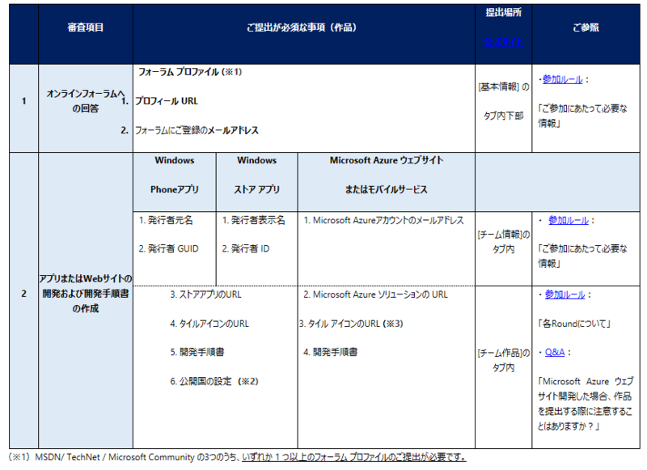
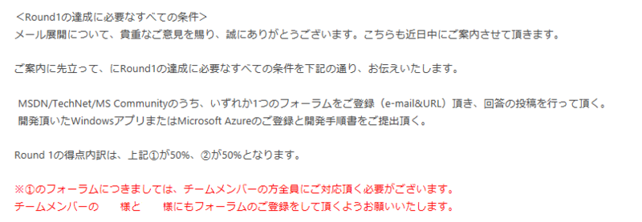

<blockquote>
1 月 23 日 （金）13 時の <a class="keyword" href="http://d.hatena.ne.jp/keyword/Microsoft">Microsoft</a> Community Champion ― Round 1 の提出期限の締切まで、残りわずか 1 週間となりました。そこで本日はあらためて “Round 1 の提出が必須な事項” および “Round 1 作品の提出に関するよくあるお問い合わせ” をご案内いたしますので、「作品」をご提出いただいていない方はもちろん、既にご提出いただいた方も今一度、本メールを最後までご一読いただき、Round 1 の締め切りまでに提出が必要な事項をご確認ください。

なお、Round 1 の終了時点で作品が提出されなかったことが確認された場合は、1月26 日（月）以降より順次<a class="keyword" href="http://d.hatena.ne.jp/keyword/%A5%AF%A5%E9%A5%A6%A5%C9">クラウド</a>利用プレミアムクーポン券のサービス利用を停止させていただきますので、締切までにご提出漏れがありませんよう必ず下記をご確認ください。
</blockquote>

ここ最近小出しに必須事項が展開されて困ってたのでMSCC事務局に問い合わせたところ一斉メールで必須事項についての連絡がありました。

これで必須事項がはっきりわかった・・・となればよかったんですが、別口で来ていたメールにこんな記載が。

というわけでチームメンバー全員何らかのフォーラムに登録する必要があるのでご注意を。

***