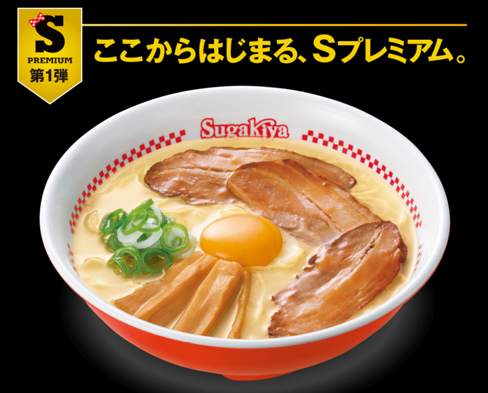

名古屋の味<a class="keyword" href="http://d.hatena.ne.jp/keyword/%A5%B9%A5%AC%A5%AD%A5%E4">スガキヤ</a>の味 というキャッチフレーズで有名な（？）東海圏の住人にとってなじみ深い<a class="keyword" href="http://d.hatena.ne.jp/keyword/%A5%B9%A5%AC%A5%AD%A5%E4">スガキヤ</a>のラーメンですが、「Sプレミアム」と題してプレミアムなラーメンが発売されるってことだったので<a class="keyword" href="http://d.hatena.ne.jp/keyword/%C2%E7%BF%DC">大須</a>行った帰りに食べてきました。

お昼時だったということもあって狭い店内は人でいっぱい。行列ずらりで注文してからラーメンが出来上がるまで15分もかかるという・・・。 
ほとんどの人はプレミ<a class="keyword" href="http://d.hatena.ne.jp/keyword/%A5%A2%A5%E0%A5%E9%A1%BC">アムラー</a>メン注文してるようでした。

<blockquote class="twitter-tweet" lang="ja">
名古屋らしいもの <a href="http://t.co/SUkG78xNFc">pic.twitter.com/SUkG78xNFc</a>
&mdash; Ovis (@Pandora_Ovis) <a href="https://twitter.com/Pandora_Ovis/status/556668680696627201">2015, 1月 18</a></blockquote>

あまりおいしそうに撮れなかったのはご愛嬌。 
肝心の味ですが、スープ、メンマ、肉の素材と味付けにこだわったと謳ってる割にスープの味が普段と変わらないような・・・？

プレミ<a class="keyword" href="http://d.hatena.ne.jp/keyword/%A5%A2%A5%E0%A5%E9%A1%BC">アムラー</a>メンで一番強く押し出している専用のチャーシューは確かに普段のペラペラのものと違ってしっかりとしたもので、なかなかおいしかったです。 
もうちょっと味が薄いほうがスープとなじんでよかったかななんて思いましたが、まぁそこは人それぞれ？

特製ラーメンが420円の中プレミ<a class="keyword" href="http://d.hatena.ne.jp/keyword/%A5%A2%A5%E0%A5%E9%A1%BC">アムラー</a>メンが期間限定390円。 
確実にプレミ<a class="keyword" href="http://d.hatena.ne.jp/keyword/%A5%A2%A5%E0%A5%E9%A1%BC">アムラー</a>メンのほうがお得ですし、<a class="keyword" href="http://d.hatena.ne.jp/keyword/%A5%B9%A5%AC%A5%AD%A5%E4">スガキヤ</a>のラーメンが好きな人は一度くらいは食べても損はないですね。

***