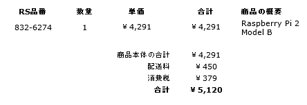

<a class="keyword" href="http://d.hatena.ne.jp/keyword/Raspberry%20Pi">Raspberry Pi</a> 2ぽちりました。

動くといってもフルセットな<a class="keyword" href="http://d.hatena.ne.jp/keyword/Windows">Windows</a> 10じゃなくて<a class="keyword" href="http://d.hatena.ne.jp/keyword/Windows">Windows</a> for IoTなるIoT向けの<a class="keyword" href="http://d.hatena.ne.jp/keyword/Windows">Windows</a>がある（作っている）そうで。 
<a class="keyword" href="http://d.hatena.ne.jp/keyword/Windows">Windows</a> Developer Program for IoTというプログラムに参加すると今年の後半ごろに提供されるらしい。

もともといろいろ遊べそうだなぁとは思っていたのでこれを機会にぽちってみました。 
<a class="keyword" href="http://d.hatena.ne.jp/keyword/Raspberry%20Pi">Raspberry Pi</a> 2は以下のショップで買えるみたいです。 
<a href="http://jp.rs-online.com/web/p/processor-microcontroller-development-kits/8326274/">RSオンライン｜電子部品・半導体の通販/販売サイト</a>

とりあえずプログラムに参加して、届いたらしばらくは<a class="keyword" href="http://d.hatena.ne.jp/keyword/Linux">Linux</a>入れていろいろ遊ぼうかな。

なお<a class="keyword" href="http://d.hatena.ne.jp/keyword/Windows">Windows</a> for IoTについては以下のブログ記事が詳しそうな感じでした。

<a href="http://www.syuheiuda.com/?p=3265">Windows for IoT &#x3067;&#x59CB;&#x3081;&#x308B;&#x52B9;&#x7387;&#x7684;&#x306A;&#x30AC;&#x30B8;&#x30A7;&#x30C3;&#x30C8;&#x958B;&#x767A;(&#x57FA;&#x790E;) &ndash; &#x30B9;&#x30E9;&#x30A4;&#x30C9;&#x516C;&#x958B;&#x3057;&#x307E;&#x3057;&#x305F;&#x3002; &ndash; Made in container</a>

<a href="http://kei-sakaki.jp/2014/08/30/intel-galileo-development-board-windows-internet-of-things-3/">&#x30A4;&#x30F3;&#x30C6;&#x30EB; Galileo &#x958B;&#x767A;&#x30DC;&#x30FC;&#x30C9;&#x3067;Windows IoT&#x3092;&#x52D5;&#x304B;&#x3059; &ndash; &#x88DC;&#x907A; | KEI SAKAKI&#39;s PAGE.</a>

***