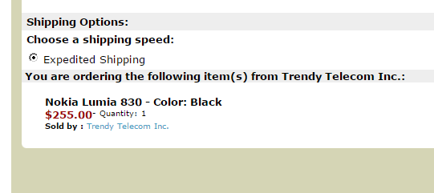

やっちまったよ。

というわけでいまさらですがLumia 830をぽちることと相成りました。 
現在の私のメイン端末は伊勢さんからお安く譲っていただいたLumia 820だったのですが、どうも最近調子が悪い。 
バッテリーもへたって来ていてガッツリ使うと一日持たないのでモバイルバッテリーは必須だしつもりんのろりありすは動かないし・・・。

<a class="keyword" href="http://d.hatena.ne.jp/keyword/Windows">Windows</a> 10 for Phonesが出てくるまで待ってようと思ってましたけど、なんか持っていた株式がいい感じに値上がりしていてLumia 830を買えるくらいになっていたのでまぁいいや買ってしまえと。

というわけで1shopmobileで購入。 
これまで<a class="keyword" href="http://d.hatena.ne.jp/keyword/Expansys">Expansys</a>で買っていたので1shopmobileは初めて。<a class="keyword" href="http://d.hatena.ne.jp/keyword/Expansys">Expansys</a>より安いけど米国<a class="keyword" href="http://d.hatena.ne.jp/keyword/Amazon">Amazon</a>のアカウントがないと購入できないのが地味に面倒でした。 
端末本体と送料で285ドル、それにプラスして関税が1000円くらいかかるのかな？

とりあえず届くのを楽しみに一週間を過ごします。

***